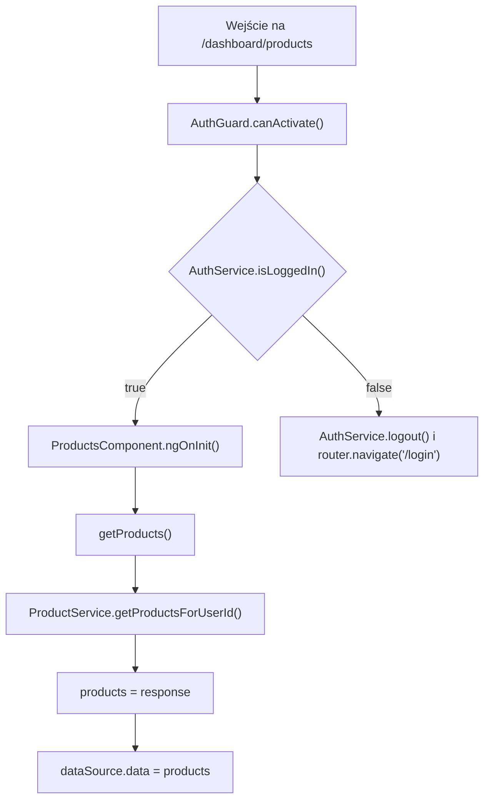
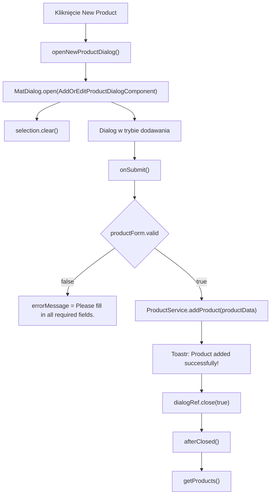
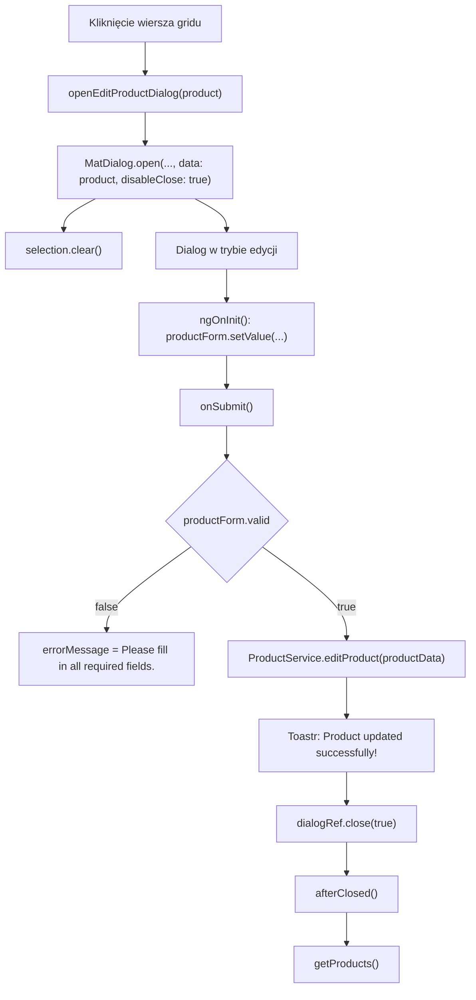

# Products — Logika frontendowa

---

## 1. Zakres dokumentu

Dokument opisuje logikę wykonywaną przez frontend ekranu Products. Dokument nie opisuje implementacji backendu, reguł bazy danych ani wewnętrznego przetwarzania po stronie API.

---

## 2. Inicjalizacja ekranu

### 2.1 Przepływ inicjalizacji

### 2.2 Opis przepływu

`AuthGuard` kontroluje dostęp do trasy `/dashboard/products`. Jeżeli użytkownik jest zalogowany, komponent wywołuje `getProducts()` podczas `ngOnInit()`.

Metoda `getProducts()` pobiera tablicę `IProduct[]` przez `ProductService.getProductsForUserId()`. Po otrzymaniu odpowiedzi komponent kopiuje dane do `products` i `dataSource.data`.

---

## 3. Przepływ filtrowania

### 3.1 Wyzwalacz

Filtrowanie jest wyzwalane przez zdarzenie `(keyup)` pola Search.

### 3.2 Kroki frontendowe

1. `applyFilter(event)` odczytuje wartość z `event.target`.
2. Wartość jest przycinana przez `trim()`.
3. Wartość jest zamieniana na małe litery przez `toLowerCase()`.
4. Wynik jest przypisywany do `dataSource.filter`.
5. Jeżeli istnieje paginator, wykonywane jest `dataSource.paginator.firstPage()`.

### 3.3 Czyszczenie filtra

`clearSearch(input)` ustawia `input.value` na pusty tekst. Metoda ustawia `dataSource.filter` na pusty tekst i resetuje paginator do pierwszej strony wyników.

---

## 4. Przepływ sortowania

Sortowanie jest realizowane przez `MatSort`. Po inicjalizacji widoku `ngAfterViewInit()` przypisuje `this.sort` do `dataSource.sort`.

Zmiana sortowania wywołuje `announceSortChange(sortState)`. Jeżeli `sortState.direction` ma wartość, `LiveAnnouncer` ogłasza kierunek sortowania. Jeżeli kierunek jest pusty, ogłaszany jest komunikat `Sorting cleared`.

---

## 5. Przepływ paginacji

Paginacja jest realizowana przez `MatPaginator`. Po inicjalizacji widoku `ngAfterViewInit()` przypisuje `this.paginator` do `dataSource.paginator`.

Paginacja działa po stronie frontendu na danych dostępnych w `MatTableDataSource`.

---

## 6. Przepływ zaznaczania wierszy

### 6.1 Zaznaczenie pojedynczego wiersza

Checkbox wiersza wywołuje `selection.toggle(row)`. Kliknięcie checkboxa zatrzymuje propagację zdarzenia, dlatego nie otwiera dialogu Edycja produktu.

### 6.2 Zaznaczenie wszystkich wierszy

Checkbox nagłówka wywołuje `masterToggle()`. Metoda sprawdza `isAllSelected()`.

Jeżeli wszystkie wiersze są zaznaczone, `selection.clear()` usuwa zaznaczenie. Jeżeli nie wszystkie wiersze są zaznaczone, każdy wiersz z `dataSource.data` jest dodawany do `selection`.

---

## 7. Przepływ dodawania produktu

`openNewProductDialog()` otwiera dialog bez danych wejściowych. Dialog inicjalizuje formularz wartościami domyślnymi. Po udanym zapisie dialog zwraca `true`, a ekran odświeża grid przez `getProducts()`.

---

## 8. Przepływ edycji produktu

`openEditProductDialog(product)` przekazuje do dialogu obiekt `IProduct`. Dialog ustawia `isEditMode = true` i wypełnia formularz wartościami z obiektu `data`.

---

## 9. Przepływ usuwania zaznaczonych produktów

`deleteSelected()` tworzy tablicę identyfikatorów przez `this.selection.selected.map((s) => s.id)`.

Metoda wywołuje `ProductService.deleteProducts(selectedIds)`. Po sukcesie ekran odświeża grid przez `getProducts()` i wyświetla komunikat `Products deleted successfully!`.

Po uruchomieniu żądania metoda czyści zaznaczenie przez `selection.clear()`.

---

## 10. Reguły walidacji frontendowej

Formularz dialogu wykonuje zapis tylko wtedy, gdy `productForm.valid` ma wartość `true`.

Walidatory `Validators.required` posiadają pola `name`, `price` i `tvaValue`. Pola `containsTva` i `unitOfMeasurement` nie mają walidatorów.

Jeżeli formularz jest niepoprawny, `onSubmit()` ustawia `errorMessage = "Please fill in all required fields."`. Żądanie HTTP nie jest wtedy wykonywane.

---

## 11. Obsługa sukcesu i błędów

Sukces operacji dodawania, edycji i usuwania jest obsługiwany lokalnie przez `ToastrService.success(...)`.

Błędy HTTP są obsługiwane przez interceptory:

- `AuthInterceptor` obsługuje status `401` przekierowaniem do `/login`.
- `ErrorInterceptor` wyświetla komunikaty błędów przez `ToastrService.error(...)`.

---

## 12. Ograniczenia opisu

- Dokument nie opisuje walidacji backendowej.
- Dokument nie opisuje struktury tabel bazy danych.
- Dokument nie opisuje sposobu usuwania rekordów po stronie API.
- Dokument nie opisuje sposobu obliczania ceny produktu poza wartościami wpisanymi w formularzu.
