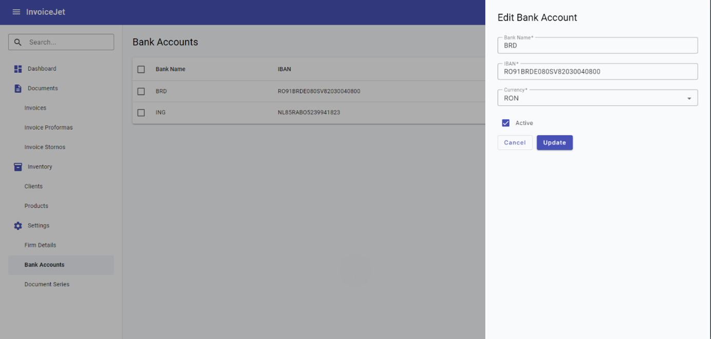

# Bank Accounts — Dane i Operacje

---

## Zrzut ekranu

---

## 1. Zakres danych widocznych na ekranie

Ekran prezentuje listę kont bankowych w gridzie Angular Material. Dane gridu pochodzą ze zmiennej `dataSource`, której typ to `MatTableDataSource<IBankAccount>`.

Dialog Dodawanie/Edycja konta bankowego prezentuje formularz reaktywny `bankAccountForm`. Formularz obsługuje dane konta bankowego w modelu `IBankAccount`.

---

## 2. Sekcja filtrów

### 2.1 Pole Search

| Atrybut | Wartość |
|---|---|
| **Nazwa elementu** | Pole Search |
| **Typ elementu** | `input matInput` w `mat-form-field` |
| **Etykieta** | `Search` |
| **Tekst podpowiedzi** | `Search` |
| **Binding** | Brak `formControlName`; wartość odczytywana ze zdarzenia DOM. |
| **Event** | `(keyup)="applyFilter($event)"` |
| **Handler** | `applyFilter(event: Event)` |
| **Mechanizm filtrowania** | `this.dataSource.filter = filterValue.trim().toLowerCase()` |
| **Skutek dodatkowy** | Jeżeli istnieje paginator, wykonywane jest `this.dataSource.paginator.firstPage()`. |

### 2.2 Przycisk Clear

| Atrybut | Wartość |
|---|---|
| **Typ elementu** | `button mat-icon-button` |
| **Widoczność** | Przycisk jest widoczny wyłącznie gdy `searchInput.value` nie jest puste. |
| **Ikona** | `clear` |
| **Event** | `(click)="clearSearch(searchInput)"` |
| **Skutek** | Czyści wartość pola Search, ustawia `dataSource.filter` na pusty tekst i resetuje paginator do pierwszej strony wyników. |

---

## 3. Grid kont bankowych

### 3.1 Opis gridu

| Atrybut | Wartość |
|---|---|
| **Komponent Angular** | `table mat-table` |
| **Źródło danych** | `dataSource` |
| **Typ źródła danych** | `MatTableDataSource<IBankAccount>` |
| **Zmienna pomocnicza** | `bankAccounts: IBankAccount[]` |
| **Kolumny** | `displayedColumns` |
| **Sortowanie** | Tak, przez `matSort` i `MatSort`. |
| **Paginacja** | Tak, przez `mat-paginator` i `MatPaginator`. |
| **Zaznaczanie wierszy** | Tak, przez `SelectionModel<IBankAccount>(true, [])`. |
| **Kliknięcie wiersza** | Otwiera dialog Edycja konta przez `openEditBankAccountDialog(row)`. |

### 3.2 Definicja kolumn

| # | `matColumnDef` | Nagłówek | Zawartość komórki | Typ | Sortowalna | Uwagi |
|---|---|---|---|---|---|---|
| 1 | `select` | Checkbox | `mat-checkbox` dla zaznaczenia wiersza | pole wyboru | Nie | Checkbox nagłówka obsługuje zaznaczanie wszystkich wierszy. |
| 2 | `bankName` | `Bank Name` | `{{ account.bankName }}` | tekst | Tak | Nazwa banku. |
| 3 | `iban` | `IBAN` | `{{ account.iban }}` | tekst | Tak | Numer rachunku bankowego. |
| 4 | `currency` | `Currency` | `{{ account.currencyName }}` | tekst | Tak | Nazwa waluty dodana w `mapCurrencyNames(...)`. |
| 5 | `isActive` | `Active` | `mat-checkbox` z `[checked]="account.isActive"` | pole wyboru | Tak | Checkbox jest zablokowany przez `disabled`. |

---

## 4. Dialog Dodawanie/Edycja konta bankowego

### 4.1 Metadane dialogu

| Atrybut | Wartość |
|---|---|
| **Komponent** | `AddOrEditBankAccountDialogComponent` |
| **Plik komponentu** | `src/app/components/firm/bank-accounts/add-or-edit-bank-account-dialog/add-or-edit-bank-account-dialog.component.ts` |
| **Plik szablonu** | `src/app/components/firm/bank-accounts/add-or-edit-bank-account-dialog/add-or-edit-bank-account-dialog.component.html` |
| **Formularz** | `bankAccountForm: FormGroup` |
| **Tryb dodawania** | Dialog otwierany przez `openNewBankAccountDialog()` bez danych wejściowych. |
| **Tryb edycji** | Dialog otwierany przez `openEditBankAccountDialog(bankAccount)` z obiektem `IBankAccount`. |
| **Blokada zamknięcia poza dialogiem** | Tylko tryb edycji: `disableClose: true`. |
| **Panel CSS** | Tryb edycji używa `panelClass: "custom-dialog-panel"`. |
| **Tytuł dialogu** | `Edit Bank Account` albo `New Bank Account`. |

### 4.2 Pola formularza dialogu

| # | Nazwa pola | Etykieta UI | Typ elementu | `formControlName` | Wymagane | Walidatory | Komunikat błędu |
|---|---|---|---|---|---|---|---|
| 1 | Pole Nazwa banku | `Bank Name` | `input matInput` | `bankName` | Tak | `Validators.required` | `Bank Name is required` |
| 2 | Pole IBAN | `IBAN` | `input matInput` | `iban` | Tak | `Validators.required` | `IBAN is required` |
| 3 | Pole Currency | `Currency` | `mat-select` | `currency` | Tak | `Validators.required` | `Currency is required` |
| 4 | Pole Active | `Active` | `mat-checkbox` | `isActive` | Nie | Brak | Brak |

### 4.3 Słownik walut

| Etykieta UI | Wartość enum `Currency` |
|---|---|
| `RON` | `Currency.Ron = 0` |
| `EUR` | `Currency.Eur = 1` |

### 4.4 Wartości początkowe formularza

| Tryb | Wartości początkowe |
|---|---|
| Dodawanie konta | `bankName = ""`, `iban = ""`, `currency = null`, `isActive = false`. |
| Edycja konta | `ngOnInit()` ustawia formularz na podstawie `data: IBankAccount`. |

---

## 5. Operacje ekranu

### 5.1 Tabela operacji

| # | Nazwa operacji | Typ elementu | Lokalizacja | Event | Handler | Warunek aktywności |
|---|---|---|---|---|---|---|
| 1 | Dodawanie konta | `button mat-raised-button` | Pasek tytułu | `(click)` | `openNewBankAccountDialog()` | Zawsze aktywna. |
| 2 | Edycja konta | `tr mat-row` | Wiersz gridu | `(click)` | `openEditBankAccountDialog(row)` | Aktywna dla każdego wiersza. |
| 3 | Filtrowanie kont | `input matInput` | Sekcja Search | `(keyup)` | `applyFilter($event)` | Aktywna gdy ekran jest załadowany. |
| 4 | Czyszczenie filtra | `button mat-icon-button` | Pole Search | `(click)` | `clearSearch(searchInput)` | Widoczna gdy pole Search ma wartość. |
| 5 | Zaznaczanie wszystkich wierszy | `mat-checkbox` | Nagłówek gridu | `(change)` | `masterToggle()` | Aktywna gdy grid jest wyrenderowany. |
| 6 | Zaznaczanie wiersza | `mat-checkbox` | Wiersz gridu | `(change)` | `selection.toggle(row)` | Aktywna dla każdego wiersza. |
| 7 | Usuwanie zaznaczonych | `button mat-menu-item` | Menu kontekstowe | `(click)` | `deleteSelected()` | Żądanie wykonywane tylko gdy `selectedIds.length !== 0`. |
| 8 | Zapis formularza konta | `button mat-raised-button` | Dialog | `(ngSubmit)` | `onSubmit()` | Wykonuje zapis tylko gdy `bankAccountForm.valid`. |
| 9 | Anulowanie edycji | `button mat-stroked-button` | Dialog | `(click)` | `closeDialog()` | Widoczne tylko w trybie edycji. |

### 5.2 Szczegóły operacji HTTP wywoływanych z frontendu

| Operacja | Metoda serwisu | Wywołanie HTTP z `BankAccountService` | Typ danych |
|---|---|---|---|
| Pobranie kont | `getUserFirmBankAccounts()` | `GET {apiUrl}/BankAccount/GetUserFirmBankAccounts/` | `IBankAccount[]` |
| Dodanie konta | `addBankAccount(bankAccount)` | `POST {apiUrl}/BankAccount/AddUserFirmBankAccount/` | `IBankAccount` |
| Edycja konta | `editBankAccount(bankAccount)` | `PUT {apiUrl}/BankAccount/EditUserFirmBankAccount/` | `IBankAccount` |
| Usunięcie zaznaczonych | `deleteBankAccounts(bankAccountIds)` | `PUT {apiUrl}/BankAccount/DeleteUserFirmBankAccounts` | `number[]` |

---

## 6. Komunikaty i obsługa błędów

### 6.1 Komunikaty sukcesu

| Operacja | Komunikat | Mechanizm |
|---|---|---|
| Dodanie konta | `Bank account added` | `ToastrService.success(..., "Success")` |
| Edycja konta | `Bank account updated` | `ToastrService.success(..., "Success")` |
| Usunięcie zaznaczonych | `Bank accounts deleted successfully.` | `ToastrService.success(..., "Success")` |

### 6.2 Komunikaty walidacyjne

| Pole | Warunek | Komunikat |
|---|---|---|
| `bankName` | `required` | `Bank Name is required` |
| `iban` | `required` | `IBAN is required` |
| `currency` | `required` | `Currency is required` |

### 6.3 Obsługa błędów HTTP

| Źródło | Zachowanie frontendowe |
|---|---|
| `AuthInterceptor` dla statusu `401` | Przekierowuje do `/login` i wywołuje `AuthService.logout()`. |
| `ErrorInterceptor` dla statusu `400` | Wyświetla `ToastrService.error(message, "Error")`. |
| `ErrorInterceptor` dla statusu `401` | Wyświetla `ToastrService.error("Session has expired", "Unauthorized")`. |
| `ErrorInterceptor` dla statusu `404` | Wyświetla `ToastrService.error(message, "Not Found")`. |
| `ErrorInterceptor` dla statusu `500` | Wyświetla `ToastrService.error(message, "Error")`. |

---

## 7. Zależności techniczne ekranu

| Typ | Nazwa | Plik |
|---|---|---|
| Komponent | `BankAccountsComponent` | `src/app/components/firm/bank-accounts/bank-accounts.component.ts` |
| Dialog | `AddOrEditBankAccountDialogComponent` | `src/app/components/firm/bank-accounts/add-or-edit-bank-account-dialog/add-or-edit-bank-account-dialog.component.ts` |
| Serwis | `BankAccountService` | `src/app/services/bank-account.service.ts` |
| Model danych | `IBankAccount` | `src/app/models/IBankAccount.ts` |
| Model danych | `ICurrency` | `src/app/models/ICurrency.ts` |
| Enum | `Currency` | `src/app/enums/Currency.ts` |
| Guard | `AuthGuard` | `src/app/guards/auth.guard.ts` |
| Interceptor | `AuthInterceptor` | `src/app/services/interceptor/auth.interceptor.ts` |
| Interceptor | `ErrorInterceptor` | `src/app/services/interceptor/error.interceptor.ts` |

---

## 8. Znane uwagi wynikające z kodu

- Szablon gridu używa `account.currencyName`, ale `IBankAccount` nie definiuje pola `currencyName`. Pole jest dodawane dynamicznie przez `mapCurrencyNames(...)`.
- `MatSnackBar` jest wstrzyknięty do `AddOrEditBankAccountDialogComponent`, ale pokazany kod go nie używa.
- Pole `iban` ma tylko `Validators.required`. Kod nie zawiera walidatora formatu IBAN.
- Przycisk `Cancel` w dialogu jest widoczny tylko w trybie edycji.
