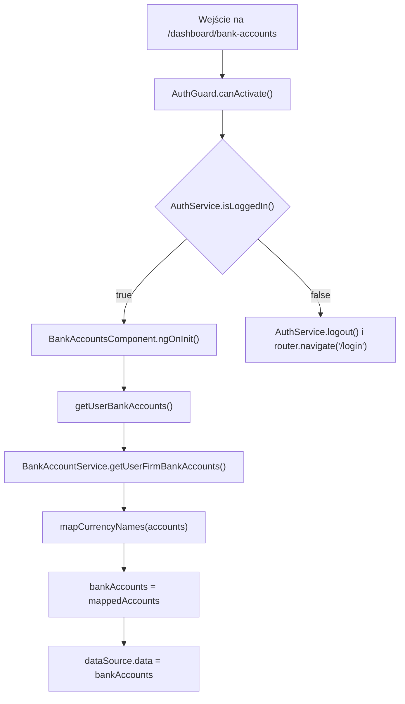
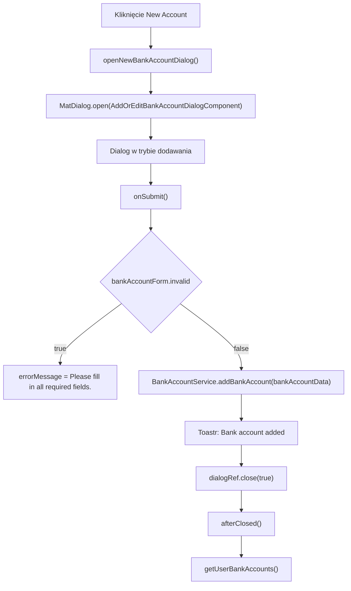
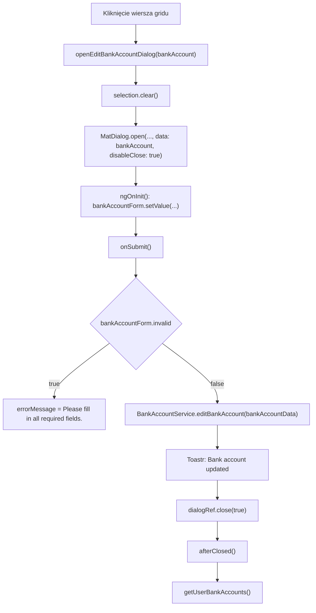

# Bank Accounts — Logika frontendowa

---

## 1. Zakres dokumentu

Dokument opisuje logikę wykonywaną przez frontend ekranu Bank Accounts. Dokument nie opisuje implementacji backendu, reguł bazy danych ani wewnętrznego przetwarzania po stronie API.

---

## 2. Inicjalizacja ekranu

### 2.1 Przepływ inicjalizacji

### 2.2 Opis przepływu

`AuthGuard` kontroluje dostęp do trasy `/dashboard/bank-accounts`. Jeżeli użytkownik jest zalogowany, komponent wywołuje `getUserBankAccounts()` podczas `ngOnInit()`.

Po otrzymaniu odpowiedzi `IBankAccount[]` komponent mapuje wartości enum `Currency` na nazwy `RON` albo `EUR`. Wynik trafia do `bankAccounts` i `dataSource.data`.

---

## 3. Przepływ mapowania waluty

`mapCurrencyNames(accounts)` przechodzi po każdym koncie bankowym. Metoda szuka dopasowania w lokalnej tablicy `currencies`.

| Wartość `account.currency` | Wynik `currencyName` |
|---|---|
| `Currency.Ron` / `0` | `RON` |
| `Currency.Eur` / `1` | `EUR` |
| Brak dopasowania | `Unknown` |

---

## 4. Przepływ filtrowania, sortowania i paginacji

Filtrowanie działa przez `MatTableDataSource.filter`. Wartość z pola Search jest przycinana, zamieniana na małe litery i przypisywana do `dataSource.filter`.

Sortowanie działa przez `MatSort`. Po inicjalizacji widoku `ngAfterViewInit()` przypisuje `this.sort` do `dataSource.sort`.

Paginacja działa przez `MatPaginator`. Po inicjalizacji widoku `ngAfterViewInit()` przypisuje `this.paginator` do `dataSource.paginator`.

---

## 5. Przepływ zaznaczania wierszy

Checkbox wiersza wywołuje `selection.toggle(row)`. Kliknięcie checkboxa zatrzymuje propagację zdarzenia, dlatego nie otwiera dialogu Edycja konta.

Checkbox nagłówka wywołuje `masterToggle()`. Jeżeli wszystkie wiersze są zaznaczone, `selection.clear()` usuwa zaznaczenie. Jeżeli nie wszystkie wiersze są zaznaczone, każdy wiersz z `dataSource.data` jest dodawany do `selection`.

---

## 6. Przepływ dodawania konta bankowego

Po zamknięciu dialogu z wartością prawdziwą ekran odświeża grid przez `getUserBankAccounts()` i czyści zaznaczenie.

---

## 7. Przepływ edycji konta bankowego

Dialog edycji otrzymuje obiekt `IBankAccount` przez `MAT_DIALOG_DATA`. `ngOnInit()` ustawia `isEditMode = true` i wypełnia formularz wartościami z `data`.

---

## 8. Przepływ usuwania zaznaczonych kont

`deleteSelected()` tworzy tablicę identyfikatorów przez `this.selection.selected.map((s) => s.id)`.

Jeżeli tablica zawiera co najmniej jeden identyfikator, metoda wywołuje `BankAccountService.deleteBankAccounts(selectedIds)`. Po sukcesie ekran odświeża grid, czyści zaznaczenie i wyświetla komunikat `Bank accounts deleted successfully.`.

---

## 9. Reguły walidacji frontendowej

Formularz dialogu kończy działanie i ustawia komunikat błędu, gdy `bankAccountForm.invalid` ma wartość `true`.

Walidatory `Validators.required` posiadają pola `bankName`, `iban` i `currency`. Pole `isActive` nie ma walidatora.

---

## 10. Obsługa sukcesu i błędów

Sukces operacji dodawania, edycji i usuwania jest obsługiwany lokalnie przez `ToastrService.success(...)`.

Błędy HTTP są obsługiwane przez interceptory:

- `AuthInterceptor` obsługuje status `401` przekierowaniem do `/login`.
- `ErrorInterceptor` wyświetla komunikaty błędów przez `ToastrService.error(...)`.

---

## 11. Ograniczenia opisu

- Dokument nie opisuje walidacji backendowej.
- Dokument nie opisuje sposobu weryfikacji formatu IBAN po stronie API.
- Dokument nie opisuje sposobu powiązania konta bankowego z firmą po stronie API.
