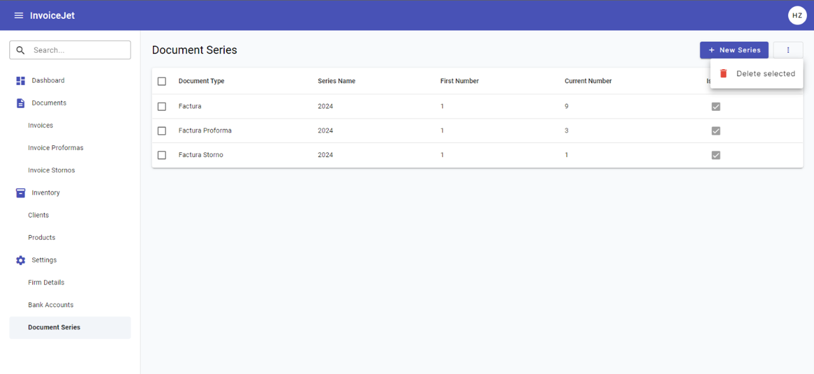

# Document Series — Dane i Operacje

---

## Zrzut ekranu

---

## 1. Zakres danych widocznych na ekranie

Ekran prezentuje listę serii dokumentów w gridzie Angular Material. Dane gridu pochodzą ze zmiennej `dataSource`, której typ to `MatTableDataSource<IDocumentSeries>`.

Dialog Dodawanie/Edycja serii dokumentów prezentuje formularz reaktywny `documentSeriesForm`. Formularz obsługuje dane serii w modelu `IDocumentSeries`.

---

## 2. Sekcja filtrów

### 2.1 Pole Search

| Atrybut | Wartość |
|---|---|
| **Nazwa elementu** | Pole Search |
| **Typ elementu** | `input matInput` w `mat-form-field` |
| **Etykieta** | `Search` |
| **Tekst podpowiedzi** | `Search` |
| **Binding** | Brak `formControlName`; wartość odczytywana ze zdarzenia DOM. |
| **Event** | `(keyup)="applyFilter($event)"` |
| **Handler** | `applyFilter(event: Event)` |
| **Mechanizm filtrowania** | `this.dataSource.filter = filterValue.trim().toLowerCase()` |
| **Skutek dodatkowy** | Jeżeli istnieje paginator, wykonywane jest `this.dataSource.paginator.firstPage()`. |

### 2.2 Przycisk Clear

| Atrybut | Wartość |
|---|---|
| **Typ elementu** | `button mat-icon-button` |
| **Widoczność** | Przycisk jest widoczny wyłącznie gdy `searchInput.value` nie jest puste. |
| **Ikona** | `clear` |
| **Event** | `(click)="clearSearch(searchInput)"` |
| **Skutek** | Czyści wartość pola Search, ustawia `dataSource.filter` na pusty tekst i resetuje paginator do pierwszej strony wyników. |

---

## 3. Grid serii dokumentów

### 3.1 Opis gridu

| Atrybut | Wartość |
|---|---|
| **Komponent Angular** | `table mat-table` |
| **Źródło danych** | `dataSource` |
| **Typ źródła danych** | `MatTableDataSource<IDocumentSeries>` |
| **Zmienna pomocnicza** | `documentSeriesList: IDocumentSeries[]` |
| **Kolumny** | `displayedColumns` |
| **Sortowanie** | Tak, przez `matSort` i `MatSort`. |
| **Paginacja** | Tak, przez `mat-paginator` i `MatPaginator`. |
| **Zaznaczanie wierszy** | Tak, przez `SelectionModel<IDocumentSeries>(true, [])`. |
| **Kliknięcie wiersza** | Otwiera dialog Edycja serii przez `openEditDocumentSeriesDialog(row)`. |

### 3.2 Definicja kolumn

| # | `matColumnDef` | Nagłówek | Zawartość komórki | Typ | Sortowalna | Uwagi |
|---|---|---|---|---|---|---|
| 1 | `select` | Checkbox | `mat-checkbox` dla zaznaczenia wiersza | pole wyboru | Nie | Checkbox nagłówka obsługuje zaznaczanie wszystkich wierszy. |
| 2 | `documentType` | `Document Type` | `{{ row.documentType.name }}` | tekst | Tak | Nazwa typu dokumentu. |
| 3 | `seriesName` | `Series Name` | `{{ row.seriesName }}` | tekst | Tak | Nazwa serii dokumentów. |
| 4 | `firstNumber` | `First Number` | `{{ row.firstNumber }}` | liczba | Tak | Pierwszy numer serii. |
| 5 | `currentNumber` | `Current Number` | `{{ row.currentNumber }}` | liczba | Tak | Bieżący numer serii. |
| 6 | `isDefault` | `Is Default` | `mat-checkbox` z `[checked]="row.isDefault"` | pole wyboru | Tak | Checkbox jest zablokowany przez `disabled`. |

---

## 4. Dialog Dodawanie/Edycja serii dokumentów

### 4.1 Metadane dialogu

| Atrybut | Wartość |
|---|---|
| **Komponent** | `AddOrEditDocumentSeriesDialogComponent` |
| **Plik komponentu** | `src/app/components/document-series/add-or-edit-document-series-dialog/add-or-edit-document-series-dialog.component.ts` |
| **Plik szablonu** | `src/app/components/document-series/add-or-edit-document-series-dialog/add-or-edit-document-series-dialog.component.html` |
| **Formularz** | `documentSeriesForm: FormGroup` |
| **Tryb dodawania** | Dialog otwierany przez `openNewDocumentSeriesDialog()` z `data: null`. |
| **Tryb edycji** | Dialog otwierany przez `openEditDocumentSeriesDialog(row)` z obiektem `IDocumentSeries`. |
| **Blokada zamknięcia poza dialogiem** | Tylko tryb edycji: `disableClose: true`. |
| **Panel CSS** | `panelClass: "custom-dialog-panel"`. |
| **Tytuł dialogu** | `Edit Document Series` albo `New Document Series`. |

### 4.2 Pola formularza dialogu

| # | Nazwa pola | Etykieta UI | Typ elementu | `formControlName` | Wymagane | Walidatory | Komunikat błędu |
|---|---|---|---|---|---|---|---|
| 1 | Pole Document Type | `Document Type` | `mat-select` | `documentType` | Tak | `Validators.required` | `Document Type is required` |
| 2 | Pole Series Name | `Series Name` | `input matInput` | `seriesName` | Tak | `Validators.required` | `Series Name is required` |
| 3 | Pole First Number | `First Number` | `input type="number"` | `firstNumber` | Tak | `Validators.required` | `First Number is required` |
| 4 | Pole Current Number | `Current Number` | `input type="number"` | `currentNumber` | Tak | `Validators.required` | `Current Number is required` |
| 5 | Pole Default | `Default` | `mat-checkbox` | `isDefault` | Nie | Brak | Brak |

### 4.3 Słownik typów dokumentów

| Id | Etykieta UI |
|---|---|
| `1` | `Factura` |
| `2` | `Factura Proforma` |
| `3` | `Factura Storno` |

### 4.4 Wartości początkowe formularza

| Tryb | Wartości początkowe |
|---|---|
| Dodawanie serii | `documentType = null`, `seriesName = ""`, `firstNumber = ""`, `currentNumber = ""`, `isDefault = false`. |
| Edycja serii | `ngOnInit()` ustawia formularz na podstawie `data: IDocumentSeries`. |

---

## 5. Operacje ekranu

### 5.1 Tabela operacji

| # | Nazwa operacji | Typ elementu | Lokalizacja | Event | Handler | Warunek aktywności |
|---|---|---|---|---|---|---|
| 1 | Dodawanie serii | `button mat-raised-button` | Pasek tytułu | `(click)` | `openNewDocumentSeriesDialog()` | Zawsze aktywna. |
| 2 | Edycja serii | `tr mat-row` | Wiersz gridu | `(click)` | `openEditDocumentSeriesDialog(row)` | Aktywna dla każdego wiersza. |
| 3 | Filtrowanie serii | `input matInput` | Sekcja Search | `(keyup)` | `applyFilter($event)` | Aktywna gdy ekran jest załadowany. |
| 4 | Czyszczenie filtra | `button mat-icon-button` | Pole Search | `(click)` | `clearSearch(searchInput)` | Widoczna gdy pole Search ma wartość. |
| 5 | Zaznaczanie wszystkich wierszy | `mat-checkbox` | Nagłówek gridu | `(change)` | `masterToggle()` | Aktywna gdy grid jest wyrenderowany. |
| 6 | Zaznaczanie wiersza | `mat-checkbox` | Wiersz gridu | `(change)` | `selection.toggle(row)` | Aktywna dla każdego wiersza. |
| 7 | Usuwanie zaznaczonych | `button mat-menu-item` | Menu kontekstowe | `(click)` | `deleteSelected()` | Kod wykonuje żądanie także dla pustej tablicy identyfikatorów. |
| 8 | Zapis formularza serii | `button mat-raised-button` | Dialog | `(ngSubmit)` | `onSubmit()` | Wykonuje zapis tylko gdy `documentSeriesForm.valid`. |
| 9 | Anulowanie dialogu | `button mat-stroked-button` | Dialog | `(click)` | `closeDialog()` | Zawsze widoczne w dialogu. |

### 5.2 Szczegóły operacji HTTP wywoływanych z frontendu

| Operacja | Metoda serwisu | Wywołanie HTTP z `DocumentSeriesService` | Typ danych |
|---|---|---|---|
| Pobranie serii | `getDocumentSeriesForUserId()` | `GET {apiUrl}/DocumentSeries/GetAllDocumentSeriesForUserId` | `IDocumentSeries[]` |
| Dodanie serii | `addDocumentSeries(documentSeries)` | `POST {apiUrl}/DocumentSeries/AddDocumentSeries` | `IDocumentSeries` |
| Edycja serii | `updateDocumentSeries(documentSeries)` | `PUT {apiUrl}/DocumentSeries/UpdateDocumentSeries` | `IDocumentSeries` |
| Usunięcie zaznaczonych | `deleteDocumentSeries(documentIds)` | `PUT {apiUrl}/DocumentSeries/DeleteDocumentSeries` | `number[]` |

---

## 6. Komunikaty i obsługa błędów

### 6.1 Komunikaty sukcesu

| Operacja | Komunikat | Mechanizm |
|---|---|---|
| Dodanie serii | `Document series added` | `ToastrService.success(..., "Success")` |
| Edycja serii | `Document series updated` | `ToastrService.success(..., "Success")` |
| Usunięcie zaznaczonych | `Document series deleted successfully.` | `ToastrService.success(..., "Success")` |

### 6.2 Komunikaty walidacyjne

| Pole | Warunek | Komunikat |
|---|---|---|
| `documentType` | `required` | `Document Type is required` |
| `seriesName` | `required` | `Series Name is required` |
| `firstNumber` | `required` | `First Number is required` |
| `currentNumber` | `required` | `Current Number is required` |

### 6.3 Obsługa błędów HTTP

| Źródło | Zachowanie frontendowe |
|---|---|
| `AuthInterceptor` dla statusu `401` | Przekierowuje do `/login` i wywołuje `AuthService.logout()`. |
| `ErrorInterceptor` dla statusu `400` | Wyświetla `ToastrService.error(message, "Error")`. |
| `ErrorInterceptor` dla statusu `401` | Wyświetla `ToastrService.error("Session has expired", "Unauthorized")`. |
| `ErrorInterceptor` dla statusu `404` | Wyświetla `ToastrService.error(message, "Not Found")`. |
| `ErrorInterceptor` dla statusu `500` | Wyświetla `ToastrService.error(message, "Error")`. |

---

## 7. Zależności techniczne ekranu

| Typ | Nazwa | Plik |
|---|---|---|
| Komponent | `DocumentSeriesComponent` | `src/app/components/document-series/document-series.component.ts` |
| Dialog | `AddOrEditDocumentSeriesDialogComponent` | `src/app/components/document-series/add-or-edit-document-series-dialog/add-or-edit-document-series-dialog.component.ts` |
| Serwis | `DocumentSeriesService` | `src/app/services/document-series.service.ts` |
| Model danych | `IDocumentSeries` | `src/app/models/IDocumentSeries.ts` |
| Model danych | `IDocumentType` | `src/app/models/IDocumentType.ts` |
| Guard | `AuthGuard` | `src/app/guards/auth.guard.ts` |
| Interceptor | `AuthInterceptor` | `src/app/services/interceptor/auth.interceptor.ts` |
| Interceptor | `ErrorInterceptor` | `src/app/services/interceptor/error.interceptor.ts` |

---

## 8. Znane uwagi wynikające z kodu

- `deleteSelected()` nie sprawdza liczby zaznaczonych serii przed wywołaniem `DocumentSeriesService.deleteDocumentSeries(selectedIds)`.
- `deleteSelected()` czyści zaznaczenie wewnątrz callbacka sukcesu i ponownie po uruchomieniu żądania.
- `getDocumentSeries()` i `deleteSelected()` wykonują `console.log(...)`.
- `IDocumentSeries` definiuje pole `documentTypeId`, ale `onSubmit()` buduje obiekt z `documentType` i nie ustawia jawnie `documentTypeId`.
- Pola `firstNumber` i `currentNumber` mają tylko `Validators.required`. Kod nie zawiera walidatorów minimalnej wartości.
