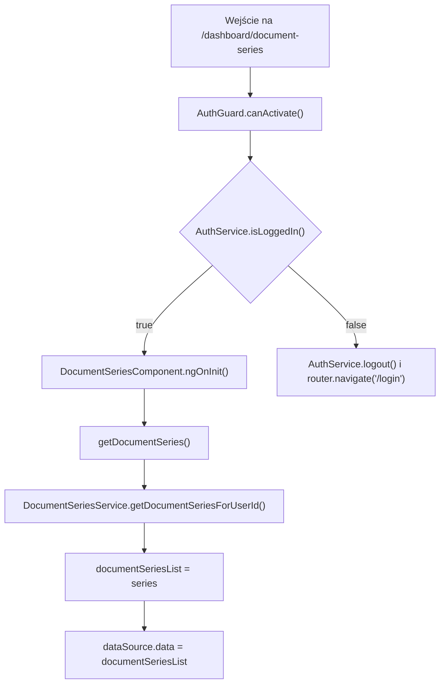
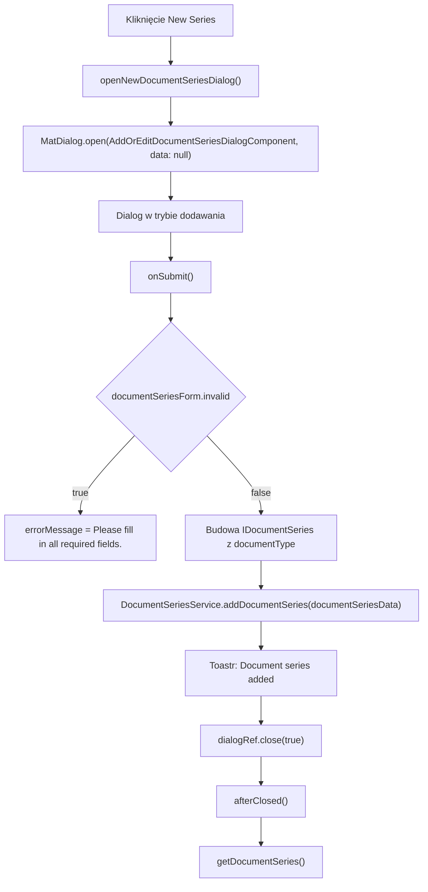
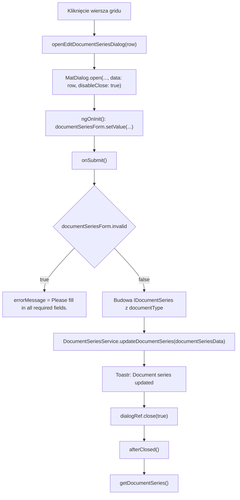

# Document Series — Logika frontendowa

---

## 1. Zakres dokumentu

Dokument opisuje logikę wykonywaną przez frontend ekranu Document Series. Dokument nie opisuje implementacji backendu, reguł bazy danych ani wewnętrznego przetwarzania po stronie API.

---

## 2. Inicjalizacja ekranu

### 2.1 Przepływ inicjalizacji

### 2.2 Opis przepływu

`AuthGuard` kontroluje dostęp do trasy `/dashboard/document-series`. Jeżeli użytkownik jest zalogowany, komponent wywołuje `getDocumentSeries()` podczas `ngOnInit()`.

Metoda `getDocumentSeries()` pobiera tablicę `IDocumentSeries[]` przez `DocumentSeriesService.getDocumentSeriesForUserId()`. Po otrzymaniu odpowiedzi komponent kopiuje dane do `documentSeriesList` i `dataSource.data`.

---

## 3. Przepływ filtrowania, sortowania i paginacji

Filtrowanie działa przez `MatTableDataSource.filter`. Wartość z pola Search jest przycinana, zamieniana na małe litery i przypisywana do `dataSource.filter`.

Sortowanie działa przez `MatSort`. Po inicjalizacji widoku `ngAfterViewInit()` przypisuje `this.sort` do `dataSource.sort`.

Paginacja działa przez `MatPaginator`. Po inicjalizacji widoku `ngAfterViewInit()` przypisuje `this.paginator` do `dataSource.paginator`.

---

## 4. Przepływ zaznaczania wierszy

Checkbox wiersza wywołuje `selection.toggle(row)`. Kliknięcie checkboxa zatrzymuje propagację zdarzenia, dlatego nie otwiera dialogu Edycja serii.

Checkbox nagłówka wywołuje `masterToggle()`. Jeżeli wszystkie wiersze są zaznaczone, `selection.clear()` usuwa zaznaczenie. Jeżeli nie wszystkie wiersze są zaznaczone, każdy wiersz z `dataSource.data` jest dodawany do `selection`.

---

## 5. Przepływ dodawania serii dokumentów

W trybie dodawania `onSubmit()` ustawia `documentSeriesData.id = 0` przed wywołaniem serwisu.

---

## 6. Przepływ edycji serii dokumentów

Dialog edycji otrzymuje obiekt `IDocumentSeries` przez `MAT_DIALOG_DATA`. `ngOnInit()` ustawia `isEditMode = true` i wypełnia formularz wartościami z `data`.

---

## 7. Przepływ budowania typu dokumentu

`onSubmit()` odczytuje identyfikator typu dokumentu z `documentSeriesForm.value.documentType`. Następnie wyszukuje nazwę w lokalnej tablicy `documentTypes`.

| Id | Nazwa |
|---|---|
| `1` | `Factura` |
| `2` | `Factura Proforma` |
| `3` | `Factura Storno` |

Obiekt wysyłany do serwisu zawiera pole `documentType` z obiektem `{ id, name }`.

---

## 8. Przepływ usuwania zaznaczonych serii

`deleteSelected()` tworzy tablicę identyfikatorów przez `this.selection.selected.map((s) => s.id)`.

Metoda wywołuje `DocumentSeriesService.deleteDocumentSeries(selectedIds)`. Po sukcesie ekran odświeża grid przez `getDocumentSeries()`, czyści zaznaczenie i wyświetla komunikat `Document series deleted successfully.`.

---

## 9. Reguły walidacji frontendowej

Formularz dialogu kończy działanie i ustawia komunikat błędu, gdy `documentSeriesForm.invalid` ma wartość `true`.

Walidatory `Validators.required` posiadają pola `documentType`, `seriesName`, `firstNumber` i `currentNumber`. Pole `isDefault` nie ma walidatora.

---

## 10. Obsługa sukcesu i błędów

Sukces operacji dodawania, edycji i usuwania jest obsługiwany lokalnie przez `ToastrService.success(...)`.

Błędy HTTP są obsługiwane przez interceptory:

- `AuthInterceptor` obsługuje status `401` przekierowaniem do `/login`.
- `ErrorInterceptor` wyświetla komunikaty błędów przez `ToastrService.error(...)`.

---

## 11. Ograniczenia opisu

- Dokument nie opisuje walidacji backendowej.
- Dokument nie opisuje sposobu wyliczania następnego numeru dokumentu po stronie API.
- Dokument nie opisuje reguł unikalności serii dokumentów po stronie API.
