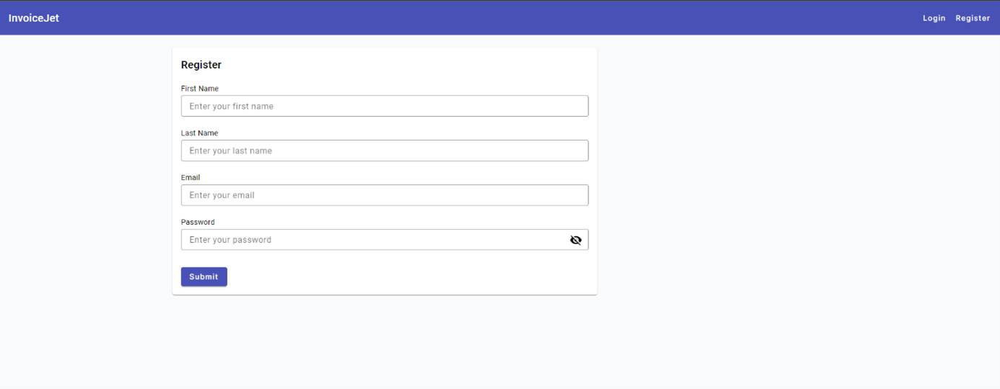

# Register — Dane i Operacje

---

## Zrzut ekranu



---

## 1. Formularz rejestracji

### 1.1 Struktura formularza

Formularz rejestracji jest formularzem reaktywnym `registerForm: FormGroup`.

```typescript
registerForm = new FormGroup({
  firstName: new FormControl("", [Validators.required]),
  lastName: new FormControl("", [Validators.required]),
  email: new FormControl("", [Validators.required, Validators.email]),
  password: new FormControl("", [Validators.required]),
  passwordConfirmation: new FormControl("", [Validators.required]),
});
```

### 1.2 Pola formularza

| # | Nazwa pola | Etykieta UI | Typ elementu | `formControlName` | Wymagane | Walidatory | Komunikat błędu |
|---|---|---|---|---|---|---|---|
| 1 | Pole First Name | `First Name` | `input matInput` | `firstName` | Tak | `Validators.required` | `First Name is required` |
| 2 | Pole Last Name | `Last Name` | `input matInput` | `lastName` | Tak | `Validators.required` | `Last Name is required` |
| 3 | Pole Email | `Email` | `input matInput` | `email` | Tak | `Validators.required`, `Validators.email` | `Email Name is required` dla `required` |
| 4 | Pole Password | `Password` | `input matInput` | `password` | Tak | `Validators.required` | `Password Name is required` |
| 5 | Pole Password Confirmation | `Password Confirmation` | `input matInput` | `passwordConfirmation` | Tak | `Validators.required` | `Password confirmation is required` |

### 1.3 Wartości początkowe

| Pole | Wartość początkowa |
|---|---|
| `firstName` | `""` |
| `lastName` | `""` |
| `email` | `""` |
| `password` | `""` |
| `passwordConfirmation` | `""` |
| `hide` | `true` |
| `errorMessage` | `null` |

---

## 2. Widoczność hasła

| Atrybut | Wartość |
|---|---|
| **Element** | Przycisk `button mat-icon-button` w polu hasła. |
| **Event** | `(click)="hide = !hide"` |
| **Typ pola gdy `hide = true`** | `password` |
| **Typ pola gdy `hide = false`** | `text` |
| **Ikona gdy `hide = true`** | `visibility_off` |
| **Ikona gdy `hide = false`** | `visibility` |
| **Zakres flagi** | Jedna flaga `hide` steruje polem `password` i `passwordConfirmation`. |

---

## 3. Operacje ekranu

### 3.1 Tabela operacji

| # | Nazwa operacji | Typ elementu | Lokalizacja | Event | Handler | Warunek aktywności |
|---|---|---|---|---|---|---|
| 1 | Wysłanie formularza | `form` | Formularz Register | `(ngSubmit)` | `onSubmit()` | Formularz wysyła zdarzenie po kliknięciu Submit. |
| 2 | Submit | `button mat-raised-button` | Karta formularza | `type="submit"` | `onSubmit()` przez formularz | Zawsze aktywny w HTML. |
| 3 | Przełączenie widoczności Password | `button mat-icon-button` | Pole Password | `(click)` | `hide = !hide` | Zawsze aktywne. |
| 4 | Przełączenie widoczności Password Confirmation | `button mat-icon-button` | Pole Password Confirmation | `(click)` | `hide = !hide` | Zawsze aktywne. |

### 3.2 Szczegóły operacji HTTP wywoływanych z frontendu

| Operacja | Metoda serwisu | Wywołanie HTTP z `AuthService` | Typ danych |
|---|---|---|---|
| Rejestracja | `register(user)` | `POST {apiUrl}/Auth/register` | `IRegisterUser` |

### 3.3 Mapowanie formularza do modelu `IRegisterUser`

| Pole formularza | Pole w modelu `IRegisterUser` |
|---|---|
| `firstName` | `firstName` |
| `lastName` | `lastName` |
| `email` | `email` |
| `password` | `password` |
| `passwordConfirmation` | `passwordConfirmation` |

---

## 4. Komunikaty i obsługa błędów

### 4.1 Komunikaty walidacyjne

| Pole | Warunek | Komunikat |
|---|---|---|
| `firstName` | `required` | `First Name is required` |
| `lastName` | `required` | `Last Name is required` |
| `email` | `required` | `Email Name is required` |
| `password` | `required` | `Password Name is required` |
| `passwordConfirmation` | `required` | `Password confirmation is required` |

### 4.2 Obsługa sukcesu

| Operacja | Zachowanie |
|---|---|
| Rejestracja | `localStorage.setItem("authToken", response.token)` |
| Rejestracja | `router.navigate(["dashboard"])` |

### 4.3 Obsługa błędów

| Źródło | Zachowanie frontendowe |
|---|---|
| Niepoprawny formularz | `onSubmit()` kończy działanie przez `return`. |
| Błąd HTTP | Obsługiwany przez globalne interceptory HTTP. |
| `errorMessage` | Pole istnieje w komponencie i stopce karty, ale pokazany kod go nie ustawia dla błędu HTTP. |

---

## 5. Zależności techniczne ekranu

| Typ | Nazwa | Plik |
|---|---|---|
| Komponent | `RegisterComponent` | `src/app/components/register/register.component.ts` |
| Serwis | `AuthService` | `src/app/services/auth.service.ts` |
| Model danych | `IRegisterUser` | `src/app/models/IRegisterUser.ts` |
| Routing | `Router` | Angular Router |
| Interceptor | `AuthInterceptor` | `src/app/services/interceptor/auth.interceptor.ts` |
| Interceptor | `ErrorInterceptor` | `src/app/services/interceptor/error.interceptor.ts` |

---

## 6. Znane uwagi wynikające z kodu

- Pole `email` ma `Validators.email`, ale szablon nie zawiera komunikatu dla błędu formatu email.
- Pola `password` i `passwordConfirmation` nie mają walidatora zgodności wartości.
- Jedna flaga `hide` steruje jednocześnie widocznością obu pól hasła.
- `errorMessage` istnieje w komponencie i szablonie, ale pokazany kod nie ustawia go przy błędzie rejestracji.
- Przycisk Submit nie ma atrybutu `[disabled]="registerForm.invalid"`.
