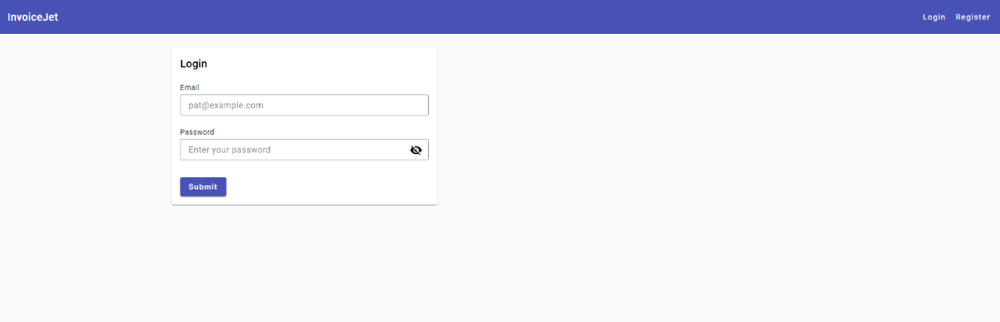

# Login — Dane i Operacje

---

## Zrzut ekranu



---

## 1. Formularz logowania

### 1.1 Struktura formularza

Formularz logowania jest formularzem reaktywnym `loginForm: FormGroup`.

```typescript
loginForm = new FormGroup({
  email: new FormControl("", [Validators.required, Validators.email]),
  password: new FormControl("", Validators.required),
});
```

### 1.2 Pola formularza

| # | Nazwa pola | Etykieta UI | Typ elementu | `formControlName` | Wymagane | Walidatory | Komunikat błędu |
|---|---|---|---|---|---|---|---|
| 1 | Pole Email | `Email` | `input matInput` | `email` | Tak | `Validators.required`, `Validators.email` | `Email is required` dla `required` |
| 2 | Pole Password | `Password` | `input matInput` | `password` | Tak | `Validators.required` | `Password is required` |

### 1.3 Wartości początkowe

| Pole | Wartość początkowa |
|---|---|
| `email` | `""` |
| `password` | `""` |
| `hide` | `true` |
| `errorMessage` | `null` |

---

## 2. Widoczność hasła

| Atrybut | Wartość |
|---|---|
| **Element** | Przycisk `button mat-icon-button` w polu hasła. |
| **Event** | `(click)="hide = !hide"` |
| **Typ pola gdy `hide = true`** | `password` |
| **Typ pola gdy `hide = false`** | `text` |
| **Ikona gdy `hide = true`** | `visibility_off` |
| **Ikona gdy `hide = false`** | `visibility` |

---

## 3. Operacje ekranu

### 3.1 Tabela operacji

| # | Nazwa operacji | Typ elementu | Lokalizacja | Event | Handler | Warunek aktywności |
|---|---|---|---|---|---|---|
| 1 | Wysłanie formularza | `form` | Formularz Login | `(ngSubmit)` | `onSubmit()` | Formularz wysyła zdarzenie po kliknięciu Submit. |
| 2 | Submit | `button mat-raised-button` | Karta formularza | `type="submit"` | `onSubmit()` przez formularz | Zawsze aktywny w HTML. |
| 3 | Przełączenie widoczności Password | `button mat-icon-button` | Pole Password | `(click)` | `hide = !hide` | Zawsze aktywne. |

### 3.2 Szczegóły operacji HTTP wywoływanych z frontendu

| Operacja | Metoda serwisu | Wywołanie HTTP z `AuthService` | Typ danych |
|---|---|---|---|
| Logowanie | `login(user)` | `POST {apiUrl}/Auth/login` | `ILoginUser` |

### 3.3 Mapowanie formularza do modelu `ILoginUser`

| Pole formularza | Pole w modelu `ILoginUser` |
|---|---|
| `email` | `email` |
| `password` | `password` |

---

## 4. Komunikaty i obsługa błędów

### 4.1 Komunikaty walidacyjne

| Pole | Warunek | Komunikat |
|---|---|---|
| `email` | `required` | `Email is required` |
| `password` | `required` | `Password is required` |

### 4.2 Obsługa sukcesu

| Operacja | Zachowanie |
|---|---|
| Logowanie | `localStorage.setItem("authToken", response.token)` |
| Logowanie | `router.navigate(["dashboard"])` |

### 4.3 Obsługa błędów

| Źródło | Zachowanie frontendowe |
|---|---|
| Niepoprawny formularz | `onSubmit()` nie wykonuje żadnego żądania HTTP. |
| Błąd HTTP | Obsługiwany przez globalne interceptory HTTP. |
| `errorMessage` | Pole istnieje w komponencie i szablonie, ale pokazany kod go nie ustawia dla błędu HTTP. |

---

## 5. Zależności techniczne ekranu

| Typ | Nazwa | Plik |
|---|---|---|
| Komponent | `LoginComponent` | `src/app/components/login/login.component.ts` |
| Serwis | `AuthService` | `src/app/services/auth.service.ts` |
| Model danych | `ILoginUser` | `src/app/models/ILoginUser.ts` |
| Routing | `Router` | Angular Router |
| Interceptor | `AuthInterceptor` | `src/app/services/interceptor/auth.interceptor.ts` |
| Interceptor | `ErrorInterceptor` | `src/app/services/interceptor/error.interceptor.ts` |

---

## 6. Znane uwagi wynikające z kodu

- Pole `email` ma `Validators.email`, ale szablon nie zawiera komunikatu dla błędu formatu email.
- `errorMessage` istnieje w komponencie i szablonie, ale pokazany kod nie ustawia go przy błędzie logowania.
- Przycisk Submit nie ma atrybutu `[disabled]="loginForm.invalid"`.
- Kod nie przekierowuje automatycznie zalogowanego użytkownika z `/login` do dashboardu.
