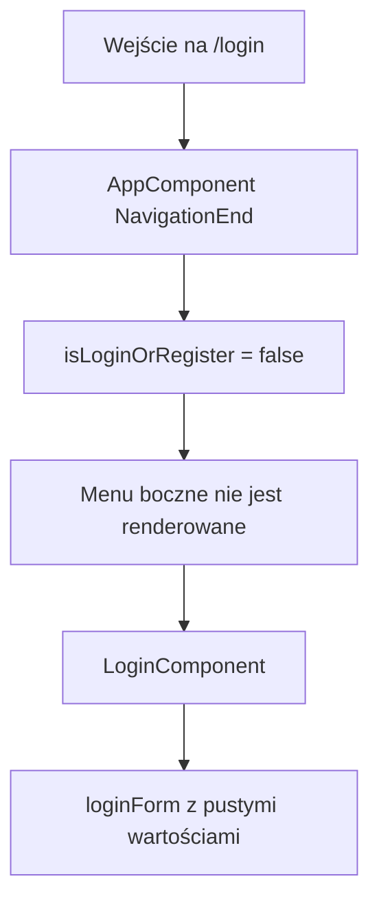
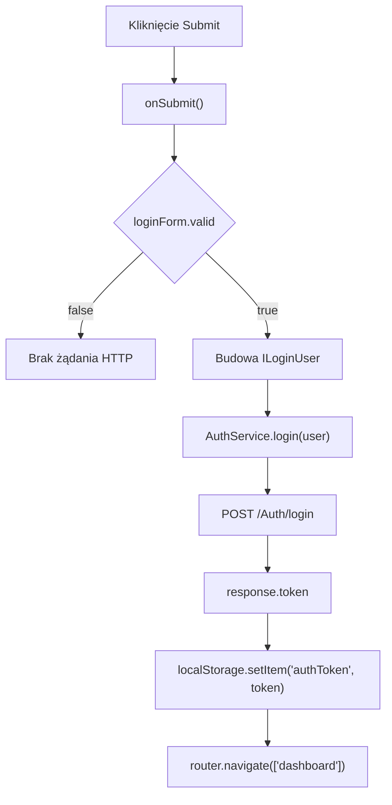

# Login — Logika frontendowa

---

## 1. Zakres dokumentu

Dokument opisuje logikę wykonywaną przez frontend ekranu Login. Dokument nie opisuje implementacji backendu, reguł bazy danych ani wewnętrznego przetwarzania po stronie API.

---

## 2. Inicjalizacja ekranu

### 2.1 Przepływ renderowania

Trasa `/login` nie ma `AuthGuard`. Ekran jest dostępny publicznie.

---

## 3. Przepływ logowania

`onSubmit()` wykonuje żądanie HTTP tylko wtedy, gdy `loginForm.valid` ma wartość `true`.

---

## 4. Reguły walidacji frontendowej

| Pole | Walidatory |
|---|---|
| `email` | `Validators.required`, `Validators.email` |
| `password` | `Validators.required` |

Walidator formatu email działa w formularzu, ale szablon pokazuje komunikat tylko dla błędu `required`.

---

## 5. Przepływ widoczności hasła

Pole `password` ma typ zależny od flagi `hide`.

| Wartość `hide` | Typ pola hasła | Ikona |
|---|---|---|
| `true` | `password` | `visibility_off` |
| `false` | `text` | `visibility` |

Kliknięcie przycisku przy polu hasła zmienia flagę `hide`.

---

## 6. Obsługa sukcesu i błędów

Sukces logowania jest obsługiwany lokalnie przez zapis tokenu i nawigację do dashboardu.

Błędy HTTP są obsługiwane przez interceptory:

- `AuthInterceptor` obsługuje status `401` przekierowaniem do `/login`.
- `ErrorInterceptor` wyświetla komunikaty błędów przez `ToastrService.error(...)`.

Komponent zawiera pole `errorMessage`, ale pokazany kod nie ustawia go w gałęzi błędu `subscribe`.

---

## 7. Ograniczenia opisu

- Dokument nie opisuje walidacji backendowej.
- Dokument nie opisuje polityki sesji po stronie API.
- Dokument nie opisuje struktury tokenu poza zapisem wartości `response.token`.
