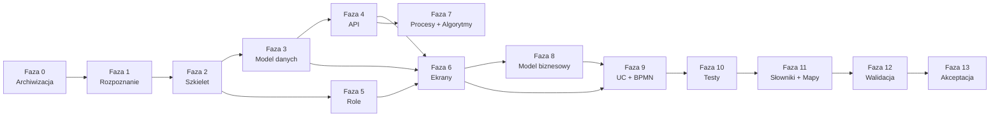

# PLAN — Dokumentacja projektu InvoiceJet (AOS)

## 1. Metryka dokumentu

| Pole | Wartość |
|---|---|
| Autor | Agent Claudiusz Sonte 4.6 max (rola: Agent-Orkiestrator) |
| Data | 2026-05-31 |
| Wersja | 3.0 |
| Status | Fala 4 ukonczona — dokumentacja kompletna |

### Rejestr zmian planu

| Wersja | Data | Autor | Opis |
|---|---|---|---|
| 0.1 | 2026-05-31 | Agent Claudiusz Sonte 4.6 max | Szkic na podstawie analizy projektu. |
| 1.0 | 2026-05-31 | Agent Claudiusz Sonte 4.6 max | Wersja zatwierdzona — plan rusza. |
| 2.0 | 2026-05-31 | Agent Claudiusz Sonte 4.6 max | **FAZA NAPRAWCZA** — audyt wykazał niezgodność z wytycznymi. Dodano kolejkę zadań naprawczych per faza. |
| 2.1 | 2026-05-31 | Agent Claudiusz Sonte 4.6 max | Fale 1+2 ukończone. Fala 3 w toku (T-08, T-10 running; T-09 complete). |
| 2.2 | 2026-05-31 | Agent Claudiusz Sonte 4.6 max | Fale 1+2+3 ukończone. Fala 4 uruchomiona (T-11, T-12 running). |
| 3.0 | 2026-05-31 | Agent Claudiusz Sonte 4.6 max | Wszystkie 13 zadań ukończone. Dokumentacja zgodna z wytycznymi. |

---

## 2. Status faz po audycie (2026-05-31)

| Faza | Opis | Status audytu | Priorytet naprawy |
|---|---|---|---|
| Faza 0 | Archiwizacja | ✅ Kompletna | — |
| Faza 1 | Rozpoznanie i inwentaryzacja | ✅ Kompletna | — |
| Faza 2 | Szkielet + szablony | ⚠️ Szablony mają zły prefiks (TEMPLATE_ zamiast SZABLON_), brakuje 16/20 szablonów | 🔴 WYSOKI |
| Faza 3 | Model danych | ✅ Naprawione — prawidłowa numeracja 01-06, erd_dbo.md, spis_dto.md | — |
| Faza 4 | API i integracje | ✅ Naprawione — lista_api.md, README, 02_systemy_dziedzinowe/ | — |
| Faza 5 | Role i uprawnienia | ✅ Naprawione — lista_uprawnien.md stworzony | — |
| Faza 6 | Ekrany | ✅ Naprawione — polska struktura, ekran.md per ekran, mapa_przejsc.md | — |
| Faza 7 | Procesy i algorytmy | ✅ Naprawione — podfoldery per proces/kategoria | — |
| Faza 8 | Model biznesowy | ✅ Naprawione — klasy biznesowe w klasy/, perspektywy/, aktorzy/ | — |
| Faza 9 | UC i BPMN | ✅ Naprawione — pełna struktura podfolderów UC + BPMN | — |
| Faza 10 | Testy | ✅ Naprawione — manualne/, automatyczne/, pokrycie/ | — |
| Faza 11 | Słowniki + Mapowania | ✅ Naprawione — 5 słowników + 9 map krzyżowych M-02..M-10 | — |
| Faza 12 | Walidacja | ❌ Nie zaczęta | — |
| Faza 13 | Akceptacja | ❌ Nie zaczęta | — |

---

## 3. KOLEJKA ZADAŃ NAPRAWCZYCH

### FALA 1 — Zadania niezależne (uruchamiane równolegle)

| ID | Zadanie | Agent | Status |
|---|---|---|---|
| T-01 | Stwórz 20 szablonów SZABLON_*.md wg spec (fix Fazy 2) | Agent-Szablonowy | ✅ Ukończone |
| T-02 | Stwórz 5 słowników S-01..S-05 (fix Fazy 11 — słowniki) | Agent-Słownikowy | ✅ Ukończone |
| T-03 | Stwórz lista_api.md, README dla 01_api_frontend, fix 02_systemy_dziedzinowe, lista_uprawnien.md | Agent-API+Roli | ✅ Ukończone |

### FALA 2 — Reorganizacja struktury (po Fali 1)

| ID | Zadanie | Agent | Status | Zależności |
|---|---|---|---|---|
| T-04 | Reorganizacja 01_ekrany/ — polskie foldery, struktura per-ekran | Agent-Ekranów | ✅ Ukończone | T-01 |
| T-05 | Reorganizacja 02_procesy/ — podfoldery per proces + proces.md | Agent-Procesów | ✅ Ukończone | T-01 |
| T-06 | Reorganizacja 03_algorytmy/ — kategorie + pliki algorytmów | Agent-Algorytmów | ✅ Ukończone | T-01 |
| T-07 | Fix 05_model_danych/ — renumeracja + brakujące pliki | Agent-ModelDanych | ✅ Ukończone | T-01 |

### FALA 3 — Treść merytoryczna (po Fali 2)

| ID | Zadanie | Agent | Status | Zależności |
|---|---|---|---|---|
| T-08 | Uzupełnij 07_use_case/ — pełna struktura podfolderów + pliki UC | Agent-UC | ✅ Ukończone | T-04 |
| T-09 | Uzupełnij 08_model_biznesowy/ — klasy biznesowe | Agent-ModelBiznesowy | ✅ Ukończone | T-07 |
| T-10 | Uzupełnij 09_procesy_biznesowe/ — BPMN (Mermaid flowchart) | Agent-BPMN | ✅ Ukończone | T-05 |

### FALA 4 — Nawigacja i walidacja (po Fali 3)

| ID | Zadanie | Agent | Status | Zależności |
|---|---|---|---|---|
| T-11 | Stwórz 10_testy/ — struktura + scenariusze testowe | Agent-Testów | ✅ Ukończone | T-08 |
| T-12 | Stwórz 9 map krzyżowych w _mapowania/ | Agent-Mapowań | ✅ Ukończone | T-08, T-09, T-10 |
| T-13 | Zaktualizuj INDEX.md + README wszystkich katalogów | Agent-Walidator | ✅ Ukończone | T-12 |

---

## 4. Diagram zależności faz (oryginalny — bez zmian)

---

## 5. Kontekst projektu (niezmieniony)

**Backend:** ASP.NET Core 8, EF Core 8, SQL Server, AutoMapper, BCrypt, JWT, QuestPDF  
**Frontend:** Angular 16, Angular Material  
**Encje DB:** 10 | **DTO:** 14 | **Endpointy:** 31 | **Ekrany:** 14 | **Role:** 1 (User)  
**Aktor:** Agent Claudiusz Sonte 4.6 max  
**Źródło prawdy:** Kod w `InvoiceJetAPI/` i `InvoiceJetUI/` + wytyczne w `wytyczne/`

---

## 6. Rejestr ryzyk (bez zmian)

| # | Ryzyko | Mitygacja |
|---|---|---|
| R-01 | Brak komentarzy w Angular — trudność logiki UI | Analiza HTML + TS, oznaczanie „Do ustalenia" |
| R-05 | Bug: GenerateInvoicePdf hardcoded InvoiceDocument | Odnotowanie w dokumentacji API |
| R-06 | Skala (~285 plików) — trudność ukończenia | Priorytetyzacja falami |

---

## 7. Punkty kontrolne dla właściciela

| # | Po fali/fazie | Co weryfikujesz |
|---|---|---|
| PK-1 | Po Fali 1 | Szablony SZABLON_*.md poprawne? Słowniki kompletne? |
| PK-2 | Po Fali 2 | Struktura ekranów, procesów, algorytmów zgodna ze spec? |
| PK-3 | Po Fali 3 | UC, BPMN, model biznesowy kompletne? |
| PK-4 | Po Fali 4 | Mapy krzyżowe poprawne? INDEX.md aktualny? |
