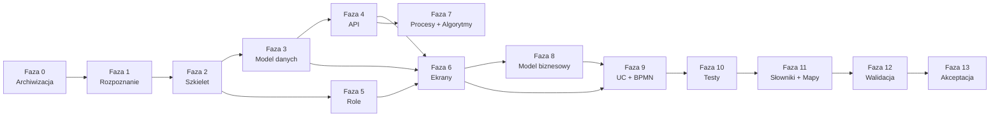

# PLAN — Dokumentacja projektu InvoiceJet (AOS)

## 1. Metryka dokumentu

| Pole | Wartość |
|---|---|
| Autor | Agent Claudiusz Sonte 4.6 max (rola: Agent-Orkiestrator) |
| Data | 2026-05-31 |
| Wersja | 1.0 |
| Status | Zatwierdzony do realizacji |

### Rejestr zmian planu

| Wersja | Data | Autor | Opis |
|---|---|---|---|
| 0.1 | 2026-05-31 | Agent Claudiusz Sonte 4.6 max | Szkic na podstawie analizy projektu. |
| 1.0 | 2026-05-31 | Agent Claudiusz Sonte 4.6 max | Wersja zatwierdzona — plan rusza. |

---

## 2. Streszczenie wykonawcze

Projekt InvoiceJet to aplikacja do wystawiania faktur, zbudowana na backendzie ASP.NET Core 8 i frontendzie Angular 16. Aplikacja obsługuje jeden typ użytkownika (rola `User`) i umożliwia zarządzanie firmami, klientami, produktami, kontami bankowymi, seriami dokumentów, oraz wystawianie i eksport do PDF trzech typów dokumentów: faktura, faktura proforma, faktura storno.

Celem projektu dokumentacyjnego AOS jest stworzenie **kompletnej, spójnej i czytelnej dla człowieka oraz RAG-u** dokumentacji techniczno-biznesowej całego systemu — od schematu bazy danych, przez kontrakty API i logikę procesów, po ekrany Angular i diagramy BPMN.

Dokumentacja powstaje **od zera**, w katalogu `doc_AI/`, zgodnie z wytycznymi z `wytyczne/`. Stara dokumentacja (gałąź git `docs/aos-backend-p11-p19`) jest zarchiwizowana i nieobowiązująca.

**Filary:**
1. Kod jest jedynym źródłem prawdy — żadnej nadinterpretacji.
2. Porządek od dołu do góry: DB → DTO → API → ekrany → UC → BPMN.
3. Każdy artefakt jest powiązany z co najmniej jednym innym.
4. Dokumenty małe, precyzyjne, gotowe do wklejenia do RAG.

**Szacowana liczba dokumentów:** ~180–220 plików Markdown.

---

## 3. Diagram zależności faz

---

## 4. Szczegółowy opis faz

### Faza 0 — Archiwizacja ✅ ZAKOŃCZONA

| Pole | Wartość |
|---|---|
| Cel | Odcięcie się od starej dokumentacji |
| Agent | Agent-Archiwista (Claudiusz Sonte 4.6 max) |
| Wejścia | Stara dokumentacja w `InvoiceJetAPI/docs/` |
| Wyjścia | `archiwum/README.md`, `archiwum/_raport_archiwizacji.md` |
| DoD | Archiwum założone, stara dokumentacja oznaczona jako nieobowiązująca |
| Złożoność | S |
| Status | ✅ Zakończona 2026-05-31 |

**Uwaga:** Stara dokumentacja pozostaje w historii git (gałąź `docs/aos-backend-p11-p19`). Fizyczne kopiowanie plików nie było konieczne — archiwum zawiera raport z lokalizacją.

---

### Faza 1 — Rozpoznanie projektu ✅ ZAKOŃCZONA

| Pole | Wartość |
|---|---|
| Cel | Ustalenie stosu technologicznego i inwentaryzacja artefaktów |
| Agent | Agent-Eksplorator (Claudiusz Sonte 4.6 max) |
| Wejścia | Kod projektu (InvoiceJetAPI + InvoiceJetUI) |
| Wyjścia | `doc_AI/00_meta/02_stos_technologiczny.md`, `doc_AI/00_meta/05_drzewo_projektu.md`, pliki `doc_AI/_mapowania/inwentaryzacja_*.md` |
| DoD | Każdy typ artefaktu ma listę inwentaryzacyjną |
| Złożoność | M |
| Zależności | Faza 0 |
| Status | ✅ Zakończona — wyniki wbudowane w fazy dalsze |

**Wyniki rozpoznania:**
- **Backend:** ASP.NET Core 8, EF Core 8, SQL Server, AutoMapper, BCrypt, JWT, QuestPDF, Scrutor
- **Frontend:** Angular 16, Angular Material, ng2-charts (Chart.js), ngx-toastr, @auth0/angular-jwt
- **Encje DB:** 10 (User, Firm, BankAccount, UserFirm, Product, DocumentType, DocumentSeries, Document, DocumentProduct, DocumentStatus)
- **DTO:** ~15 klas w `InvoiceJet.Application/DTOs/`
- **Endpointy API:** 31 (5 kontrolerów)
- **Ekrany Angular:** 16 tras (13 unikalnych komponentów ekranowych + 3 modale dialogowe)
- **Serwisy Angular:** 8 (auth, firm, product, bank-account, document-series, document, sidebar, user)
- **Role:** 1 (`User`)
- **Wyjątki domenowe:** 12 klas w `InvoiceJet.Domain/Exceptions/`

---

### Faza 2 — Szkielet katalogów i szablony ✅ W TOKU

| Pole | Wartość |
|---|---|
| Cel | Stworzenie pełnej struktury `doc_AI/` |
| Agent | Agent-Szablonowy (Claudiusz Sonte 4.6 max) |
| Wejścia | `wytyczne/02_struktura_dokumentacji.md`, `wytyczne/03_szablony_dokumentow.md` |
| Wyjścia | Szkielet `doc_AI/` z README.md w każdym katalogu, szablony w `doc_AI/_szablony/` |
| DoD | Każdy katalog z wytycznych istnieje i ma README |
| Złożoność | M |
| Zależności | Faza 1 |

---

### Faza 3 — Model danych

| Pole | Wartość |
|---|---|
| Cel | Kompletny opis warstwy danych |
| Agent | Agent-Dokumentalista-Modelu-Danych (Claudiusz Sonte 4.6 max) |
| Wejścia | `InvoiceJetDbContextModelSnapshot.cs`, pliki DTO, profile AutoMapper |
| Wyjścia | `doc_AI/05_model_danych/` — 10 dokumentów tabel, ~15 dokumentów DTO, 7 profili AutoMapper, ERD |
| DoD | Każda encja i DTO mają dokument. ERD globalny istnieje. |
| Złożoność | L |
| Zależności | Faza 2 |

**Podfazy:**
- 3a: Schemat DB (10 tabel, 1 schema `dbo`)
- 3b: DTO (~15 klas)
- 3c: LINQ (zapytania w repozytoriach i serwisach)
- 3d: AutoMapper (7 profili)
- 3e: Skrypty (DbSeeder)

---

### Faza 4 — API i integracje

| Pole | Wartość |
|---|---|
| Cel | Opis 31 endpointów API + integracja ANAF |
| Agent | Agent-Dokumentalista-API (Claudiusz Sonte 4.6 max) |
| Wejścia | Kontrolery ASP.NET Core, serwisy Angular, gotowy model danych (faza 3) |
| Wyjścia | `doc_AI/04_api_i_integracje/` — 31 dokumentów endpointów + 1 dokument ANAF |
| DoD | Każdy endpoint ma dokument z żądaniem, odpowiedzią, danymi testowymi |
| Złożoność | XL |
| Zależności | Faza 3 |

**Podfazy:**
- 4a: 31 endpointów (AuthController 2, FirmController 7, ProductController 4, BankAccountController 4, DocumentSeriesController 4, DocumentController 10)
- 4b: ANAF (integracja zewnętrzna)

---

### Faza 5 — Role i uprawnienia

| Pole | Wartość |
|---|---|
| Cel | Opis ról, uprawnień, macierzy |
| Agent | Agent-Dokumentalista-Ról-i-Uprawnień (Claudiusz Sonte 4.6 max) |
| Wejścia | `Program.cs`, `ExceptionMiddleware.cs`, atrybut `[Authorize(Roles = "User")]` |
| Wyjścia | `doc_AI/06_role_i_uprawnienia/` — `lista_rol.md`, `User.md`, `macierz_role_uprawnienia.md` |
| DoD | Wszystkie dokumenty ról i macierz istnieją |
| Złożoność | S |
| Zależności | Faza 2 |

---

### Faza 6 — Ekrany

| Pole | Wartość |
|---|---|
| Cel | Opis 16 tras (13 komponentów ekranowych) Angular |
| Agent | Agent-Dokumentalista-Ekranow (Claudiusz Sonte 4.6 max) |
| Wejścia | Pliki `.component.ts`, `.component.html`, routing, gotowe API (faza 4), DTO (faza 3) |
| Wyjścia | `doc_AI/01_ekrany/` — komplet dokumentów ekranów |
| DoD | Każdy ekran z inwentaryzacji ma katalog z `ekran.md` |
| Złożoność | XL |
| Zależności | Fazy 3, 4, 5 |

**Podfazy:**
- 6a: Wspólne (navbar, sidebar, TokenExpiredDialog)
- 6b: Mapa przejść (`mapa_przejsc.md`)
- 6c: Ekrany właściwe (login, register, dashboard, firm-details, clients, bank-accounts, products, document-series, invoices, add-invoice, invoice-proformas, invoice-stornos, pdf-viewer)

---

### Faza 7 — Procesy i algorytmy

| Pole | Wartość |
|---|---|
| Cel | Opis procesów technicznych i algorytmów |
| Agenci | Agent-Dokumentalista-Procesow + Agent-Dokumentalista-Algorytmow |
| Złożoność | XL |
| Zależności | Faza 4 |

**Procesy do opisania:** rejestracja, logowanie, dodawanie firmy, pobieranie z ANAF, edycja firmy, zarządzanie klientami, zarządzanie produktami, zarządzanie kontami bankowymi, zarządzanie seriami dokumentów, dodawanie/edycja/usuwanie dokumentów, generowanie PDF, dashboard, transformacja na storno.

**Algorytmy do opisania:** walidacja hasła (regex), hashowanie BCrypt, walidacja JWT, generowanie PDF przez wzorzec fabryki, obliczanie wartości dokumentu.

---

### Faza 8 — Model biznesowy

| Pole | Wartość |
|---|---|
| Cel | Diagram klas biznesowych i opis aktorów |
| Złożoność | M |
| Zależności | Fazy 3, 5 |

---

### Faza 9 — UC i BPMN

| Pole | Wartość |
|---|---|
| Cel | Przypadki użycia per ekran + diagramy BPMN |
| Złożoność | XL |
| Zależności | Faza 6 |

---

### Faza 10 — Testy

| Pole | Wartość |
|---|---|
| Cel | Scenariusze testowe i mapy pokrycia |
| Złożoność | L |
| Zależności | Faza 9 |

---

### Faza 11 — Słowniki, mapowania, README katalogów

| Pole | Wartość |
|---|---|
| Cel | Finalizacja warstwy nawigacyjnej |
| Złożoność | M |
| Zależności | Wszystkie poprzednie |

---

### Fazy 12–13 — Walidacja i akceptacja

| Pole | Wartość |
|---|---|
| Złożoność | S / S |
| Zależności | Faza 11 |

---

## 5. Macierz odpowiedzialności (RACI)

| Faza | Claudiusz Sonte 4.6 max | Właściciel projektu |
|---|---|---|
| 0 Archiwizacja | **R** | I |
| 1 Rozpoznanie | **R** | C |
| 2 Szkielet | **R** | I |
| 3 Model danych | **R** | C |
| 4 API | **R** | C |
| 5 Role | **R** | C |
| 6 Ekrany | **R** | C |
| 7 Procesy | **R** | C |
| 8 Model biznesowy | **R** | C |
| 9 UC + BPMN | **R** | **A** |
| 10 Testy | **R** | C |
| 11 Słowniki | **R** | C |
| 12 Walidacja | **R** | **A** |
| 13 Akceptacja | C | **A/R** |

R = Responsible (wykonuje), A = Accountable (odpowiada za wynik), C = Consulted, I = Informed.

---

## 6. Lista deliverables

| Artefakt | Liczba | Faza | Lokalizacja |
|---|---|---|---|
| Pliki wytycznych | 8 | 0 | `wytyczne/` |
| Raport archiwizacji | 1 | 0 | `archiwum/` |
| Stos technologiczny | 1 | 1 | `doc_AI/00_meta/` |
| Drzewo projektu | 1 | 1 | `doc_AI/00_meta/` |
| Listy inwentaryzacyjne | ~12 | 1 | `doc_AI/_mapowania/` |
| Szkielet katalogów + README | ~30 | 2 | `doc_AI/` |
| Szablony | 14 | 2 | `doc_AI/_szablony/` |
| Dokumenty tabel DB | 10 | 3a | `doc_AI/05_model_danych/01_db/` |
| ERD | 2 | 3a | `doc_AI/05_model_danych/01_db/` |
| Dokumenty DTO | ~15 | 3b | `doc_AI/05_model_danych/02_dto/` |
| Dokumenty LINQ | ~10 | 3c | `doc_AI/05_model_danych/03_linq/` |
| Profile AutoMapper | 7 | 3d | `doc_AI/05_model_danych/05_automapper/` |
| Skrypty (DbSeeder) | 1 | 3e | `doc_AI/05_model_danych/06_skrypty/` |
| Dokumenty endpointów API | 31 | 4a | `doc_AI/04_api_i_integracje/01_api_frontend/` |
| Integracja ANAF | 1 | 4b | `doc_AI/04_api_i_integracje/02_systemy_dziedzinowe/` |
| Dokumenty ról | 3 | 5 | `doc_AI/06_role_i_uprawnienia/` |
| Dokumenty ekranów | ~40 | 6 | `doc_AI/01_ekrany/` |
| Mapa przejść | 1 | 6 | `doc_AI/01_ekrany/` |
| Dokumenty procesów | ~15 | 7 | `doc_AI/02_procesy/` |
| Dokumenty algorytmów | ~10 | 7 | `doc_AI/03_algorytmy/` |
| Model biznesowy | ~8 | 8 | `doc_AI/08_model_biznesowy/` |
| Diagramy UC | ~10 | 9 | `doc_AI/07_use_case/` |
| Diagramy BPMN | ~8 | 9 | `doc_AI/09_procesy_biznesowe/` |
| Scenariusze testowe | ~30 | 10 | `doc_AI/10_testy/` |
| Słowniki | 5 | 11 | `doc_AI/_slowniki/` |
| Mapy krzyżowe | ~10 | 11 | `doc_AI/_mapowania/` |
| **RAZEM (szacunek)** | **~285** | — | `doc_AI/` |

---

## 7. Rejestr ryzyk

| # | Ryzyko | P | W | Mitygacja | Właściciel |
|---|---|---|---|---|---|
| R-01 | Brak komentarzy w kodzie Angular — trudność ustalenia logiki UI | Ś | Ś | Analiza kodu komponentów + HTML, ostrożne oznaczanie „Do ustalenia" | Agent |
| R-02 | Generowane pliki PDF — brak możliwości podglądu renderu w RAG | W | N | Dokumentujemy logikę generowania, nie wygląd PDF | Agent |
| R-03 | `appsettings.json` ma puste sekrety (`Token`, `ProdConnection`) | N | N | Odnotowujemy w dokumentacji — mechanizm env vars | Agent |
| R-04 | 3 wyjątki niemapowane w ExceptionMiddleware → 500 zamiast 400 | N | Ś | Odnotowanie jako anomalia w dokumentach API i algorytmów | Agent |
| R-05 | `GenerateInvoicePdf` (API-28) hardcoded `InvoiceDocument` — bug | N | Ś | Odnotowanie bug w doc. API i algorytmów | Agent |
| R-06 | Liczba dokumentów (~285) — trudność ukończenia w jednej sesji | W | Ś | Priorytetyzacja: DB → DTO → API → Ekrany → reszta | Agent |
| R-07 | Brak testów w projekcie — faza 10 oparta na scenariuszach, nie kodzie | Ś | N | Scenariusze tworzone na bazie UC i logiki biznesowej | Agent |

P/W: N=niskie, Ś=średnie, W=wysokie.

---

## 8. Punkty kontrolne dla właściciela projektu

| # | Po fazie | Co weryfikujesz | Produkt do oceny |
|---|---|---|---|
| PK-1 | Faza 2 | Czy szkielet `doc_AI/` jest zgodny z oczekiwaniami? Czy nazwy katalogów są czytelne? | `doc_AI/README.md` + wszystkie README podkatalogów |
| PK-2 | Faza 3 | Czy opis tabel DB jest kompletny i zgodny z rzeczywistym schematem? | `doc_AI/05_model_danych/01_db/` + `erd_globalny.md` |
| PK-3 | Faza 4 | Czy kontrakty API są poprawne? Czy przykłady JSON są realistyczne? | `doc_AI/04_api_i_integracje/01_api_frontend/lista_api.md` |
| PK-4 | Faza 6 | Czy ekrany są opisane wystarczająco? Czy pola linkują do DTO i DB? | `doc_AI/01_ekrany/mapa_przejsc.md` + losowe 3 ekrany |
| PK-5 | Faza 12 | Raport walidacyjny — czy brak krytycznych niezgodności? | `doc_AI/_mapowania/raport_walidacji.md` |

---

## 9. Decyzje do podjęcia przez właściciela projektu

### D-01: Linkowanie do plików kodu — format linków

**Kontekst:** wytyczne mówią o linkach względnych. Pliki kodu leżą w `InvoiceJetAPI/` i `InvoiceJetUI/`, dokumentacja w `doc_AI/`. Linki relative byłyby długie (`../../InvoiceJetAPI/...`).

**Opcje:**
1. Linki względne (zgodnie z wytycznymi).
2. Ścieżki bezwzględne od roota repo (`InvoiceJetAPI/...`).
3. Brak linków do kodu — tylko opis kotwicy (np. `AuthController.cs › AuthController.Register`).

**Rekomendacja:** Opcja 3 — kotwice w formacie `Plik.cs › Klasa.Metoda`. Jest czytelna, nie zależy od struktury katalogów, dobrze działa w RAG.

**Konsekwencja wyboru:** Opcja 1 — dużo pisania, łamie się przy restrukturyzacji. Opcja 3 — prostota, wymaga odszukania pliku ręcznie.

---

### D-02: Zakres dokumentacji ekranów — pola wewnętrzne vs. tylko UI-facing

**Kontekst:** Komponenty Angular mają wiele pól wewnętrznych (zmienne stanu, flagi ładowania, subskrypcje RxJS). Czy dokumentujemy wszystkie czy tylko pola widoczne w szablonie HTML?

**Opcje:**
1. Tylko pola z `ekran.html` (widoczne w UI).
2. Wszystkie pola publiczne komponentu `.ts`.
3. Pola UI + zmienne stanu istotne dla logiki.

**Rekomendacja:** Opcja 3 — UI + istotne zmienne stanu (np. `isLoading`, `selectedItems`).

---

### D-03: BPMN — narzędzie do tworzenia diagramów

**Kontekst:** wytyczne wymagają BPMN 2.0 (pliki `.bpmn` + render PNG/SVG). Tworzenie plików `.bpmn` wymaga narzędzia (np. draw.io, Camunda Modeler).

**Opcje:**
1. Pliki `.bpmn` + render (zgodnie z wytycznymi).
2. Mermaid `flowchart` zamiast BPMN (uproszczenie).
3. ASCII-art BPMN inline.

**Rekomendacja:** Opcja 2 (Mermaid flowchart) dla bieżącej iteracji. Pełne BPMN jako planowane rozszerzenie po akceptacji.

**Konsekwencja:** Wymaga aktualizacji wytycznych (odstępstwo od RO-01 dla sekcji 09).

---

### D-04: Język terminu „AOS"

**Kontekst:** nazwa „AOS" nie jest wyjaśniona w wytycznych ani w kodzie.

**Rekomendacja do potwierdzenia:** AOS = „Analiza i Opis Systemu" — wewnętrzny termin projektu dokumentacyjnego.

---

## 10. Założenia robocze

| # | Założenie | Do walidacji przez właściciela |
|---|---|---|
| Z-01 | Projekt ma jeden deployment — backend pod `https://localhost:XXXX`, frontend pod `http://localhost:4200` | Tak |
| Z-02 | Baza danych to SQL Server LocalDB / Express w środowisku deweloperskim | Tak |
| Z-03 | Jedyna rola to `User` — brak ról admin, moderator, system | Tak — sprawdzone w kodzie |
| Z-04 | Frontend `InvoiceJetUI` łączy się wyłącznie z `InvoiceJetAPI` — brak innych usług | Tak — sprawdzone w `environment.ts` |
| Z-05 | ANAF to zewnętrzne API rumuńskiego rejestru firm — brak autentykacji | Tak — sprawdzone w `appsettings.json` |
| Z-06 | `doc_AI/` zastępuje `docs/` z wytycznych — wszystkie odniesienia do `docs/` czytamy jako `doc_AI/` | Tak — decyzja właściciela |
| Z-07 | Nazwa agenta: „Agent Claudiusz Sonte 4.6 max" zamiast „Agent Codex 5.5 (bardzo wysoki)" z wytycznych | Tak — decyzja właściciela |
| Z-08 | Brak scenariuszy testowych w kodzie — faza 10 tworzy je od zera na bazie UC | Tak |
| Z-09 | Projekt nie ma i18n — polska dokumentacja odpowiada UI, które jest w języku rumuńskim/angielskim w kodzie, ale po polsku w dokumentacji | Do potwierdzenia |

---

## Notatka Agenta-Orkiestratora po przygotowaniu planu

### 1. Niejasności w wytycznych i ich interpretacja

**Wytyczna: „Zakaz czytania starej dokumentacji"** — stara dokumentacja jest w historii git, nie w systemie plików. Zinterpretowano: nie czytamy jej podczas tworzenia nowej. Git log pozostaje dostępny na wypadek konieczności weryfikacji, ale nie jako źródło treści.

**Wytyczna: `docs/` jako katalog docelowy** — właściciel zdecydował o nazwie `doc_AI/`. Wszystkie odniesienia w wytycznych do `docs/` zastąpiono `doc_AI/`. Prośba o potwierdzenie (D-06, Z-06).

**Wytyczna: BPMN 2.0 w sekcji 09** — tworzenie plików `.bpmn` wymaga zewnętrznego toolingu niedostępnego w sesji agenta. Zaproponowano Mermaid flowchart jako substytut (D-03).

### 2. Odkrycia z analizy projektu wpływające na plan

1. **Projekt ma frontend i backend** — wytyczne były pisane dla aplikacji webowej, ale dominujące przykłady dotyczyły backendu. Rozszerzono zakres ekranów o Angular.
2. **Bug w `PdfGenerationService.GenerateInvoicePdf`** — API-28 zawsze generuje layout faktury zwykłej niezależnie od `DocumentType`. Odnotowane jako ryzyko R-05 i wejdzie do dokumentacji API.
3. **3 wyjątki niemapowane w ExceptionMiddleware** → 500 zamiast 400. Wejdą do dokumentacji jako anomalie.
4. **Jeden typ użytkownika (`User`)** — sekcja ról będzie prosta (3 dokumenty), ale macierz uprawnień musi być kompletna.
5. **Aplikacja rumuńska** — nazwa firmy `Facturila` (faktury po rumuńsku), integracja z rumuńskim ANAF. Dokumentacja po polsku (zgodnie z ZZ-01), ale nazwy z kodu 1:1.

### 3. Rekomendacja: który agent rusza jako pierwszy

**Agent-Szablonowy** (Faza 2) rusza natychmiast po zaakceptowaniu tego planu.

Konkretne zadanie:
- Folder: `doc_AI/` w roocie projektu
- Pliki: README.md w każdym z 14 podkatalogów wg `wytyczne/02_struktura_dokumentacji.md`
- Kryterium zakończenia: `doc_AI/README.md` istnieje + każdy katalog `01_ekrany/` … `_szablony/` ma `README.md` z sekcją „Opis biznesowy: [do uzupełnienia]" i pustym drzewem

Po Fazie 2 równolegle startują:
- **Agent-Dokumentalista-Modelu-Danych** (Faza 3) — zaczyna od `dbo.User.md`
- **Agent-Dokumentalista-Ról-i-Uprawnień** (Faza 5) — prosta, 3 pliki

### 4. Ocena kompletności wytycznych

Wytyczne są **dobrze skonstruowane i kompletne** dla typowego projektu webowego. Wymagają jednego uzupełnienia przed startem:

**Brakujące w wytycznych:** konwencja dokumentowania komponentów Angular (`.component.ts` + `.component.html` + ewentualny service). Wytyczne były nastawione na backend. Propozycja: dodać do `wytyczne/02_struktura_dokumentacji.md` sekcję o podkatalogach komponentów Angular (analogiczna do sekcji D o ekranach, ale z osobnym szablonem dla TypeScript + HTML).

Poza tym wytyczne są gotowe do produkcji.
