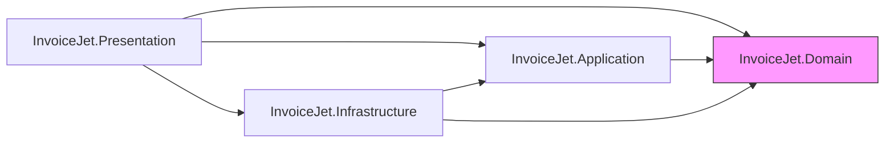

# Architektura aplikacji

| Atrybut | Wartość |
|---|---|
| Ostatnia walidacja | 2026-05-31 |
| Autor | Agent Claudiusz Sonte 4.6 max |
| Źródło | `*.csproj`, `Program.cs`, eksploracja katalogów |

## 1. Wzorzec architektoniczny

**Clean Architecture** — 4 warstwy z jawną hierarchią zależności:

```
Presentation → Application → Domain ← Infrastructure
```

Warstwa zewnętrzna może zależeć od wewnętrznej, ale nie odwrotnie. `Domain` nie zależy od niczego.

---

## 2. Warstwy backendu

### 2.1 `InvoiceJet.Domain` — Warstwa domenowa

**Projekt:** `InvoiceJet.Domain.csproj`  
**Brak zależności do innych projektów projektu.**

Zawiera:
- **Modele:** `User`, `Firm`, `BankAccount`, `UserFirm`, `Product`, `DocumentType`, `DocumentSeries`, `Document`, `DocumentProduct`, `DocumentStatus`
- **Interfejsy repozytoriów:** `IGenericRepository<T>`, `IUnitOfWork`, repozytoria specjalizowane
- **Wyjątki domenowe:** `UserAlreadyExistsException`, `UserNotFoundException`, `InvalidPasswordException`, `PasswordMismatchException`, `IncorrectPasswordException`, `UserHasNoAssociatedFirmException`, `NoBankAccountAddedException` i inne
- **Enumeracje:** `DocumentStatusEnum`, `DocumentTypeEnum`, `CurrencyEnum`

---

### 2.2 `InvoiceJet.Application` — Warstwa aplikacyjna

**Projekt:** `InvoiceJet.Application.csproj`  
**Zależy od:** `InvoiceJet.Domain`

Zawiera:
- **Serwisy (interfejsy):** `IAuthService`, `IFirmService`, `IBankAccountService`, `IProductService`, `IDocumentSeriesService`, `IDocumentService`, `IPdfGenerationService`, `IUserService`
- **Serwisy (implementacje):** `AuthService`, `FirmService`, `BankAccountService`, `ProductService`, `DocumentSeriesService`, `DocumentService`, `UserService`
- **DTO (14 klas):** patrz [inwentaryzacja_dto.md](../_mapowania/inwentaryzacja_dto.md)
- **Profile AutoMapper (7):** patrz [inwentaryzacja_automappera.md](../_mapowania/inwentaryzacja_automappera.md)

---

### 2.3 `InvoiceJet.Infrastructure` — Warstwa infrastrukturalna

**Projekt:** `InvoiceJet.Infrastructure.csproj`  
**Zależy od:** `InvoiceJet.Application`, `InvoiceJet.Domain`

Zawiera:
- **DbContext:** `InvoiceJetDbContext` — konfiguracja EF Core, `OnModelCreating`, seed
- **Repozytoria:** `GenericRepository<T>`, repozytoria specjalizowane (`FirmRepository`, `DocumentRepository`, `DocumentProductRepository`, `DocumentSeriesRepository`, `BankAccountRepository`, `ProductRepository`, `UserRepository`)
- **Unit of Work:** `UnitOfWork` — agreguje repozytoria, `CompleteAsync()` = `SaveChangesAsync()`
- **Seedery:** `DbSeeder` — seeduje `DocumentType` (3 rekordy) i `DocumentStatus` (2 rekordy) przy starcie
- **PDF Services:** `PdfGenerationService` — implementacja `IPdfGenerationService` przez QuestPDF
- **Factories (zakomentowane):** `IDocumentFactory`, `InvoiceDocumentFactory`, `ProformaDocumentFactory`, `DocumentFactoryProvider` — martwy kod

---

### 2.4 `InvoiceJet.Presentation` — Warstwa prezentacji

**Projekt:** `InvoiceJet.Presentation.csproj`  
**Zależy od:** `InvoiceJet.Application`, `InvoiceJet.Domain`, `InvoiceJet.Infrastructure`

Zawiera:
- **Kontrolery (6):** `AuthController`, `FirmController`, `BankAccountController`, `ProductController`, `DocumentSeriesController`, `DocumentController`
- **Middleware:** `ExceptionMiddleware` — obsługuje wyjątki domenowe i mapuje na odpowiednie statusy HTTP
- **Program.cs:** konfiguracja DI, middleware pipeline, CORS, JWT, EF Core, Swagger

---

## 3. Diagram zależności warstw



---

## 4. Frontend (Angular 16)

### Struktura Angular

```
src/app/
├── app.component.ts          ← Root component (shell)
├── app.module.ts             ← Root module (NgModule)
├── app-routing.module.ts     ← Routing (17 tras)
│
├── components/               ← Komponenty UI
│   ├── login/
│   ├── register/
│   ├── dashboard/
│   ├── navbar/
│   ├── sidebar/
│   ├── firm/ (firm-details, clients, bank-accounts, add-edit dialogi)
│   ├── products/
│   ├── document-series/
│   ├── invoices/ (list, add-or-edit, base-invoice)
│   ├── invoice-proformas/
│   ├── invoice-stornos/
│   ├── pdf-viewer/
│   └── token-expired-dialog/
│
├── services/                 ← Serwisy HTTP i logika
│   ├── auth.service.ts
│   ├── firm.service.ts
│   ├── bank-account.service.ts
│   ├── product.service.ts
│   ├── document-series.service.ts
│   ├── document.service.ts
│   ├── sidebar.service.ts
│   ├── user.service.ts
│   └── interceptor/
│       ├── auth.interceptor.ts   ← Dodaje Bearer token do każdego żądania
│       └── error.interceptor.ts  ← Obsługuje błędy 400/401/404/500
│
├── models/                   ← Interfejsy TypeScript (17 interfejsów + 1 enum)
│
├── guards/
│   └── auth.guard.ts         ← Sprawdza isLoggedIn() przez JwtHelperService
│
└── environments/
    ├── environment.ts         ← apiUrl: localhost:7229
    └── environment.prod.ts    ← apiUrl: invoicejetapi.azurewebsites.net
```

---

## 5. Przepływ żądania HTTP

```
Angular Component
  → HttpClient (z Bearer token przez AuthInterceptor)
  → [ErrorInterceptor obsługuje odpowiedzi błędów]
  → ASP.NET Core Web API
     → ExceptionMiddleware (top-level try/catch)
     → Authentication middleware (JWT validation)
     → Authorization middleware ([Authorize])
     → Controller
     → Service (Application layer)
     → Repository / UnitOfWork (Infrastructure layer)
     → EF Core → SQL Server
     ← Odpowiedź mapowana przez AutoMapper
  ← JSON response
Angular Component (subskrypcja Observable)
```

---

## 6. Mechanizm obsługi wyjątków

### Backend (ExceptionMiddleware)

Centralny try/catch w middleware. Mapowanie wyjątków domenowych na kody HTTP:

| Wyjątek | Status HTTP |
|---|---|
| `UserAlreadyExistsException` | 409 Conflict |
| `UserNotFoundException` | 404 Not Found |
| `InvalidPasswordException` | 400 Bad Request |
| `PasswordMismatchException` | 400 Bad Request |
| `IncorrectPasswordException` | 400 Bad Request |
| `UserHasNoAssociatedFirmException` | 400 Bad Request |
| `NoBankAccountAddedException` | 400 Bad Request |
| Pozostałe wyjątki | 500 Internal Server Error |

> **Uwaga:** `DocumentController.GenerateDocument` (API-28) ma własny try/catch i omija ExceptionMiddleware.

### Frontend (ErrorInterceptor)

| Status HTTP | Akcja Angular |
|---|---|
| 400 | `toastr.error(message, "Error")` |
| 401 | `toastr.error("Session has expired", "Unauthorized")` |
| 404 | `toastr.error(message, "Not Found")` |
| 500 | `toastr.error(message, "Error")` |
| Inne | `toastr.error("An unexpected error has occurred.", "Unexpected Error")` |

---

## Rejestr zmian

| Wersja | Data | Autor | Opis |
|---|---|---|---|
| 1.0 | 2026-05-31 | Agent Claudiusz Sonte 4.6 max | Dokumentacja architektury na podstawie eksploracji kodu. |
