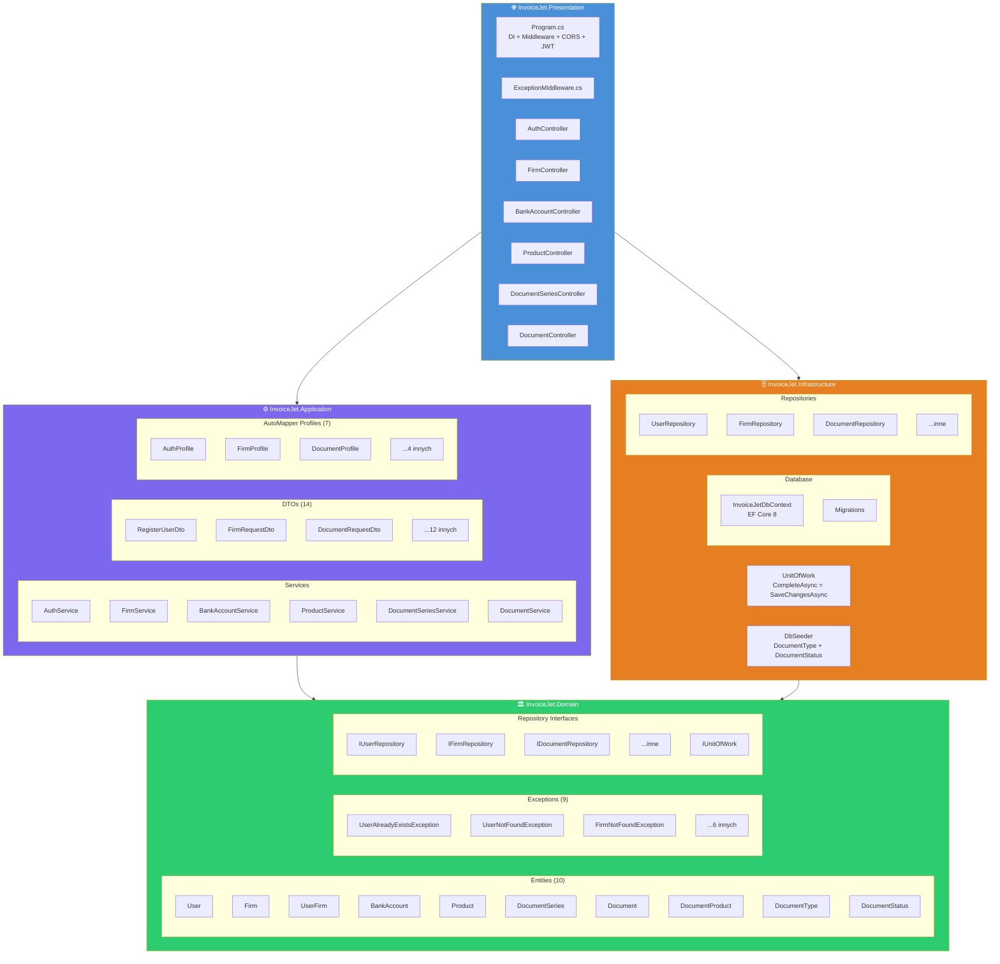

# Diagram Clean Architecture — InvoiceJet

| Atrybut | Wartość |
|---|---|
| Ostatnia walidacja | 2026-05-31 |
| Autor | Agent Claudiusz Sonte 4.6 max |

## Warstwy projektu



## HTTP Request Pipeline

```
HTTP Request
    ↓
[HTTPS Redirection]
    ↓
[CORS: localhost:4200]
    ↓
[Authentication: JwtBearer]
    ↓
[Authorization: [Authorize]]
    ↓
[ExceptionMiddleware] ← przechwytuje wszystkie wyjątki
    ↓
[Controller] → [Service] → [Repository] → [DB]
    ↓
HTTP Response (200/201/400/401/404/409/500)
```

## Dependency Injection (Program.cs)

```
Scoped:
  IUnitOfWork → UnitOfWork
  IAuthService → AuthService
  IFirmService → FirmService
  IBankAccountService → BankAccountService
  IProductService → ProductService
  IDocumentSeriesService → DocumentSeriesService
  IDocumentService → DocumentService

Singleton:
  AutoMapper (AddAutoMapper)
  
HttpClient:
  IHttpClientFactory (dla ANAF API)
```

## Rejestr zmian

| Wersja | Data | Autor | Opis |
|---|---|---|---|
| 1.0 | 2026-05-31 | Agent Claudiusz Sonte 4.6 max | Dokument wstępny. |
