# Mapa przejść między ekranami

| Pole | Wartość |
|---|---|
| ID dokumentu | META-MapaPrzejsc |
| Typ dokumentu | mapa nawigacji |
| Wersja | 0.1 |
| Status | szkic |
| Autor (ostatnia modyfikacja) | Agent Claudiusz Sonte 4.6 max |
| Data ostatniej modyfikacji | 2026-05-31 |

## Streszczenie

Diagram przepływu nawigacyjnego aplikacji InvoiceJet. Przedstawia wszystkie możliwe przejścia między ekranami wraz ze ścieżkami URL i wymaganymi rolami. Ekrany publiczne (login, register) nie wymagają autoryzacji. Wszystkie ekrany wewnątrz `/dashboard/` chronione są przez `AuthGuard` (rola: User).

## Diagram przejść

```mermaid
flowchart TD
    subgraph Publiczne["Ekrany publiczne (bez AuthGuard)"]
        LOGIN[/"Login\n/login"/]
        REGISTER[/"Register\n/register"/]
    end

    subgraph Dashboard["Ekrany chronione (AuthGuard — rola: User)"]
        DASH[/"Dashboard\n/dashboard"/]

        subgraph Firma["Grupa: Firma"]
            DANE_FIRMY[/"Dane firmy\n/dashboard/firm-details"/]
            KLIENCI[/"Klienci\n/dashboard/clients"/]
            KONTA[/"Konta bankowe\n/dashboard/bank-accounts"/]
        end

        PRODUKTY[/"Produkty\n/dashboard/products"/]
        SERIE[/"Serie dokumentów\n/dashboard/document-series"/]

        subgraph Faktury["Dokumenty — Faktury"]
            LISTA_FAK[/"Lista faktur\n/dashboard/invoices"/]
            DODAJ_FAK[/"Formularz faktury\n/dashboard/add-invoice\n/dashboard/edit-invoice/:id"/]
        end

        subgraph Proformy["Dokumenty — Proformy"]
            LISTA_PRO[/"Lista proform\n/dashboard/invoice-proformas"/]
            DODAJ_PRO[/"Formularz proformy\n/dashboard/add-invoice-proforma\n/dashboard/edit-invoice-proforma/:id"/]
        end

        subgraph Storna["Dokumenty — Storna"]
            LISTA_STO[/"Lista storn\n/dashboard/invoice-stornos"/]
            DODAJ_STO[/"Formularz storna\n/dashboard/edit-invoice-storno/:id"/]
        end
    end

    subgraph Modale["Modale (otwierane z ekranów)"]
        M_KLIENT["Modal: Dodaj/Edytuj klienta"]
        M_KONTO["Modal: Dodaj/Edytuj konto bankowe"]
        M_PRODUKT["Modal: Dodaj/Edytuj produkt"]
        M_SERIA["Modal: Dodaj/Edytuj serię"]
        M_TOKEN["Modal: Token wygasł\n(otwierany przez JwtInterceptor)"]
        M_PDF["PdfViewer\n(podgląd dokumentu PDF)"]
    end

    %% Publiczne → Dashboard
    LOGIN -->|"Sukces logowania\nlocalStorage.setItem('authToken')"| DASH
    REGISTER -->|"Sukces rejestracji\nlocalStorage.setItem('authToken')"| DASH
    LOGIN -->|"Klik 'Zarejestruj się'"| REGISTER
    REGISTER -->|"Klik 'Zaloguj się'"| LOGIN

    %% Dashboard → sekcje
    DASH -->|"Sidebar: Dane firmy"| DANE_FIRMY
    DASH -->|"Sidebar: Klienci"| KLIENCI
    DASH -->|"Sidebar: Konta bankowe"| KONTA
    DASH -->|"Sidebar: Produkty"| PRODUKTY
    DASH -->|"Sidebar: Serie dokumentów"| SERIE
    DASH -->|"Sidebar: Faktury"| LISTA_FAK
    DASH -->|"Sidebar: Proformy"| LISTA_PRO
    DASH -->|"Sidebar: Storna"| LISTA_STO

    %% Nawigacja między sekcjami (sidebar zawsze dostępny)
    DANE_FIRMY & KLIENCI & KONTA & PRODUKTY & SERIE -->|"Sidebar: Dashboard"| DASH
    LISTA_FAK & LISTA_PRO & LISTA_STO -->|"Sidebar: Dashboard"| DASH

    %% Faktury
    LISTA_FAK -->|"Klik 'Add Invoice'"| DODAJ_FAK
    LISTA_FAK -->|"Klik wiersza (edycja)"| DODAJ_FAK
    LISTA_FAK -->|"TransformToStorno (zaznaczone)"| LISTA_STO
    DODAJ_FAK -->|"Sukces zapisu"| LISTA_FAK
    DODAJ_FAK -->|"Klik 'Podgląd PDF'"| M_PDF

    %% Proformy
    LISTA_PRO -->|"Klik 'Add Proforma'"| DODAJ_PRO
    LISTA_PRO -->|"Klik wiersza (edycja)"| DODAJ_PRO
    DODAJ_PRO -->|"Sukces zapisu"| LISTA_PRO
    DODAJ_PRO -->|"Klik 'Podgląd PDF'"| M_PDF

    %% Storna
    LISTA_STO -->|"Klik wiersza (edycja)"| DODAJ_STO
    DODAJ_STO -->|"Sukces zapisu"| LISTA_STO
    DODAJ_STO -->|"Klik 'Podgląd PDF'"| M_PDF

    %% Modale — Klienci
    KLIENCI -->|"Klik 'Add Client'"| M_KLIENT
    KLIENCI -->|"Klik 'Edit' przy wierszu"| M_KLIENT
    M_KLIENT -->|"Zamknięcie (anuluj/sukces)"| KLIENCI

    %% Modale — Konta bankowe
    KONTA -->|"Klik 'Add Bank Account'"| M_KONTO
    KONTA -->|"Klik 'Edit' przy wierszu"| M_KONTO
    M_KONTO -->|"Zamknięcie (anuluj/sukces)"| KONTA

    %% Modale — Produkty
    PRODUKTY -->|"Klik 'Add Product'"| M_PRODUKT
    PRODUKTY -->|"Klik 'Edit' przy wierszu"| M_PRODUKT
    M_PRODUKT -->|"Zamknięcie (anuluj/sukces)"| PRODUKTY

    %% Modale — Serie
    SERIE -->|"Klik 'Add Series'"| M_SERIA
    SERIE -->|"Klik 'Edit' przy wierszu"| M_SERIA
    M_SERIA -->|"Zamknięcie (anuluj/sukces)"| SERIE

    %% Token wygasł — globalny
    M_TOKEN -->|"Klik 'OK'\nlocalStorage.removeItem('authToken')"| LOGIN

    %% Wylogowanie (Navbar)
    DASH & DANE_FIRMY & KLIENCI & KONTA & PRODUKTY & SERIE & LISTA_FAK & LISTA_PRO & LISTA_STO & DODAJ_FAK & DODAJ_PRO & DODAJ_STO -->|"Navbar: Logout"| LOGIN
```

## Legenda

| Symbol | Znaczenie |
|---|---|
| `/dashboard/*` | Wymaga AuthGuard (rola: User) |
| `/login`, `/register` | Publiczne — bez autoryzacji |
| Modal | Komponent `MatDialog` — nie zmienia URL |
| `TransformToStorno` | Operacja batch z listy faktur — tworzy storna |

## Ścieżki URL — tabela zbiorcza

| Ekran | URL | AuthGuard | Komponent |
|---|---|---|---|
| Login | `/login` | NIE | `LoginComponent` |
| Register | `/register` | NIE | `RegisterComponent` |
| Dashboard | `/dashboard` | TAK | `DashboardComponent` |
| Dane firmy | `/dashboard/firm-details` | TAK | `FirmDetailsComponent` |
| Klienci | `/dashboard/clients` | TAK | `ClientsComponent` |
| Konta bankowe | `/dashboard/bank-accounts` | TAK | `BankAccountsComponent` |
| Produkty | `/dashboard/products` | TAK | `ProductsComponent` |
| Serie dokumentów | `/dashboard/document-series` | TAK | `DocumentSeriesComponent` |
| Lista faktur | `/dashboard/invoices` | TAK | `InvoicesComponent` |
| Formularz faktury (dodaj) | `/dashboard/add-invoice` | TAK | `AddOrEditInvoiceComponent` |
| Formularz faktury (edytuj) | `/dashboard/edit-invoice/:id` | TAK | `AddOrEditInvoiceComponent` |
| Lista proform | `/dashboard/invoice-proformas` | TAK | `InvoiceProformasComponent` |
| Formularz proformy (dodaj) | `/dashboard/add-invoice-proforma` | TAK | `AddOrEditInvoiceProformaComponent` |
| Formularz proformy (edytuj) | `/dashboard/edit-invoice-proforma/:id` | TAK | `AddOrEditInvoiceProformaComponent` |
| Lista storn | `/dashboard/invoice-stornos` | TAK | `InvoiceStornosComponent` |
| Formularz storna (edytuj) | `/dashboard/edit-invoice-storno/:id` | TAK | `AddOrEditInvoiceStornosComponent` |

## Powiązania z kodem

- Konfiguracja routingu: `src/app/app-routing.module.ts`
- `AuthGuard`: `src/app/guards/auth.guard.ts`
- `JwtInterceptor` (globalny trigger TokenExpiredDialog): `src/app/interceptors/jwt.interceptor.ts`

## Wątpliwości i braki

- Brak trasy `/dashboard/add-invoice-storno` — storno tworzone wyłącznie przez `TransformToStorno` z listy faktur lub przez bezpośrednią edycję. Trasa `add-invoice-storno` istnieje w kodzie EKRAN-14, ale nie jest linkowana z UI listy storn.
- Brak mechanizmu redirect po wygaśnięciu tokenu dla stron publicznych (login → redirect na dashboard gdy token ważny).

## Rejestr zmian

| Wersja | Data | Autor | Opis zmiany |
|---|---|---|---|
| 0.1 | 2026-05-31 | Agent Claudiusz Sonte 4.6 max | Pierwsza wersja — diagram na podstawie analizy kodu komponentów Angular. |
