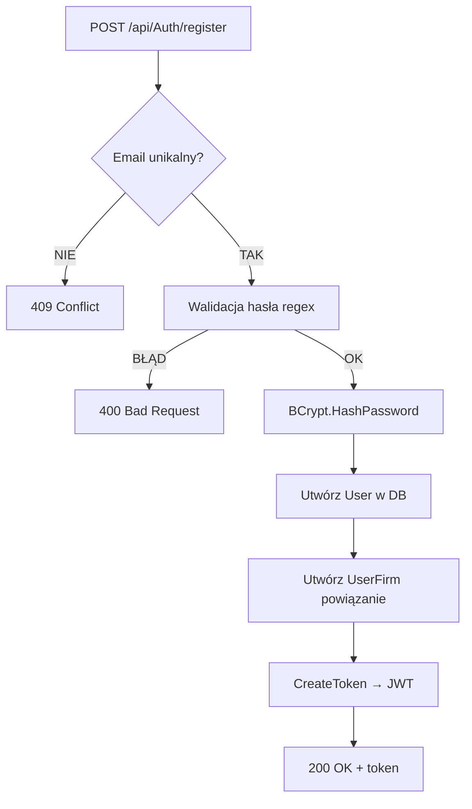

# Proces: Rejestracja użytkownika (RegisterUser)

| Atrybut | Wartość |
|---|---|
| ID | P-01 |
| Nazwa | RegisterUser |
| Kontroler | `AuthController` |
| Serwis | `AuthService` |
| Endpoint | [POST /api/Auth/register](../04_api_i_integracje/01_api_frontend/auth/POST_Auth_register.md) |
| AuthGuard | NIE |
| Ostatnia walidacja | 2026-05-31 |
| Autor | Agent Claudiusz Sonte 4.6 max |

## Cel biznesowy

Założenie nowego konta użytkownika. Po pomyślnej rejestracji użytkownik jest od razu zalogowany (token JWT w odpowiedzi).

## Diagram przepływu



## Walidacje

| ID | Warunek | Wyjątek | HTTP |
|---|---|---|---|
| WAL-01 | Email już istnieje w tabeli `User` | `UserAlreadyExistsException` | 409 |
| WAL-02 | Hasło nie spełnia regex `^(?=.*[a-z])(?=.*[A-Z])(?=.*\d)(?=.*[@$!%*?&]).{8,}$` | `InvalidPasswordException` | 400 |

## Kroki algorytmu

1. **Sprawdzenie unikalności email** — `UserRepository.GetUserByEmail(email)` → jeśli istnieje → `UserAlreadyExistsException`
2. **Walidacja hasła** — regex, jeśli nie przechodzi → `InvalidPasswordException`
3. **Haszowanie hasła** — `BCrypt.Net.BCrypt.HashPassword(registerUserDto.Password)`
4. **Zapis użytkownika** — `_mapper.Map<User>(registerUserDto)` + `PasswordHash = hash` → `AddAsync()` + `CompleteAsync()`
5. **Utwórz UserFirm** — `ManageUserFirmRelation(user.Id)` → wpis w `UserFirm` (bez firmy, `FirmId = null` lub osobna logika)
6. **Generuj JWT** — `CreateToken(user)` → `HmacSha512`, wygasa za 10 minut
7. **Odpowiedź** — `{ token: "..." }`

## Komponenty

| Warstwa | Komponent |
|---|---|
| Presentation | `AuthController.RegisterUser()` |
| Application | `AuthService.RegisterUser()` |
| Domain | `User` (encja), `UserAlreadyExistsException`, `InvalidPasswordException` |
| Infrastructure | `UserRepository`, `UnitOfWork` |

## Dane wejściowe

```json
{
  "firstName": "Jan",
  "lastName": "Kowalski",
  "email": "jan@example.com",
  "password": "Haslo123!",
  "passwordConfirmation": "Haslo123!"
}
```

## Dane wyjściowe

```json
{
  "token": "eyJhbGciOiJIUzUxMiIsInR5cCI6IkpXVCJ9..."
}
```

## Anomalie

| # | Anomalia |
|---|---|
| RA-01 | `passwordConfirmation` — walidacja zgodności haseł nie jest widoczna w backendzie (tylko frontend) |
| RA-02 | Po rejestracji `ManageUserFirmRelation` tworzy powiązanie `UserFirm` bez firmy — logika tworzenia firmy musi nastąpić potem przez EKRAN-04 |

## Rejestr zmian

| Wersja | Data | Autor | Opis |
|---|---|---|---|
| 1.0 | 2026-05-31 | Agent Claudiusz Sonte 4.6 max | Dokument wstępny. |
