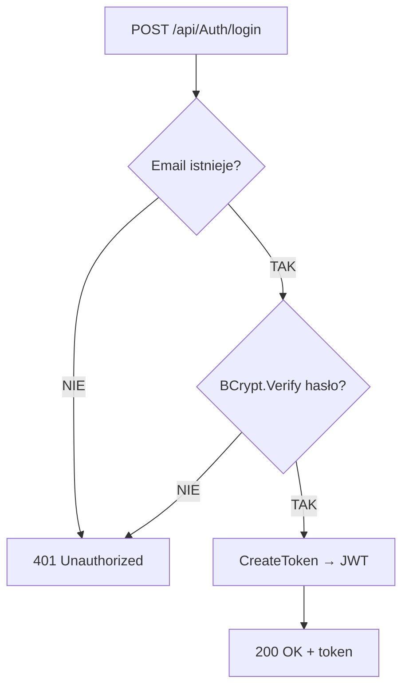

# Proces: Logowanie użytkownika (LoginUser)

| Atrybut | Wartość |
|---|---|
| ID | P-02 |
| Nazwa | LoginUser |
| Kontroler | `AuthController` |
| Serwis | `AuthService` |
| Endpoint | [POST /api/Auth/login](../04_api_i_integracje/01_api_frontend/auth/POST_Auth_login.md) |
| AuthGuard | NIE |
| Ostatnia walidacja | 2026-05-31 |
| Autor | Agent Claudiusz Sonte 4.6 max |

## Cel biznesowy

Uwierzytelnienie istniejącego użytkownika i wydanie tokenu JWT umożliwiającego dostęp do zasobów chronionych.

## Diagram przepływu



## Walidacje

| ID | Warunek | Wyjątek | HTTP |
|---|---|---|---|
| WAL-01 | Email nie istnieje w bazie | `UserNotFoundException` | 401 |
| WAL-02 | Hasło niepoprawne (BCrypt.Verify) | `InvalidCredentialsException` | 401 |

## Kroki algorytmu

1. **Wyszukanie użytkownika** — `UserRepository.GetUserByEmail(email)` → jeśli nie istnieje → `UserNotFoundException`
2. **Weryfikacja hasła** — `BCrypt.Net.BCrypt.Verify(password, user.PasswordHash)` → jeśli `false` → `InvalidCredentialsException`
3. **Generuj JWT** — `CreateToken(user)` → claims: `userId`, `firstName`, `lastName`, `email`, `role=User`; wygasa za 10 minut; algorytm: `HmacSha512`
4. **Odpowiedź** — `{ token: "..." }`

## CreateToken — szczegóły

```csharp
var claims = new List<Claim> {
    new("userId", user.Id.ToString()),
    new("firstName", user.FirstName),
    new("lastName", user.LastName),
    new("email", user.Email),
    new(ClaimTypes.Role, "User")
};
var key = new SymmetricSecurityKey(Encoding.UTF8.GetBytes(config["AppSettings:Token"]!));
var creds = new SigningCredentials(key, SecurityAlgorithms.HmacSha512Signature);
var token = new JwtSecurityToken(
    claims: claims,
    expires: DateTime.UtcNow.AddMinutes(10),
    signingCredentials: creds
);
```

## Komponenty

| Warstwa | Komponent |
|---|---|
| Presentation | `AuthController.LoginUser()` |
| Application | `AuthService.LoginUser()`, `AuthService.CreateToken()` |
| Domain | `User` (encja), `UserNotFoundException`, `InvalidCredentialsException` |
| Infrastructure | `UserRepository` |

## Dane wejściowe

```json
{
  "email": "jan@example.com",
  "password": "Haslo123!"
}
```

## Dane wyjściowe

```json
{
  "token": "eyJhbGciOiJIUzUxMiIsInR5cCI6IkpXVCJ9..."
}
```

## Anomalie

| # | Anomalia |
|---|---|
| LU-01 | Token wygasa po **10 minutach** — bardzo krótki czas dla aplikacji biznesowej |
| LU-02 | Brak refresh token — każde wygaśnięcie wymaga ponownego logowania |
| LU-03 | `ValidateIssuer=false`, `ValidateAudience=false` — token akceptowany z dowolnego źródła |

## Rejestr zmian

| Wersja | Data | Autor | Opis |
|---|---|---|---|
| 1.0 | 2026-05-31 | Agent Claudiusz Sonte 4.6 max | Dokument wstępny. |
