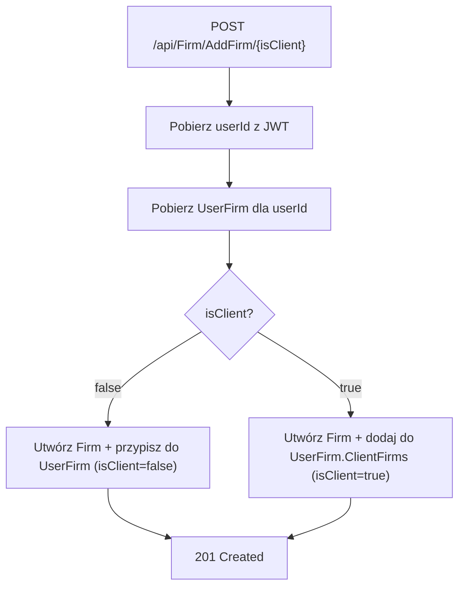
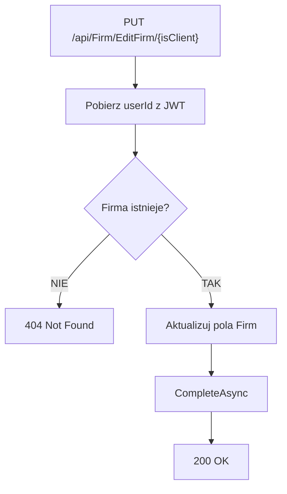

# Proces: Zarządzanie firmą (ManageFirm)

| Atrybut | Wartość |
|---|---|
| ID | P-03 |
| Nazwa | ManageFirm |
| Kontroler | `FirmController` |
| Serwis | `FirmService` |
| Endpointy | `POST /api/Firm/AddFirm/{isClient}`, `PUT /api/Firm/EditFirm/{isClient}` |
| AuthGuard | TAK |
| Ostatnia walidacja | 2026-05-31 |
| Autor | Agent Claudiusz Sonte 4.6 max |

## Cel biznesowy

Dodawanie i edycja firm — zarówno własnej firmy wystawiającego (`isClient=false`) jak i firm klientów (`isClient=true`). Jeden endpoint obsługuje oba przypadki przez parametr `isClient`.

## Diagram przepływu — AddFirm



## Diagram przepływu — EditFirm



## Walidacje

| ID | Warunek | Wyjątek | HTTP |
|---|---|---|---|
| WAL-01 | Firma o podanym `id` nie istnieje (EditFirm) | `FirmNotFoundException` | 404 |

## Komponenty

| Warstwa | Komponent |
|---|---|
| Presentation | `FirmController` |
| Application | `FirmService.AddFirm()`, `FirmService.EditFirm()` |
| Domain | `Firm`, `UserFirm`, `FirmNotFoundException` |
| Infrastructure | `FirmRepository`, `UserFirmRepository`, `UnitOfWork` |

## Parametr isClient

| Wartość | Znaczenie | Kontekst użycia |
|---|---|---|
| `false` | Własna firma wystawiającego | EKRAN-04 (Dane firmy) |
| `true` | Firma klienta | DIALOG-01 (Add/Edit Client Dialog) |

## Dane wejściowe — AddFirm / EditFirm

```json
{
  "id": 0,
  "firmName": "Firma Example SRL",
  "cuiValue": "12345678",
  "regCom": "J40/1234/2020",
  "address": "Str. Exemplu nr. 1",
  "county": "Ilfov",
  "city": "Bukareszt"
}
```

## Rejestr zmian

| Wersja | Data | Autor | Opis |
|---|---|---|---|
| 1.0 | 2026-05-31 | Agent Claudiusz Sonte 4.6 max | Dokument wstępny. |
