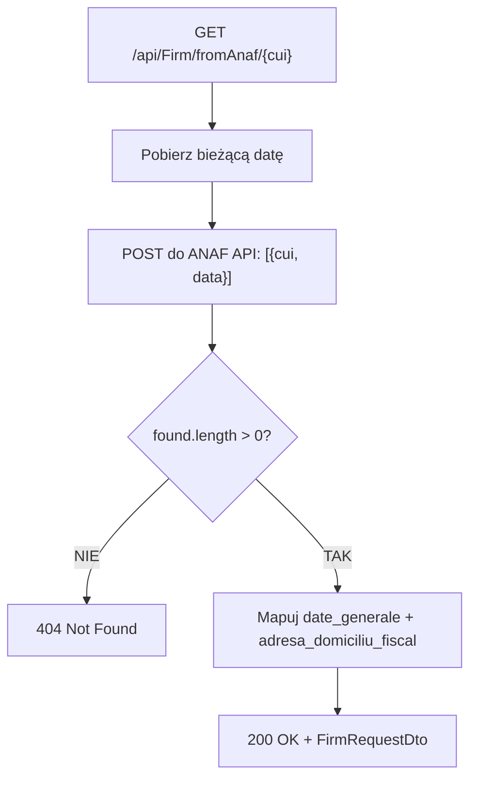

# Proces: Pobieranie danych firmy z ANAF (GetFirmFromAnaf)

| Atrybut | Wartość |
|---|---|
| ID | P-04 |
| Nazwa | GetFirmFromAnaf |
| Kontroler | `FirmController` |
| Serwis | `FirmService` |
| Endpoint | [GET /api/Firm/fromAnaf](../04_api_i_integracje/01_api_frontend/firm/GET_Firm_fromAnaf.md) |
| AuthGuard | TAK |
| Ostatnia walidacja | 2026-05-31 |
| Autor | Agent Claudiusz Sonte 4.6 max |

## Cel biznesowy

Autouzupełnienie danych firmy na podstawie numeru CUI (Cod Unic de Înregistrare — rumuński NIP). Wywołuje zewnętrzne API rumuńskiej administracji podatkowej (ANAF) i mapuje odpowiedź na pola formularza.

## Diagram przepływu



## Zewnętrzne API ANAF

| Parametr | Wartość |
|---|---|
| URL | `AppSettings:AnafApiUrl` (z konfiguracji) |
| Metoda | `POST` |
| Content-Type | `application/json` |
| Body | `[{ "cui": 12345678, "data": "2026-05-31" }]` |

## Mapowanie odpowiedzi ANAF

| Pole DTO | Ścieżka JSON ANAF |
|---|---|
| `firmName` | `found[0].date_generale.denumire` |
| `cuiValue` | `found[0].date_generale.cui` |
| `regCom` | `found[0].date_generale.nrRegCom` |
| `address` | `found[0].date_generale.adresa` |
| `county` | `found[0].adresa_domiciliu_fiscal.ddenumire_Judet` |
| `city` | `found[0].adresa_domiciliu_fiscal.ddenumire_Localitate` |

## Walidacje

| ID | Warunek | Wyjątek | HTTP |
|---|---|---|---|
| WAL-01 | `found` puste (firma nie znaleziona w ANAF) | `FirmNotFoundException` | 404 |

## Anomalie

| # | Anomalia |
|---|---|
| ANAF-01 | Brak obsługi timeoutu — jeśli ANAF API nie odpowiada, żądanie czeka bez limitu |
| ANAF-02 | Brak cache — każde kliknięcie "chmury" wysyła nowe żądanie do ANAF |
| ANAF-03 | URL ANAF z konfiguracji (`AppSettings:AnafApiUrl`) — brak fallback jeśli klucz nie istnieje |

## Dane wyjściowe

```json
{
  "id": 0,
  "firmName": "EXAMPLE SRL",
  "cuiValue": "12345678",
  "regCom": "J40/1234/2020",
  "address": "STR. EXEMPLU NR. 1",
  "county": "ILFOV",
  "city": "BUKARESZT"
}
```

## Rejestr zmian

| Wersja | Data | Autor | Opis |
|---|---|---|---|
| 1.0 | 2026-05-31 | Agent Claudiusz Sonte 4.6 max | Dokument wstępny. |
