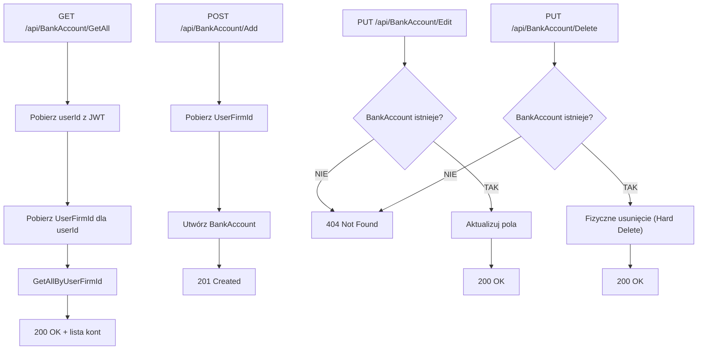

# Proces: Zarządzanie kontami bankowymi (ManageBankAccounts)

| Atrybut | Wartość |
|---|---|
| ID | P-05 |
| Nazwa | ManageBankAccounts |
| Kontroler | `BankAccountController` |
| Serwis | `BankAccountService` |
| Endpointy | [GET /api/BankAccount/GetAll](../04_api_i_integracje/01_api_frontend/bank_account/GET_BankAccount_GetAll.md), [POST /api/BankAccount/Add](../04_api_i_integracje/01_api_frontend/bank_account/POST_BankAccount_Add.md), [PUT /api/BankAccount/Edit](../04_api_i_integracje/01_api_frontend/bank_account/PUT_BankAccount_Edit.md), [PUT /api/BankAccount/Delete](../04_api_i_integracje/01_api_frontend/bank_account/PUT_BankAccount_Delete.md) |
| AuthGuard | TAK |
| Ostatnia walidacja | 2026-05-31 |
| Autor | Agent Claudiusz Sonte 4.6 max |

## Cel biznesowy

CRUD kont bankowych własnej firmy wystawiającej faktury. Konta bankowe są przypisane do UserFirm i używane przy wystawianiu dokumentów.

## Diagram przepływu

## Walidacje

| ID | Warunek | Wyjątek | HTTP |
|---|---|---|---|
| WAL-01 | BankAccount nie istnieje (Edit) | `BankAccountNotFoundException` | 404 |
| WAL-02 | BankAccount nie istnieje (Delete) | `BankAccountNotFoundException` | 404 |

## KRYTYCZNA anomalia — CASCADE DELETE

| # | Anomalia |
|---|---|
| BA-01 | **KRYTYCZNE:** `Document.BankAccountId` ma `NOT NULL + CASCADE DELETE` — usunięcie konta bankowego **usuwa WSZYSTKIE powiązane dokumenty**! Brak ostrzeżenia dla użytkownika |
| BA-02 | Hard delete (fizyczne usunięcie) — brak soft-delete |

## Model danych

| Tabela | Kolumna | Typ | Opis |
|---|---|---|---|
| `BankAccount` | `Id` | `int` | PK |
| `BankAccount` | `BankName` | `nvarchar(max)` | Nazwa banku |
| `BankAccount` | `Iban` | `nvarchar(max)` | Numer IBAN |
| `BankAccount` | `Currency` | `nvarchar(max)` | Waluta |
| `BankAccount` | `UserFirmId` | `int` | FK → UserFirm |

## Rejestr zmian

| Wersja | Data | Autor | Opis |
|---|---|---|---|
| 1.0 | 2026-05-31 | Agent Claudiusz Sonte 4.6 max | Dokument wstępny. |
