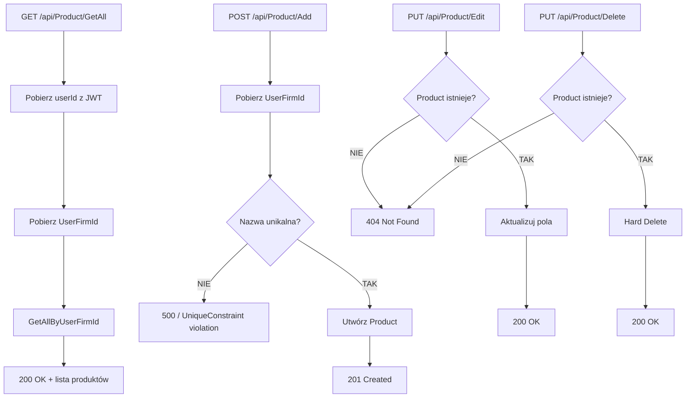

# Proces: Zarządzanie produktami (ManageProducts)

| Atrybut | Wartość |
|---|---|
| ID | P-06 |
| Nazwa | ManageProducts |
| Kontroler | `ProductController` |
| Serwis | `ProductService` |
| Endpointy | [GET /api/Product/GetAll](../04_api_i_integracje/01_api_frontend/product/GET_Product_GetAll.md), [POST /api/Product/Add](../04_api_i_integracje/01_api_frontend/product/POST_Product_Add.md), [PUT /api/Product/Edit](../04_api_i_integracje/01_api_frontend/product/PUT_Product_Edit.md), [PUT /api/Product/Delete](../04_api_i_integracje/01_api_frontend/product/PUT_Product_Delete.md) |
| AuthGuard | TAK |
| Ostatnia walidacja | 2026-05-31 |
| Autor | Agent Claudiusz Sonte 4.6 max |

## Cel biznesowy

CRUD katalogu produktów/usług, które można dodawać do pozycji faktur. Produkty przypisane do UserFirm — każda firma ma własny katalog.

## Diagram przepływu

## Walidacje

| ID | Warunek | Wyjątek | HTTP |
|---|---|---|---|
| WAL-01 | Product nie istnieje (Edit) | `ProductNotFoundException` | 404 |
| WAL-02 | Product nie istnieje (Delete) | `ProductNotFoundException` | 404 |
| WAL-03 (implicit) | Nazwa produktu nieunikalna globalnie | UniqueConstraint DB | 500 |

## Anomalie

| # | Anomalia |
|---|---|
| PD-01 | `Product.Name` ma UNIQUE INDEX globalny (nie per UserFirm) — dwóch różnych użytkowników nie może mieć produktu o tej samej nazwie |
| PD-02 | Naruszenie UNIQUE zwraca niezrozumiały 500 (catch-all middleware), nie 409 Conflict z komunikatem |

## Model danych

| Tabela | Kolumna | Typ | Opis |
|---|---|---|---|
| `Product` | `Id` | `int` | PK |
| `Product` | `Name` | `nvarchar(max)` | Nazwa (UNIQUE INDEX globalny) |
| `Product` | `MeasureUnit` | `nvarchar(max)` | Jednostka miary |
| `Product` | `Price` | `decimal(18,2)` | Cena jednostkowa |
| `Product` | `VatRate` | `decimal(18,2)` | Stawka VAT |
| `Product` | `UserFirmId` | `int` | FK → UserFirm |

## Rejestr zmian

| Wersja | Data | Autor | Opis |
|---|---|---|---|
| 1.0 | 2026-05-31 | Agent Claudiusz Sonte 4.6 max | Dokument wstępny. |
