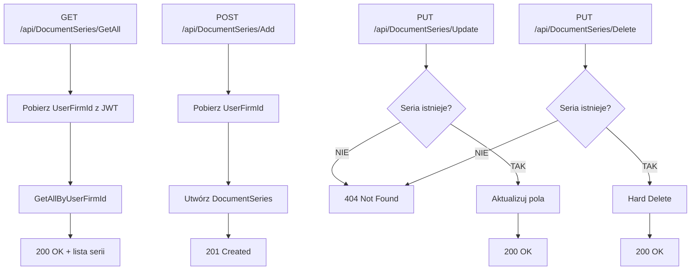

# Proces: Zarządzanie seriami dokumentów (ManageDocumentSeries)

| Atrybut | Wartość |
|---|---|
| ID | P-07 |
| Nazwa | ManageDocumentSeries |
| Kontroler | `DocumentSeriesController` |
| Serwis | `DocumentSeriesService` |
| Endpointy | [GET /api/DocumentSeries/GetAll](../04_api_i_integracje/01_api_frontend/document_series/GET_DocumentSeries_GetAll.md), [POST /api/DocumentSeries/Add](../04_api_i_integracje/01_api_frontend/document_series/POST_DocumentSeries_Add.md), [PUT /api/DocumentSeries/Update](../04_api_i_integracje/01_api_frontend/document_series/PUT_DocumentSeries_Update.md), [PUT /api/DocumentSeries/Delete](../04_api_i_integracje/01_api_frontend/document_series/PUT_DocumentSeries_Delete.md) |
| AuthGuard | TAK |
| Ostatnia walidacja | 2026-05-31 |
| Autor | Agent Claudiusz Sonte 4.6 max |

## Cel biznesowy

CRUD serii numeracji dokumentów. Serie definiują prefiks i bieżący numer, które składają się na numer dokumentu (np. `FV0005`). Każda seria powiązana z konkretnym typem dokumentu.

## Diagram przepływu



## Format numeru dokumentu

```
DocumentNumber = SeriesName + CurrentNumber.ToString("D4")
```

Przykłady:
| SeriesName | CurrentNumber | DocumentNumber |
|---|---|---|
| `FV` | 1 | `FV0001` |
| `FV` | 15 | `FV0015` |
| `PRF` | 3 | `PRF0003` |
| `STORNO` | 1 | `STORNO0001` |

## Inkrementacja numeru

Po każdym wystawieniu dokumentu: `DocumentSeries.CurrentNumber++` (w `DocumentService.AddDocument`).

## Walidacje

| ID | Warunek | Wyjątek | HTTP |
|---|---|---|---|
| WAL-01 | Seria nie istnieje (Update) | `DocumentSeriesNotFoundException` | 404 |
| WAL-02 | Seria nie istnieje (Delete) | `DocumentSeriesNotFoundException` | 404 |

## Anomalie

| # | Anomalia |
|---|---|
| DS-01 | **Race condition:** Brak transakcji/lock przy inkrementacji `CurrentNumber` — przy równoległych żądaniach możliwe duplikaty numerów dokumentów |
| DS-02 | Usunięcie serii z powiązanymi dokumentami — FK constraint może powodować błąd DB |

## Model danych

| Tabela | Kolumna | Typ | Opis |
|---|---|---|---|
| `DocumentSeries` | `Id` | `int` | PK |
| `DocumentSeries` | `SeriesName` | `nvarchar(max)` | Prefiks serii |
| `DocumentSeries` | `CurrentNumber` | `int` | Bieżący numer (auto-inkrement) |
| `DocumentSeries` | `DocumentTypeId` | `int` | FK → DocumentType |
| `DocumentSeries` | `UserFirmId` | `int` | FK → UserFirm |

## Rejestr zmian

| Wersja | Data | Autor | Opis |
|---|---|---|---|
| 1.0 | 2026-05-31 | Agent Claudiusz Sonte 4.6 max | Dokument wstępny. |
