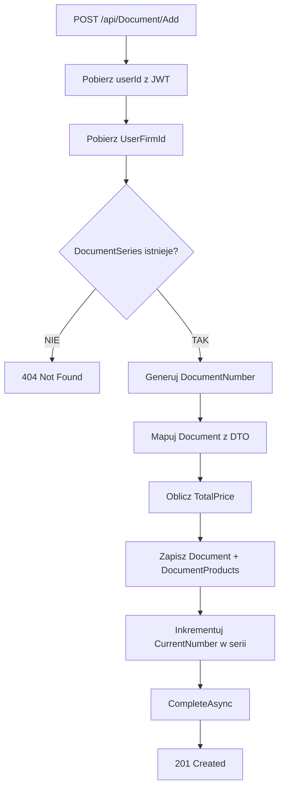

# Proces: Dodawanie dokumentu (AddDocument)

| Atrybut | Wartość |
|---|---|
| ID | P-08 |
| Nazwa | AddDocument |
| Kontroler | `DocumentController` |
| Serwis | `DocumentService` |
| Endpoint | [POST /api/Document/Add](../04_api_i_integracje/01_api_frontend/document/POST_Document_Add.md) |
| AuthGuard | TAK |
| Ostatnia walidacja | 2026-05-31 |
| Autor | Agent Claudiusz Sonte 4.6 max |

## Cel biznesowy

Wystawienie nowego dokumentu (faktura, proforma, storno) z przypisaniem numeru z serii, zapisem pozycji i obliczeniem sum. Jeden endpoint obsługuje wszystkie 3 typy dokumentów przez `DocumentTypeId`.

## Diagram przepływu



## Generowanie numeru dokumentu

```csharp
DocumentNumber = documentRequestDto.DocumentSeries?.SeriesName +
                 documentRequestDto.DocumentSeries?.CurrentNumber.ToString("D4")
```

Seria przekazywana jest w całości z frontendu jako obiekt — walidacja czy seria należy do użytkownika może nie być wykonywana (anomalia!).

## Obliczanie TotalPrice

Suma `DocumentProduct.Price * Quantity * (1 + VatRate/100)` dla każdej pozycji, lub suma `TotalPrice` każdej pozycji.

## Kroki algorytmu

1. Pobierz `userId` z JWT claims
2. Pobierz `UserFirmId` dla `userId`
3. Sprawdź czy `DocumentSeries` z żądanym `Id` istnieje
4. Wygeneruj `DocumentNumber` = `SeriesName + CurrentNumber.D4`
5. Zmapuj `DocumentRequestDto` → `Document` (AutoMapper)
6. Ustaw `UserFirmId`, `DocumentNumber`, `DocumentStatusId`, `IssueDate`
7. Dodaj `DocumentProduct[]` do dokumentu
8. Oblicz `TotalPrice` z pozycji
9. Zapisz (`AddAsync` + `CompleteAsync`)
10. Inkrementuj `DocumentSeries.CurrentNumber++` + `CompleteAsync`

## Walidacje

| ID | Warunek | Wyjątek | HTTP |
|---|---|---|---|
| WAL-01 | DocumentSeries nie istnieje | `DocumentSeriesNotFoundException` | 404 |

## Anomalie

| # | Anomalia |
|---|---|
| AD-01 | **Race condition:** Brak lock przy inkrementacji `CurrentNumber` — możliwe duplikaty numerów przy równoległych żądaniach |
| AD-02 | Seria przekazywana z frontendu jako obiekt — brak server-side walidacji czy seria należy do zalogowanego użytkownika |
| AD-03 | Dwa osobne `CompleteAsync()` — zapis dokumentu i inkrementacja serii — brak atomowości (możliwe niespójności) |

## Rejestr zmian

| Wersja | Data | Autor | Opis |
|---|---|---|---|
| 1.0 | 2026-05-31 | Agent Claudiusz Sonte 4.6 max | Dokument wstępny. |
