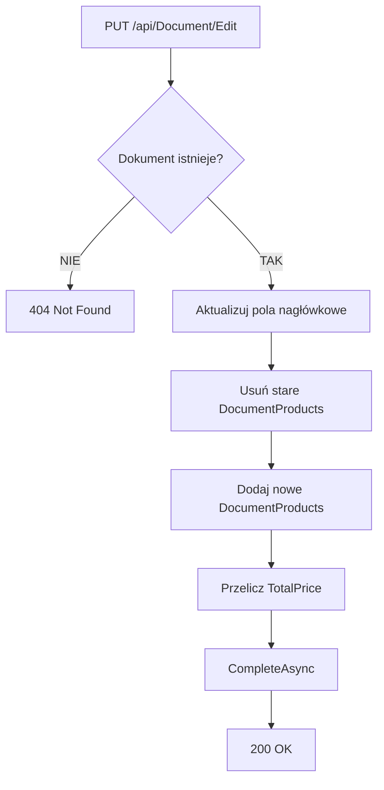

# Proces: Edycja dokumentu (EditDocument)

| Atrybut | Wartość |
|---|---|
| ID | P-09 |
| Nazwa | EditDocument |
| Kontroler | `DocumentController` |
| Serwis | `DocumentService` |
| Endpoint | [PUT /api/Document/Edit](../04_api_i_integracje/01_api_frontend/document/PUT_Document_Edit.md) |
| AuthGuard | TAK |
| Ostatnia walidacja | 2026-05-31 |
| Autor | Agent Claudiusz Sonte 4.6 max |

## Cel biznesowy

Edycja istniejącego dokumentu. Aktualizacja pól nagłówkowych (klient, konto, daty, status) oraz pozycji (usunięcie starych, dodanie nowych).

## Diagram przepływu

## Strategia aktualizacji pozycji

Pattern "delete-all-then-insert":
1. Usuń wszystkie istniejące `DocumentProduct` powiązane z dokumentem
2. Dodaj nowe `DocumentProduct[]` z żądania

Brak strategii "patch" (aktualizacji pojedynczych pozycji).

## Walidacje

| ID | Warunek | Wyjątek | HTTP |
|---|---|---|---|
| WAL-01 | Dokument nie istnieje | `DocumentNotFoundException` | 404 |

## Anomalie

| # | Anomalia |
|---|---|
| ED-01 | Numer dokumentu (`DocumentNumber`) nie jest regenerowany przy edycji — może być niespójny jeśli zmieniono serię |
| ED-02 | Brak walidacji czy edytowany dokument należy do zalogowanego użytkownika (sprawdzane przez UserFirmId w zapytaniu) |

## Rejestr zmian

| Wersja | Data | Autor | Opis |
|---|---|---|---|
| 1.0 | 2026-05-31 | Agent Claudiusz Sonte 4.6 max | Dokument wstępny. |
