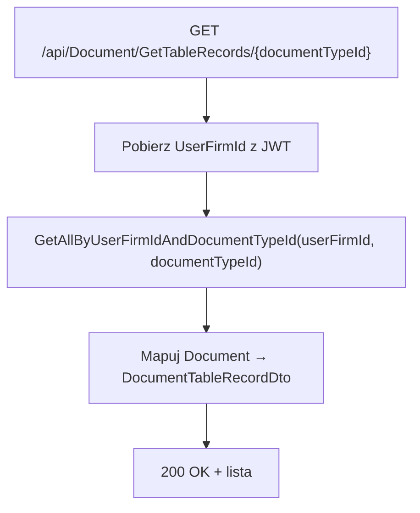

# Proces: Pobieranie listy dokumentów (GetDocuments)

| Atrybut | Wartość |
|---|---|
| ID | P-10 |
| Nazwa | GetDocuments |
| Kontroler | `DocumentController` |
| Serwis | `DocumentService` |
| Endpointy | `GET /api/Document/GetTableRecords/{documentTypeId}`, `GET /api/Document/GetDocumentById/{id}` |
| AuthGuard | TAK |
| Ostatnia walidacja | 2026-05-31 |
| Autor | Agent Claudiusz Sonte 4.6 max |

## Cel biznesowy

Pobieranie dokumentów do wyświetlenia w tabelach listowych oraz ładowanie pojedynczego dokumentu do formularza edycji.

## GetTableRecords

Zwraca listę dokumentów w formacie tabelarycznym (uproszczonym) dla danego typu dokumentu.



### Mapowanie DocumentTableRecordDto

| Pole DTO | Źródło |
|---|---|
| `id` | `Document.Id` |
| `documentNumber` | `Document.DocumentNumber` |
| `clientName` | `Document.Client.Name` (JOIN) |
| `issueDate` | `Document.IssueDate` |
| `dueDate` | `Document.DueDate` |
| `totalValue` | `Document.TotalPrice` (alias AutoMapper) |
| `documentStatus` | `Document.DocumentStatus.Name` (JOIN) |

## GetDocumentById

Zwraca pełny dokument z pozycjami — do wypełnienia formularza edycji.

```mermaid
flowchart TD
    A["GET /api/Document/GetDocumentById/{id}"] --> B{Dokument istnieje?}
    B -- NIE --> C[404 Not Found]
    B -- TAK --> D["Mapuj Document → DocumentRequestDto"]
    D --> E[Mapuj DocumentProducts inline (LINQ w profilu)"]
    E --> F[200 OK + pełny dokument]
```

### Kluczowe: LINQ projekcja w AutoMapper

```csharp
CreateMap<Document, DocumentRequestDto>()
    .ForMember(dest => dest.Products, opt => opt.MapFrom(src =>
        src.DocumentProducts!.Select(dp => new DocumentProductRequestDto {
            ProductId = dp.ProductId,
            Quantity = dp.Quantity,
            Price = dp.Price,
            VatRate = dp.VatRate,
            Name = dp.Product!.Name,
            MeasureUnit = dp.Product!.MeasureUnit
        }).ToList()));
```

## Anomalie

| # | Anomalia |
|---|---|
| GD-01 | Brak paginacji — `GetTableRecords` zwraca wszystkie dokumenty naraz; przy dużej liczbie może być wolne |
| GD-02 | Brak filtrowania i sortowania po stronie API |

## Rejestr zmian

| Wersja | Data | Autor | Opis |
|---|---|---|---|
| 1.0 | 2026-05-31 | Agent Claudiusz Sonte 4.6 max | Dokument wstępny. |
