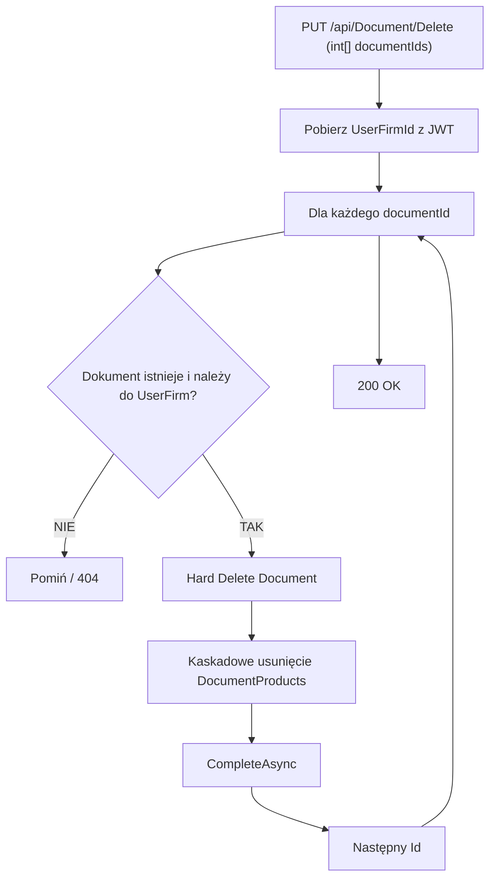

# Proces: Usunięcie dokumentu (DeleteDocument)

| Atrybut | Wartość |
|---|---|
| ID | P-11 |
| Nazwa | DeleteDocument |
| Kontroler | `DocumentController` |
| Serwis | `DocumentService` |
| Endpoint | `PUT /api/Document/Delete` |
| AuthGuard | TAK |
| Ostatnia walidacja | 2026-05-31 |
| Autor | Agent Claudiusz Sonte 4.6 max |

## Cel biznesowy

Fizyczne usunięcie dokumentu (lub wielu dokumentów) z bazy danych. Endpoint przyjmuje tablicę ID — możliwe usunięcie wsadowe.

## Diagram przepływu



## Parametr wejściowy

```http
PUT /api/Document/Delete
Content-Type: application/json

[1, 2, 3]
```

## Anomalie

| # | Anomalia |
|---|---|
| DD-01 | **Anomalia backendowa:** Parametr `[int[] documentIds]` ma atrybut `[FromBody]` domyślnie, ale w kodzie może brakować atrybutu dla tablicy — potencjalny problem z deserializacją (zależy od wersji kontrolera) |
| DD-02 | Hard delete — brak soft-delete, dokument bezpowrotnie znika |
| DD-03 | Brak transakcji obejmującej wszystkie ID — częściowe usunięcie możliwe jeśli błąd w trakcie pętli |
| DD-04 | `DocumentProducts` usuwane kaskadowo przez FK |

## Rejestr zmian

| Wersja | Data | Autor | Opis |
|---|---|---|---|
| 1.0 | 2026-05-31 | Agent Claudiusz Sonte 4.6 max | Dokument wstępny. |
