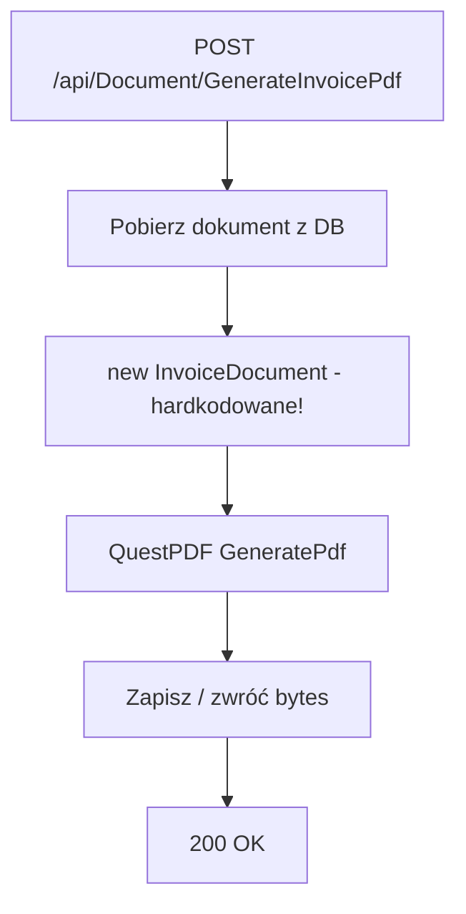
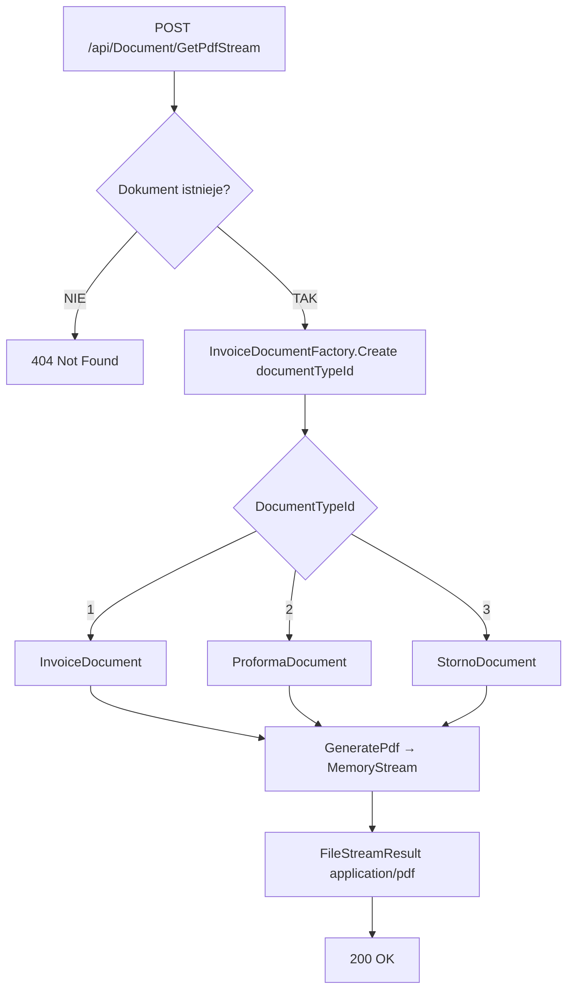

# Proces: Generowanie PDF dokumentu (GeneratePdf)

| Atrybut | Wartość |
|---|---|
| ID | P-12 |
| Nazwa | GeneratePdf |
| Kontroler | `DocumentController` |
| Serwis | `DocumentService` |
| Endpointy | [POST /api/Document/GeneratePdf](../04_api_i_integracje/01_api_frontend/document/POST_Document_GeneratePdf.md), [POST /api/Document/GetPdfStream](../04_api_i_integracje/01_api_frontend/document/POST_Document_GetPdfStream.md) |
| AuthGuard | TAK |
| Ostatnia walidacja | 2026-05-31 |
| Autor | Agent Claudiusz Sonte 4.6 max |

## Cel biznesowy

Generowanie pliku PDF na podstawie danych dokumentu. Dwa endpointy: jeden generuje i zapisuje PDF na serwerze, drugi zwraca strumień PDF do przeglądarki.

## GenerateInvoicePdf

Generuje PDF i zapisuje na serwerze (lub zwraca byte array). Używa **hardkodowanej** klasy `InvoiceDocument`.



### KRYTYCZNA anomalia

```csharp
// Hardkodowane — zawsze generuje fakturę zwykłą niezależnie od DocumentTypeId!
var document = new InvoiceDocument(data);
```

## GetPdfStream

Zwraca strumień PDF — używa **fabryki** do wyboru właściwego szablonu.



## Biblioteka QuestPDF

- Wersja: `2024.3.10 Community`
- Licencja Community — bezpłatna dla projektów < 1M USD przychodu
- Klasy dokumentów dziedziczą z `IDocument`

## Anomalie

| # | Anomalia |
|---|---|
| PDF-01 | **KRYTYCZNE:** `GenerateInvoicePdf` hardkoduje `new InvoiceDocument()` — proforma i storno generują się jako zwykła faktura |
| PDF-02 | `GetPdfStream` (z fabryką) działa poprawnie — rozbieżność zachowania między dwoma endpointami |
| PDF-03 | Brak cache PDF — każde wywołanie generuje PDF od nowa |

## Rejestr zmian

| Wersja | Data | Autor | Opis |
|---|---|---|---|
| 1.0 | 2026-05-31 | Agent Claudiusz Sonte 4.6 max | Dokument wstępny. |
