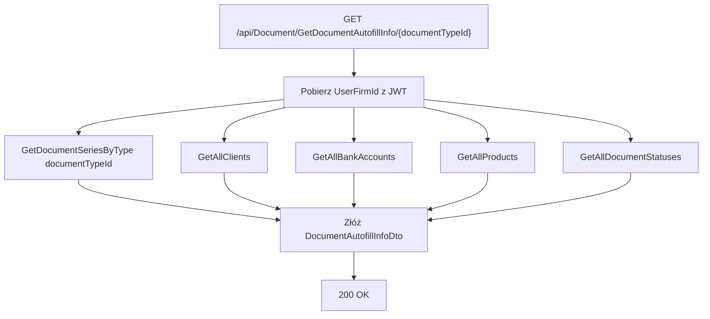

# Proces: Pobieranie danych do autouzupełnienia dokumentu (GetDocumentAutofillInfo)

| Atrybut | Wartość |
|---|---|
| ID | P-13 |
| Nazwa | GetDocumentAutofillInfo |
| Kontroler | `DocumentController` |
| Serwis | `DocumentService` |
| Endpoint | [GET /api/Document/GetAutofillInfo](../04_api_i_integracje/01_api_frontend/document/GET_Document_GetAutofillInfo.md) |
| AuthGuard | TAK |
| Ostatnia walidacja | 2026-05-31 |
| Autor | Agent Claudiusz Sonte 4.6 max |

## Cel biznesowy

Jednorazowe wywołanie przy otwieraniu formularza nowego/edytowanego dokumentu. Zwraca wszystkie dane potrzebne do wypełnienia selektorów: serie dokumentów, listę klientów, konta bankowe, produkty, statusy.

## Diagram przepływu



## Dane wyjściowe (DocumentAutofillInfoDto)

```json
{
  "documentSeries": [
    { "id": 1, "seriesName": "FV", "currentNumber": 5, "documentTypeId": 1 }
  ],
  "clients": [
    { "id": 2, "firmName": "Klient SRL", "cuiValue": "..." }
  ],
  "bankAccounts": [
    { "id": 3, "bankName": "BRD", "iban": "RO49...", "currency": "RON" }
  ],
  "products": [
    { "id": 1, "name": "Usługa IT", "price": 100.00, "vatRate": 19.00, "measureUnit": "ore" }
  ],
  "documentStatuses": [
    { "id": 1, "name": "Wysłana" },
    { "id": 2, "name": "Zapłacona" }
  ],
  "seller": {
    "firmName": "Moja Firma SRL",
    "cuiValue": "98765432",
    "address": "Str. Mea nr. 5",
    "county": "Ilfov",
    "city": "Bukareszt"
  }
}
```

## Parametr documentTypeId

Filtruje serie dokumentów — zwracane są tylko serie przypisane do danego typu.

| documentTypeId | Typ dokumentu |
|---|---|
| 1 | Factura (faktura) |
| 2 | Factura Proforma |
| 3 | Factura Storno |

## Rejestr zmian

| Wersja | Data | Autor | Opis |
|---|---|---|---|
| 1.0 | 2026-05-31 | Agent Claudiusz Sonte 4.6 max | Dokument wstępny. |
