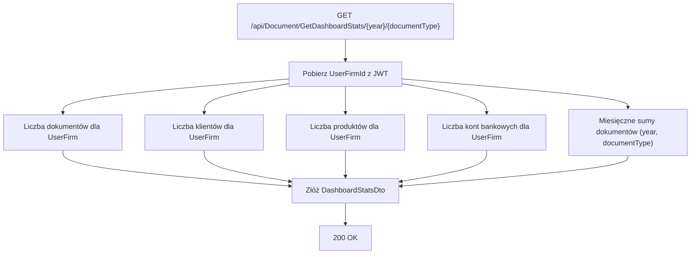

# Proces: Pobieranie statystyk dashboardu (GetDashboardStats)

| Atrybut | Wartość |
|---|---|
| ID | P-14 |
| Nazwa | GetDashboardStats |
| Kontroler | `DocumentController` |
| Serwis | `DocumentService` |
| Endpoint | `GET /api/Document/GetDashboardStats/{year}/{documentType}` |
| AuthGuard | TAK |
| Ostatnia walidacja | 2026-05-31 |
| Autor | Agent Claudiusz Sonte 4.6 max |

## Cel biznesowy

Pobieranie danych statystycznych dla widżetów i wykresu na ekranie Dashboard. Zwraca liczniki globalne (dokumenty, klienci, produkty, konta) oraz miesięczne sumy dokumentów dla wybranego roku i typu.

## Diagram przepływu



## Dane wyjściowe (DashboardStatsDto)

```json
{
  "totalDocuments": 42,
  "totalClients": 8,
  "totalProducts": 15,
  "totalBankAccounts": 2,
  "monthlyTotals": [
    { "month": 1, "invoiceAmount": 5000.00, "incomeAmount": 4200.00 },
    { "month": 3, "invoiceAmount": 8500.00, "incomeAmount": 8500.00 }
  ]
}
```

## Anomalie

| # | Anomalia |
|---|---|
| DS-01 | `monthlyTotals` zwraca tylko miesiące z dokumentami — miesiące puste są pomijane; wykres liniowy na froncie wyświetla tylko bary dla niepustych miesięcy (zamiast 12 punktów zawsze) |
| DS-02 | `console.log(invoiceAmounts)` i `console.log(incomeAmounts)` aktywne w kodzie Angular w produkcji |
| DS-03 | Brak cache — przy każdej zmianie selektora wywołuje API ponownie |

## Rejestr zmian

| Wersja | Data | Autor | Opis |
|---|---|---|---|
| 1.0 | 2026-05-31 | Agent Claudiusz Sonte 4.6 max | Dokument wstępny. |
