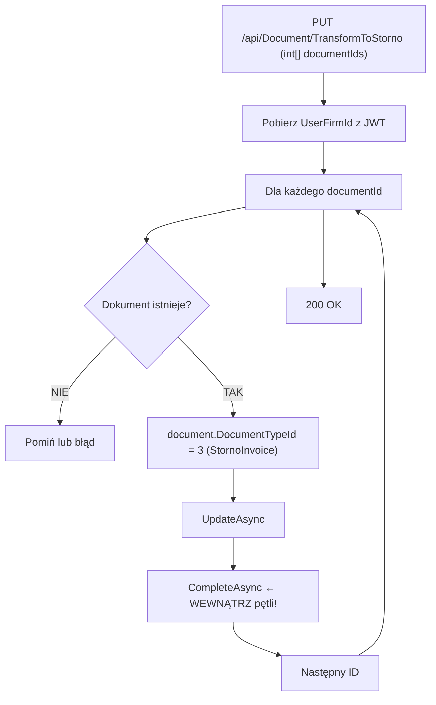

# Proces: Konwersja dokumentów na storno (TransformToStorno)

| Atrybut | Wartość |
|---|---|
| ID | P-15 |
| Nazwa | TransformToStorno |
| Kontroler | `DocumentController` |
| Serwis | `DocumentService` |
| Endpoint | [PUT /api/Document/TransformToStorno](../04_api_i_integracje/01_api_frontend/document/PUT_Document_TransformToStorno.md) |
| AuthGuard | TAK |
| Ostatnia walidacja | 2026-05-31 |
| Autor | Agent Claudiusz Sonte 4.6 max |

## Cel biznesowy

Masowa konwersja istniejących dokumentów (faktur, proform) na faktury storno przez zmianę `DocumentTypeId` na 3 (StornoInvoice). Wywoływana z listy EKRAN-13 po zaznaczeniu dokumentów.

## Diagram przepływu



## Krytyczna anomalia — non-atomowość

```csharp
// DocumentService.TransformToStorno
foreach (var documentId in documentIds) {
    var document = await _unitOfWork.Documents.GetByIdAsync(documentId);
    document.DocumentTypeId = (int)DocumentTypeEnum.StornoInvoice; // = 3
    await _unitOfWork.Documents.UpdateAsync(document);
    await _unitOfWork.CompleteAsync(); // ← SaveChangesAsync WEWNĄTRZ pętli!
}
```

`CompleteAsync()` (alias `SaveChangesAsync()`) wywoływany po każdym dokumencie osobno — **brak transakcji obejmującej całą operację**. Jeśli operacja zakończy się błędem w połowie listy, część dokumentów zostanie przekonwertowana, część nie.

## Anomalie

| # | Anomalia |
|---|---|
| TS-01 | **KRYTYCZNE:** `CompleteAsync()` wewnątrz pętli — brak atomowości; możliwa częściowa konwersja |
| TS-02 | Brak walidacji czy dokument należy do zalogowanego użytkownika (sprawdzane przez `GetByIdAsync` który może nie filtrować po UserFirm) |
| TS-03 | Brak cofnięcia numeru dokumentu ani przypisania numeru storno — dokumenty zmieniają typ bez zmiany numeru |
| TS-04 | Parametr `int[]` bez `[FromBody]` — potencjalny problem z deserializacją (patrz: anomalia A-07 w inwentaryzacji API) |

## Rejestr zmian

| Wersja | Data | Autor | Opis |
|---|---|---|---|
| 1.0 | 2026-05-31 | Agent Claudiusz Sonte 4.6 max | Dokument wstępny. |
