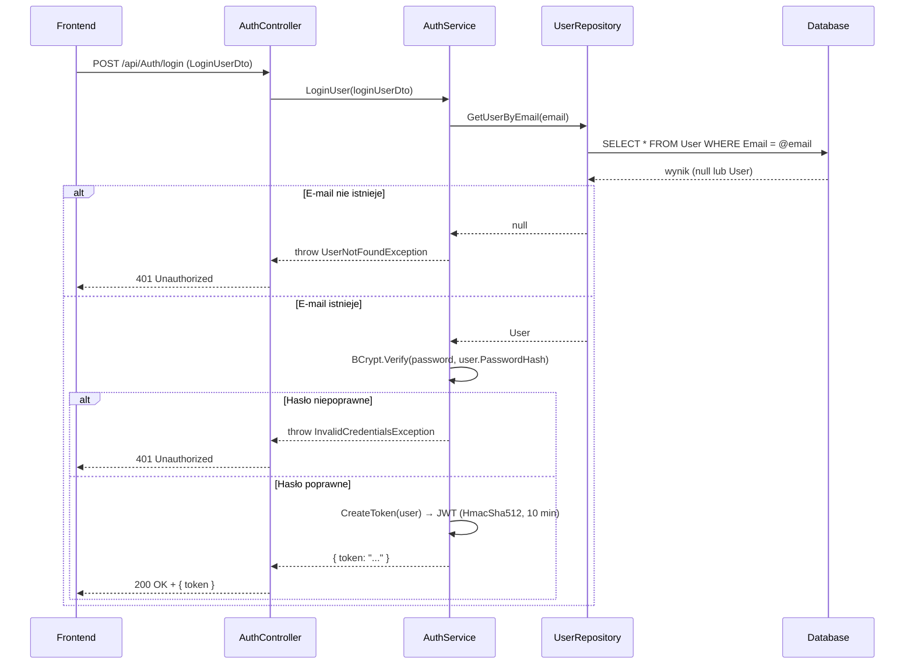

# Logowanie użytkownika — proces techniczny

| Pole | Wartość |
|---|---|
| ID dokumentu | PROC-LoginUser |
| Typ dokumentu | proces |
| Wersja | 0.1 |
| Status | szkic |
| Autor (ostatnia modyfikacja) | Agent Claudiusz Sonte 4.6 max |
| Data ostatniej modyfikacji | 2026-05-31 |

## Streszczenie

Proces uwierzytelnia istniejącego użytkownika na podstawie adresu e-mail i hasła. Backend wyszukuje rekord `User` po e-mailu, weryfikuje hasło algorytmem BCrypt, a następnie wystawia token JWT uprawniający do dostępu do chronionych zasobów API. Token wygasa po 10 minutach.

## Cel procesu

Wydać zalogowanemu użytkownikowi token JWT umożliwiający dostęp do wszystkich endpointów chronionych przez `[Authorize]`, identyfikując użytkownika i jego firmę na podstawie claims wbudowanych w token.

## Charakterystyka

| Atrybut | Wartość |
|---|---|
| ID procesu | PROC-LoginUser |
| Typ | główny |
| Inicjator | Ekran logowania + operacja „Zaloguj się" |
| Warunki startu | Użytkownik wpisał e-mail i hasło i wysłał formularz |
| Warunki zakończenia (sukces) | Token JWT zwrócony do klienta; Angular zapisuje go w localStorage |
| Warunki zakończenia (błąd) | E-mail nieznany lub hasło niepoprawne (401) |
| Uczestnicy | Frontend (Angular), API (AuthController), Service (AuthService), Repository (UserRepository), Database (dbo.User) |

## Diagram sekwencji

## Kroki

1. **Odbiór żądania** — `AuthController.LoginUser()` odbiera `LoginUserDto` (e-mail + hasło) z ciała żądania POST `/api/Auth/login`.
2. **Wyszukanie użytkownika** — `AuthService` wywołuje `UserRepository.GetUserByEmail(email)`. Jeśli rekord nie istnieje → `UserNotFoundException` (HTTP 401).
3. **Weryfikacja hasła** — `BCrypt.Net.BCrypt.Verify(loginUserDto.Password, user.PasswordHash)`. Jeśli `false` → `InvalidCredentialsException` (HTTP 401).
4. **Generowanie tokenu JWT** — `CreateToken(user)` buduje claims: `userId`, `firstName`, `lastName`, `email`, `role=User`. Klucz: `AppSettings:Token` (HMAC-SHA512). Czas życia: 10 minut od `DateTime.UtcNow`.
5. **Odpowiedź** — `200 OK` z `{ "token": "..." }`.

## Obsługa błędów

| Błąd | Miejsce wystąpienia | Reakcja |
|---|---|---|
| `UserNotFoundException` | AuthService | HTTP 401 Unauthorized — e-mail nie istnieje w bazie |
| `InvalidCredentialsException` | AuthService | HTTP 401 Unauthorized — hasło niepoprawne |
| Błąd DB (nieoczekiwany) | UserRepository | HTTP 500 Internal Server Error (ExceptionMiddleware) |

## Powiązania

- Wywołany z ekranu: [Login](../../../01_ekrany/login/ekran.md)
- Wywołany przez operację: formularz logowania (submit)
- Powiązane API: [POST /api/Auth/login](../../../04_api_i_integracje/01_api_frontend/auth/POST_Auth_login.md)
- Powiązany algorytm: [tworzenie_tokenu_jwt](../../../03_algorytmy/autoryzacyjne/tworzenie_tokenu_jwt.md), [weryfikacja_tokenu_jwt](../../../03_algorytmy/autoryzacyjne/weryfikacja_tokenu_jwt.md)

## Powiązania z kodem

- Kontroler: `InvoiceJetAPI/Controllers/AuthController.cs`
- Serwis: `InvoiceJetAPI/Services/AuthService.cs`
- Repozytorium: `InvoiceJetAPI/Repositories/UserRepository.cs`

## Wątpliwości i braki

- Token wygasa po **10 minutach** — bardzo krótki czas dla aplikacji biznesowej; brak mechanizmu refresh token powoduje, że każde wygaśnięcie wymaga ponownego logowania.
- `ValidateIssuer=false`, `ValidateAudience=false` w konfiguracji JWT — token akceptowany z dowolnego issuer i audience, co osłabia bezpieczeństwo.

## Rejestr zmian

| Wersja | Data | Autor | Opis zmiany |
|---|---|---|---|
| 0.1 | 2026-05-31 | Agent Claudiusz Sonte 4.6 max | Pierwsza wersja — adaptacja z P-02_LoginUser.md do nowego formatu. |
