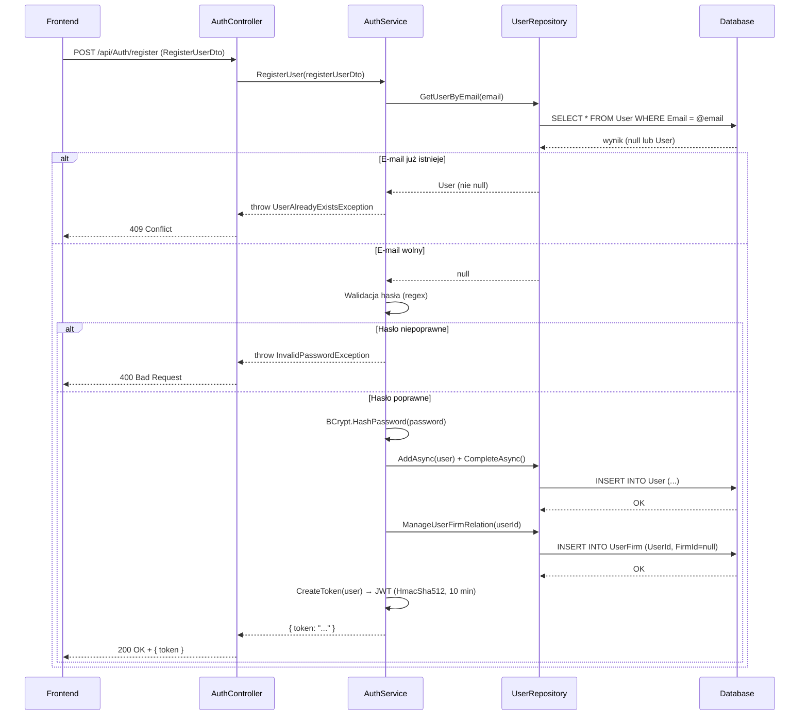

# Rejestracja użytkownika — proces techniczny

| Pole | Wartość |
|---|---|
| ID dokumentu | PROC-RegisterUser |
| Typ dokumentu | proces |
| Wersja | 0.1 |
| Status | szkic |
| Autor (ostatnia modyfikacja) | Agent Claudiusz Sonte 4.6 max |
| Data ostatniej modyfikacji | 2026-05-31 |

## Streszczenie

Proces obejmuje założenie nowego konta użytkownika w systemie InvoiceJet. Użytkownik podaje dane osobowe, adres e-mail i hasło; backend weryfikuje unikalność e-maila, hashuje hasło algorytmem BCrypt i zapisuje rekord w tabeli `User`. Po pomyślnej rejestracji system natychmiast wystawia token JWT — użytkownik jest zalogowany bez konieczności osobnego kroku logowania.

## Cel procesu

Umożliwić nowej osobie utworzenie konta i uzyskanie dostępu do aplikacji w jednym kroku, bez konieczności potwierdzenia e-mail ani ręcznego aktywowania konta.

## Charakterystyka

| Atrybut | Wartość |
|---|---|
| ID procesu | PROC-RegisterUser |
| Typ | główny |
| Inicjator | Ekran rejestracji + operacja „Zarejestruj się" |
| Warunki startu | Użytkownik wypełnił formularz rejestracji i kliknął przycisk wysłania |
| Warunki zakończenia (sukces) | Rekord `User` i powiązanie `UserFirm` zapisane w DB; token JWT zwrócony do klienta |
| Warunki zakończenia (błąd) | E-mail już zajęty (409) lub hasło nie spełnia reguł (400) |
| Uczestnicy | Frontend (Angular), API (AuthController), Service (AuthService), Repository (UserRepository), Database (dbo.User, dbo.UserFirm) |

## Diagram sekwencji

## Kroki

1. **Odbiór żądania** — `AuthController.RegisterUser()` odbiera `RegisterUserDto` z ciała żądania POST `/api/Auth/register`.
2. **Sprawdzenie unikalności e-maila** — `AuthService` wywołuje `UserRepository.GetUserByEmail(email)`. Jeśli rekord istnieje → rzuca `UserAlreadyExistsException` (HTTP 409).
3. **Walidacja hasła** — sprawdzenie regex `^(?=.*[a-z])(?=.*[A-Z])(?=.*\d)(?=.*[@$!%*?&]).{8,}$`. Niespełnienie → `InvalidPasswordException` (HTTP 400).
4. **Haszowanie hasła** — `BCrypt.Net.BCrypt.HashPassword(registerUserDto.Password)` generuje bezpieczny hash.
5. **Zapis użytkownika** — `_mapper.Map<User>(registerUserDto)` + ustawienie `PasswordHash`. `UserRepository.AddAsync(user)` + `UnitOfWork.CompleteAsync()`.
6. **Powiązanie UserFirm** — `ManageUserFirmRelation(user.Id)` tworzy rekord w tabeli `UserFirm` z `FirmId = null` (użytkownik jeszcze nie ma firmy).
7. **Generowanie tokenu JWT** — `CreateToken(user)` buduje claims (`userId`, `firstName`, `lastName`, `email`, `role=User`) i podpisuje tokenem HMAC-SHA512 (czas życia: 10 minut).
8. **Odpowiedź** — `200 OK` z `{ "token": "..." }`.

## Obsługa błędów

| Błąd | Miejsce wystąpienia | Reakcja |
|---|---|---|
| `UserAlreadyExistsException` | AuthService | HTTP 409 Conflict — e-mail już zarejestrowany |
| `InvalidPasswordException` | AuthService | HTTP 400 Bad Request — hasło nie spełnia wymagań złożoności |
| Błąd DB (nieoczekiwany) | UserRepository | HTTP 500 Internal Server Error (obsługiwany przez ExceptionMiddleware) |

## Powiązania

- Wywołany z ekranu: [Register](../../../01_ekrany/register/ekran.md)
- Wywołany przez operację: formularz rejestracji (submit)
- Powiązane API: [POST /api/Auth/register](../../../04_api_i_integracje/01_api_frontend/auth/POST_Auth_register.md)
- Powiązany algorytm: [tworzenie_tokenu_jwt](../../../03_algorytmy/autoryzacyjne/tworzenie_tokenu_jwt.md), [walidacja_hasla](../../../03_algorytmy/walidacji/walidacja_hasla.md)

## Powiązania z kodem

- Kontroler: `InvoiceJetAPI/Controllers/AuthController.cs`
- Serwis: `InvoiceJetAPI/Services/AuthService.cs`
- Repozytorium: `InvoiceJetAPI/Repositories/UserRepository.cs`

## Wątpliwości i braki

- `passwordConfirmation` — walidacja zgodności haseł nie jest wykonywana po stronie backendu; tylko frontend sprawdza zgodność obu pól. Możliwe ominięcie przez bezpośrednie wywołanie API.
- Po rejestracji `ManageUserFirmRelation` tworzy powiązanie `UserFirm` bez firmy — użytkownik musi osobno dodać firmę przez odpowiedni ekran.

## Rejestr zmian

| Wersja | Data | Autor | Opis zmiany |
|---|---|---|---|
| 0.1 | 2026-05-31 | Agent Claudiusz Sonte 4.6 max | Pierwsza wersja — adaptacja z P-01_RegisterUser.md do nowego formatu. |
