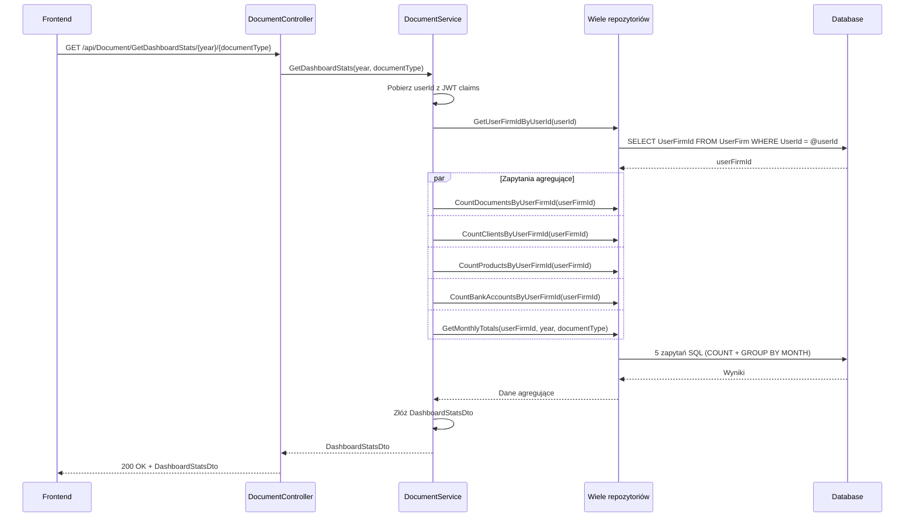

# Pobierz statystyki dashboardu — proces techniczny

| Pole | Wartość |
|---|---|
| ID dokumentu | PROC-GetDashboardStats |
| Typ dokumentu | proces |
| Wersja | 0.1 |
| Status | szkic |
| Autor (ostatnia modyfikacja) | Agent Claudiusz Sonte 4.6 max |
| Data ostatniej modyfikacji | 2026-05-31 |

## Streszczenie

Proces pobiera dane statystyczne dla ekranu Dashboard: cztery liczniki globalne (dokumenty, klienci, produkty, konta bankowe) oraz miesięczne sumy dokumentów dla wybranego roku i typu dokumentu. Dane zasilają widżety KPI i wykres liniowy. Miesięczne sumy zawierają tylko miesiące z dokumentami — miesiące bez dokumentów są pomijane (anomalia wpływająca na wygląd wykresu).

## Cel procesu

Dostarczyć frontendowi zagregowane dane statystyczne firmy do wyświetlenia na ekranie głównym dashboardu — liczniki i trend miesięczny.

## Charakterystyka

| Atrybut | Wartość |
|---|---|
| ID procesu | PROC-GetDashboardStats |
| Typ | pomocniczy |
| Inicjator | Ekran Dashboard — ngOnInit; lub zmiana selektora roku/typu dokumentu |
| Warunki startu | Użytkownik zalogowany (JWT); firma przypisana do UserFirm |
| Warunki zakończenia (sukces) | `DashboardStatsDto` z licznikami i `monthlyTotals[]`; HTTP 200 |
| Warunki zakończenia (błąd) | Brak — puste dane gdy firma nie ma dokumentów |
| Uczestnicy | Frontend (Angular), API (DocumentController), Service (DocumentService), Repository (wiele), Database (dbo.Document, dbo.Firm, dbo.Product, dbo.BankAccount) |

## Diagram sekwencji



## Kroki

1. **Odbiór żądania** — `DocumentController` obsługuje GET `/api/Document/GetDashboardStats/{year}/{documentType}`.
2. **Ekstrakcja userId** — serwis pobiera `userId` z claims JWT.
3. **Pobranie UserFirmId** — zapytanie przez repozytorium.
4. **5 zapytań agregujących** (równolegle lub sekwencyjnie):
   - Liczba dokumentów dla `UserFirmId`
   - Liczba klientów dla `UserFirmId`
   - Liczba produktów dla `UserFirmId`
   - Liczba kont bankowych dla `UserFirmId`
   - Miesięczne sumy dokumentów (GROUP BY MONTH) dla danego `year` i `documentType`
5. **Złożenie DTO** — `DashboardStatsDto` z czterema licznikami i `monthlyTotals[]`.
6. **Odpowiedź** — HTTP 200 OK + `DashboardStatsDto`.

## Struktura odpowiedzi

```json
{
  "totalDocuments": 42,
  "totalClients": 8,
  "totalProducts": 15,
  "totalBankAccounts": 2,
  "monthlyTotals": [
    { "month": 1, "invoiceAmount": 5000.00, "incomeAmount": 4200.00 },
    { "month": 3, "invoiceAmount": 8500.00, "incomeAmount": 8500.00 }
  ]
}
```

## Obsługa błędów

| Błąd | Miejsce wystąpienia | Reakcja |
|---|---|---|
| Nieautoryzowany dostęp | AuthMiddleware | HTTP 401 Unauthorized |
| Błąd DB (nieoczekiwany) | Repozytorium | HTTP 500 Internal Server Error (ExceptionMiddleware) |

## Powiązania

- Wywołany z ekranu: [Dashboard](../../../01_ekrany/dashboard/ekran.md)
- Powiązane API: [GET /api/Document/GetDashboardStats](../../../04_api_i_integracje/01_api_frontend/document/GET_Document_GetDashboardStats.md)
- Powiązany algorytm: Nie dotyczy

## Powiązania z kodem

- Kontroler: `InvoiceJetAPI/Controllers/DocumentController.cs`
- Serwis: `InvoiceJetAPI/Services/DocumentService.cs`
- Repozytorium: `InvoiceJetAPI/Repositories/DocumentRepository.cs` i inne

## Wątpliwości i braki

- **DS-01:** `monthlyTotals` zawiera tylko miesiące z dokumentami — miesiące puste pomijane; wykres na froncie wyświetla tylko bary dla niepustych miesięcy zamiast zawsze 12 punktów.
- **DS-02:** `console.log(invoiceAmounts)` i `console.log(incomeAmounts)` aktywne w kodzie Angular w środowisku produkcyjnym — wyciek danych do konsoli.
- **DS-03:** Brak cache — przy każdej zmianie selektora wywołuje API ponownie.

## Rejestr zmian

| Wersja | Data | Autor | Opis zmiany |
|---|---|---|---|
| 0.1 | 2026-05-31 | Agent Claudiusz Sonte 4.6 max | Pierwsza wersja — adaptacja z P-14_GetDashboardStats.md do nowego formatu. |
