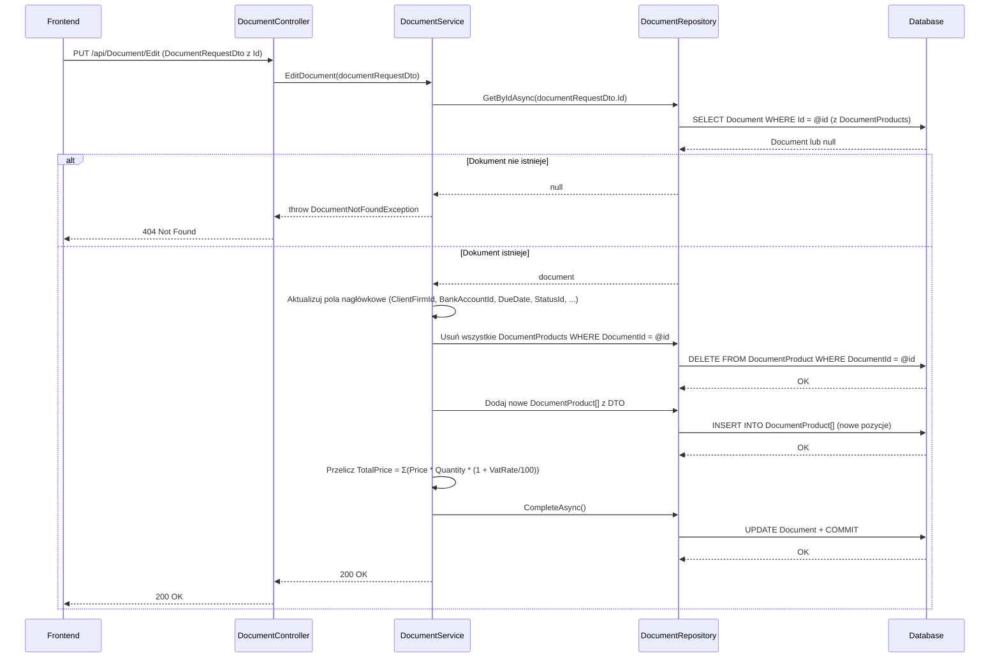

# Edytuj dokument — proces techniczny

| Pole | Wartość |
|---|---|
| ID dokumentu | PROC-EditDocument |
| Typ dokumentu | proces |
| Wersja | 0.1 |
| Status | szkic |
| Autor (ostatnia modyfikacja) | Agent Claudiusz Sonte 4.6 max |
| Data ostatniej modyfikacji | 2026-05-31 |

## Streszczenie

Proces aktualizuje istniejący dokument. Aktualizowane są pola nagłówkowe (klient, konto bankowe, daty, status) oraz pozycje dokumentu. Aktualizacja pozycji stosuje strategię „usuń wszystkie stare, wstaw nowe" (delete-all-then-insert) — brak strategii patch dla pojedynczych pozycji. Numer dokumentu nie jest regenerowany nawet jeśli zmieniono serię.

## Cel procesu

Zaktualizować dane istniejącego dokumentu (np. poprawić dane klienta, zmienić status na „Zapłacona", dodać/usunąć pozycje) bez zmiany numeru dokumentu.

## Charakterystyka

| Atrybut | Wartość |
|---|---|
| ID procesu | PROC-EditDocument |
| Typ | główny |
| Inicjator | Ekran dodaj/edytuj fakturę (w trybie edycji) + operacja „Zapisz" |
| Warunki startu | Użytkownik zalogowany (JWT); dokument załadowany do formularza (przez GetDocumentById) |
| Warunki zakończenia (sukces) | Rekord `Document` zaktualizowany; stare `DocumentProduct[]` usunięte; nowe wstawione; HTTP 200 |
| Warunki zakończenia (błąd) | Dokument nie istnieje (404) |
| Uczestnicy | Frontend (Angular), API (DocumentController), Service (DocumentService), Repository (DocumentRepository), Database (dbo.Document, dbo.DocumentProduct) |

## Diagram sekwencji

## Kroki

1. **Odbiór żądania** — `DocumentController` odbiera `DocumentRequestDto` (z niepustym `id`) z PUT `/api/Document/Edit`.
2. **Pobranie dokumentu** — `DocumentRepository.GetByIdAsync(id)` (z dołączonymi `DocumentProducts`). Jeśli `null` → `DocumentNotFoundException` (HTTP 404).
3. **Aktualizacja pól nagłówkowych** — serwis aktualizuje: `ClientFirmId`, `BankAccountId`, `DueDate`, `DocumentStatusId` i inne pola nagłówkowe.
4. **Usunięcie starych pozycji** — wszystkie istniejące `DocumentProduct` powiązane z dokumentem są usuwane.
5. **Wstawienie nowych pozycji** — nowe `DocumentProduct[]` z DTO dodawane do dokumentu.
6. **Przeliczenie TotalPrice** — suma `Price * Quantity * (1 + VatRate/100)`.
7. **Zapis** — `UnitOfWork.CompleteAsync()`.
8. **Odpowiedź** — HTTP 200 OK.

## Obsługa błędów

| Błąd | Miejsce wystąpienia | Reakcja |
|---|---|---|
| `DocumentNotFoundException` | DocumentService | HTTP 404 Not Found |
| Nieautoryzowany dostęp | AuthMiddleware | HTTP 401 Unauthorized |
| Błąd DB (nieoczekiwany) | DocumentRepository | HTTP 500 Internal Server Error (ExceptionMiddleware) |

## Powiązania

- Wywołany z ekranu: [Dodaj/edytuj fakturę](../../../01_ekrany/faktury/dodaj_edytuj_fakture/ekran.md), [Dodaj/edytuj proformę](../../../01_ekrany/faktury_proforma/dodaj_edytuj_fakture_proforma/ekran.md)
- Powiązane API: [PUT /api/Document/Edit](../../../04_api_i_integracje/01_api_frontend/document/PUT_Document_Edit.md)
- Powiązany algorytm: [obliczanie_wartosci_dokumentu](../../../03_algorytmy/wyliczeniowe/obliczanie_wartosci_dokumentu.md)

## Powiązania z kodem

- Kontroler: `InvoiceJetAPI/Controllers/DocumentController.cs`
- Serwis: `InvoiceJetAPI/Services/DocumentService.cs`
- Repozytorium: `InvoiceJetAPI/Repositories/DocumentRepository.cs`

## Wątpliwości i braki

- **ED-01:** `DocumentNumber` nie jest regenerowany przy edycji — jeśli użytkownik zmienił serię w formularzu, numer dokumentu pozostaje ze starej serii.
- **ED-02:** Brak explicitnej walidacji czy edytowany dokument należy do zalogowanego użytkownika (sprawdzane pośrednio przez UserFirmId w zapytaniu — do weryfikacji).

## Rejestr zmian

| Wersja | Data | Autor | Opis zmiany |
|---|---|---|---|
| 0.1 | 2026-05-31 | Agent Claudiusz Sonte 4.6 max | Pierwsza wersja — adaptacja z P-09_EditDocument.md do nowego formatu. |
