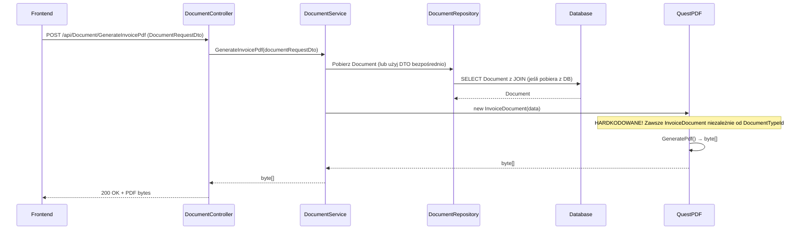
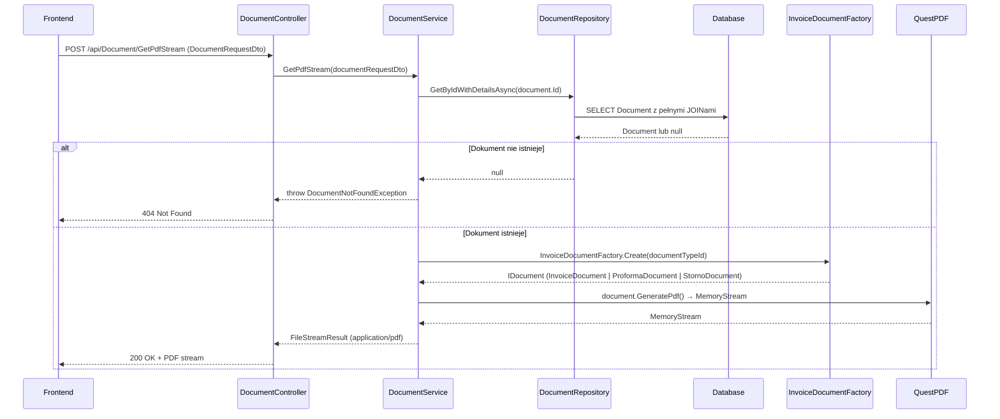

# Generuj PDF dokumentu — proces techniczny

| Pole | Wartość |
|---|---|
| ID dokumentu | PROC-GeneratePdf |
| Typ dokumentu | proces |
| Wersja | 0.1 |
| Status | szkic |
| Autor (ostatnia modyfikacja) | Agent Claudiusz Sonte 4.6 max |
| Data ostatniej modyfikacji | 2026-05-31 |

## Streszczenie

Proces generuje plik PDF na podstawie danych dokumentu z bazy. System udostępnia dwa endpointy: `GenerateInvoicePdf` (zapisuje PDF na serwerze lub zwraca bajty — hardkoduje klasę `InvoiceDocument` niezależnie od typu dokumentu) oraz `GetPdfStream` (zwraca strumień PDF do przeglądarki — używa fabryki `InvoiceDocumentFactory` i wybiera właściwy szablon per typ). Biblioteka: **QuestPDF 2024.3.10 Community**.

## Cel procesu

Wygenerować plik PDF dokumentu handlowego (faktura, proforma lub storno) w formacie gotowym do pobrania lub wydruku przez użytkownika.

## Charakterystyka

| Atrybut | Wartość |
|---|---|
| ID procesu | PROC-GeneratePdf |
| Typ | pomocniczy |
| Inicjator | Ekran listy faktur + operacja „Pobierz PDF"; lub podgląd PDF w modalu (PdfViewer) |
| Warunki startu | Użytkownik zalogowany (JWT); dokument istnieje w DB |
| Warunki zakończenia (sukces) | PDF zwrócony jako strumień (`FileStreamResult`) lub bajty; HTTP 200 |
| Warunki zakończenia (błąd) | Dokument nie istnieje (404) — tylko GetPdfStream |
| Uczestnicy | Frontend (Angular), API (DocumentController), Service (DocumentService), QuestPDF (generowanie), Database (dbo.Document + JOINy) |

## Diagram sekwencji — GenerateInvoicePdf

## Diagram sekwencji — GetPdfStream

## Kroki — GenerateInvoicePdf

1. **Odbiór żądania** — `DocumentController` odbiera `DocumentRequestDto` z POST `/api/Document/GenerateInvoicePdf`.
2. **Przygotowanie danych** — serwis pobiera dane dokumentu (z DTO lub z bazy).
3. **Hardkodowane tworzenie dokumentu PDF** — `new InvoiceDocument(data)` — zawsze szablon faktury zwykłej.
4. **Generowanie** — `QuestPDF.GeneratePdf()` → `byte[]`.
5. **Odpowiedź** — HTTP 200 OK + bajty PDF.

## Kroki — GetPdfStream

1. **Odbiór żądania** — `DocumentController` odbiera żądanie z POST `/api/Document/GetPdfStream`.
2. **Pobranie dokumentu z DB** — `DocumentRepository.GetByIdWithDetailsAsync(id)`. Jeśli `null` → `DocumentNotFoundException` (HTTP 404).
3. **Fabryka szablonów** — `InvoiceDocumentFactory.Create(documentTypeId)`:
   - `1` → `InvoiceDocument`
   - `2` → `ProformaDocument`
   - `3` → `StornoDocument`
4. **Generowanie PDF** — `document.GeneratePdf()` → `MemoryStream`.
5. **Odpowiedź** — `FileStreamResult` z `Content-Type: application/pdf`.

## Obsługa błędów

| Błąd | Miejsce wystąpienia | Reakcja |
|---|---|---|
| `DocumentNotFoundException` | DocumentService (GetPdfStream) | HTTP 404 Not Found |
| Błąd generowania QuestPDF | QuestPDF | HTTP 500 Internal Server Error |
| Nieautoryzowany dostęp | AuthMiddleware | HTTP 401 Unauthorized |

## Powiązania

- Wywołany z ekranu: `01_ekrany/faktury/lista_faktur/` (pobierz PDF), `01_ekrany/00_wspolne/modale_wspolne/pdf_viewer/` (podgląd)
- Powiązane API: `POST /api/Document/GenerateInvoicePdf`, `POST /api/Document/GetPdfStream`
- Powiązany algorytm: `03_algorytmy/generowania_pdf/generuj_pdf_na_dysk.md`, `03_algorytmy/generowania_pdf/generuj_pdf_stream.md`

## Powiązania z kodem

- Kontroler: `InvoiceJetAPI/Controllers/DocumentController.cs`
- Serwis: `InvoiceJetAPI/Services/DocumentService.cs`
- Repozytorium: `InvoiceJetAPI/Repositories/DocumentRepository.cs`

## Wątpliwości i braki

- **KRYTYCZNE (PDF-01):** `GenerateInvoicePdf` hardkoduje `new InvoiceDocument()` — proforma i storno generują się jako zwykła faktura. Rozbieżność z `GetPdfStream` który działa poprawnie przez fabrykę.
- **PDF-02:** Dwa endpointy o różnym zachowaniu — należy zunifikować lub jednoznacznie opisać ich różne przeznaczenia.
- **PDF-03:** Brak cache PDF — każde wywołanie generuje PDF od nowa.

## Rejestr zmian

| Wersja | Data | Autor | Opis zmiany |
|---|---|---|---|
| 0.1 | 2026-05-31 | Agent Claudiusz Sonte 4.6 max | Pierwsza wersja — adaptacja z P-12_GeneratePdf.md do nowego formatu. |
