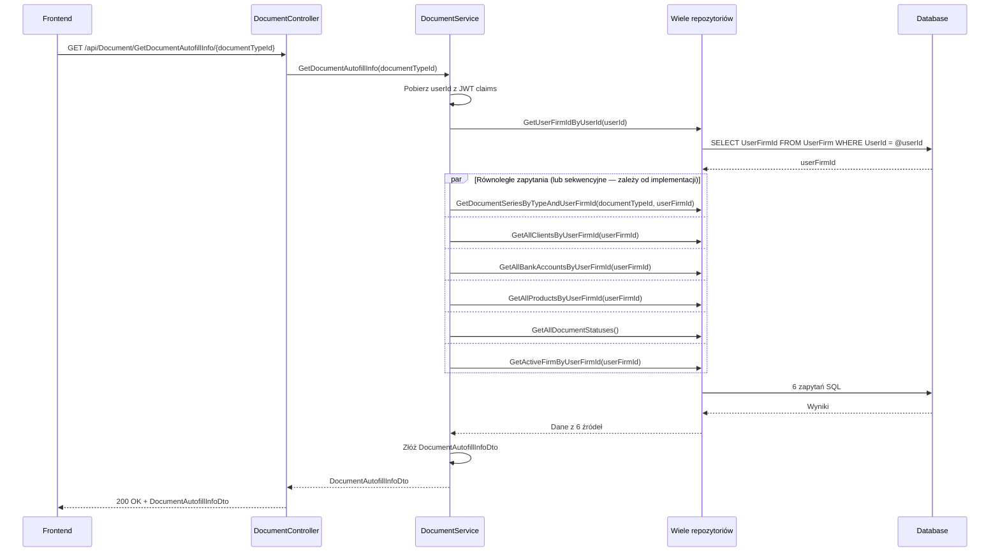

# Pobierz dane do autouzupełnienia dokumentu — proces techniczny

| Pole | Wartość |
|---|---|
| ID dokumentu | PROC-GetDocumentAutofillInfo |
| Typ dokumentu | proces |
| Wersja | 0.1 |
| Status | szkic |
| Autor (ostatnia modyfikacja) | Agent Claudiusz Sonte 4.6 max |
| Data ostatniej modyfikacji | 2026-05-31 |

## Streszczenie

Proces wykonuje jednorazowe wywołanie przy otwieraniu formularza nowego lub edytowanego dokumentu. Jednym żądaniem pobiera wszystkie dane potrzebne do zasilenia selektorów formularza: serie dokumentów (filtrowane po typie), listę klientów, konta bankowe, produkty, statusy dokumentów i dane sprzedawcy. Zwraca zagregowane `DocumentAutofillInfoDto`.

## Cel procesu

Zasilić formularz tworzenia/edycji dokumentu wszystkimi niezbędnymi danymi referencyjnymi w jednym żądaniu HTTP, minimalizując liczbę wywołań API przy inicjalizacji formularza.

## Charakterystyka

| Atrybut | Wartość |
|---|---|
| ID procesu | PROC-GetDocumentAutofillInfo |
| Typ | pomocniczy |
| Inicjator | Ekran dodaj/edytuj dokument — ngOnInit |
| Warunki startu | Użytkownik zalogowany (JWT); firma przypisana do UserFirm |
| Warunki zakończenia (sukces) | `DocumentAutofillInfoDto` z kompletnymi danymi referencyjnymi; HTTP 200 |
| Warunki zakończenia (błąd) | Brak — puste kolekcje gdy brak danych |
| Uczestnicy | Frontend (Angular), API (DocumentController), Service (DocumentService), Repozytorium (wiele), Database (dbo.DocumentSeries, dbo.Firm, dbo.BankAccount, dbo.Product, dbo.DocumentStatus, dbo.UserFirm) |

## Diagram sekwencji



## Kroki

1. **Odbiór żądania** — `DocumentController` obsługuje GET `/api/Document/GetDocumentAutofillInfo/{documentTypeId}`.
2. **Ekstrakcja userId** — serwis pobiera `userId` z claims JWT.
3. **Pobranie UserFirmId** — zapytanie przez repozytorium.
4. **6 zapytań danych referencyjnych** (sekwencyjnie lub równolegle):
   - Serie dokumentów przefiltrowane po `documentTypeId`
   - Lista klientów firmy
   - Konta bankowe firmy
   - Produkty firmy
   - Statusy dokumentów (słownik globalny)
   - Dane własnej firmy (sprzedawcy)
5. **Złożenie DTO** — `DocumentAutofillInfoDto` z 6 kolekcji/obiektów.
6. **Odpowiedź** — HTTP 200 OK + `DocumentAutofillInfoDto`.

## Struktura odpowiedzi

```json
{
  "documentSeries": [{ "id": 1, "seriesName": "FV", "currentNumber": 5, "documentTypeId": 1 }],
  "clients": [{ "id": 2, "firmName": "Klient SRL", "cuiValue": "..." }],
  "bankAccounts": [{ "id": 3, "bankName": "BRD", "iban": "RO49...", "currency": "RON" }],
  "products": [{ "id": 1, "name": "Usługa IT", "price": 100.00, "vatRate": 19.00, "measureUnit": "ore" }],
  "documentStatuses": [{ "id": 1, "name": "Wysłana" }, { "id": 2, "name": "Zapłacona" }],
  "seller": { "firmName": "Moja Firma SRL", "cuiValue": "98765432", "address": "Str. Mea nr. 5" }
}
```

## Obsługa błędów

| Błąd | Miejsce wystąpienia | Reakcja |
|---|---|---|
| Nieautoryzowany dostęp | AuthMiddleware | HTTP 401 Unauthorized |
| Błąd DB (nieoczekiwany) | Repozytorium | HTTP 500 Internal Server Error (ExceptionMiddleware) |

## Powiązania

- Wywołany z ekranu: [Dodaj/edytuj fakturę](../../../01_ekrany/faktury/dodaj_edytuj_fakture/ekran.md), [Dodaj/edytuj proformę](../../../01_ekrany/faktury_proforma/dodaj_edytuj_fakture_proforma/ekran.md), [Dodaj/edytuj storno](../../../01_ekrany/faktury_storno/dodaj_edytuj_fakture_storno/ekran.md)
- Powiązane API: [GET /api/Document/GetAutofillInfo](../../../04_api_i_integracje/01_api_frontend/document/GET_Document_GetAutofillInfo.md)
- Powiązany algorytm: Nie dotyczy

## Powiązania z kodem

- Kontroler: `InvoiceJetAPI/Controllers/DocumentController.cs`
- Serwis: `InvoiceJetAPI/Services/DocumentService.cs`
- Repozytorium: Wiele repozytoriów (`DocumentSeriesRepository`, `FirmRepository`, `BankAccountRepository`, `ProductRepository`)

## Wątpliwości i braki

- Niejasne czy 6 zapytań wykonywanych jest równolegle (Task.WhenAll) czy sekwencyjnie — wpływa na czas odpowiedzi.
- Redundancja: klienci, konta i produkty pobierane też przez dedykowane endpointy — możliwa niespójność jeśli implementacja różni się.

## Rejestr zmian

| Wersja | Data | Autor | Opis zmiany |
|---|---|---|---|
| 0.1 | 2026-05-31 | Agent Claudiusz Sonte 4.6 max | Pierwsza wersja — adaptacja z P-13_GetDocumentAutofillInfo.md do nowego formatu. |
