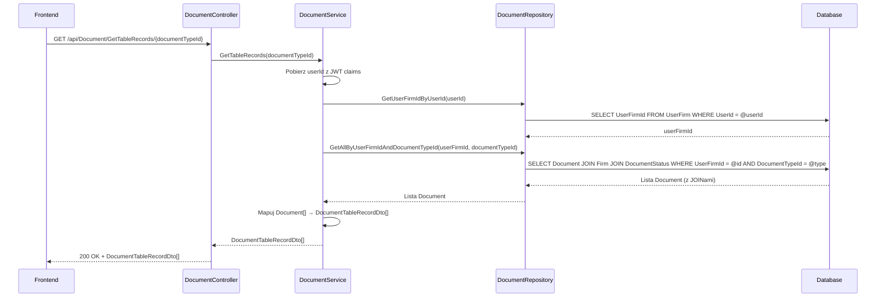
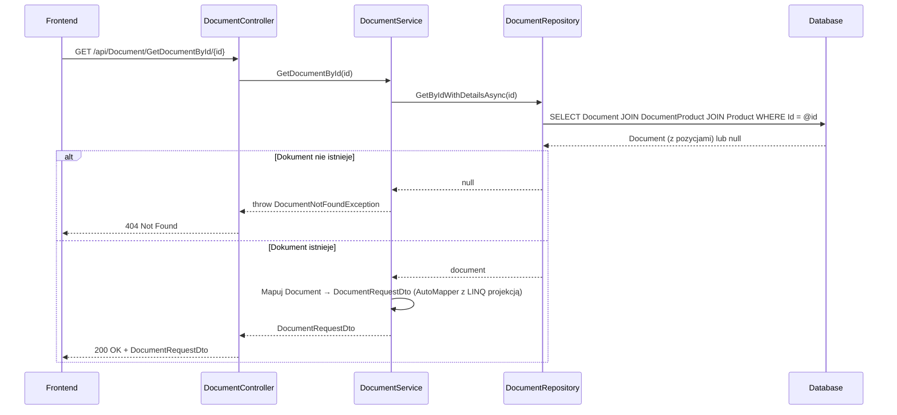

# Pobierz dokumenty — proces techniczny

| Pole | Wartość |
|---|---|
| ID dokumentu | PROC-GetDocuments |
| Typ dokumentu | proces |
| Wersja | 0.1 |
| Status | szkic |
| Autor (ostatnia modyfikacja) | Agent Claudiusz Sonte 4.6 max |
| Data ostatniej modyfikacji | 2026-05-31 |

## Streszczenie

Proces obejmuje dwa endpointy: `GetTableRecords` zwraca uproszczoną listę dokumentów danego typu do wyświetlenia w tabeli, a `GetDocumentById` zwraca pełny dokument z pozycjami do załadowania w formularzu edycji. Oba endpointy wymagają autoryzacji JWT i filtrują dane po `UserFirmId`. Brak paginacji — lista zwracana jednorazowo w całości.

## Cel procesu

Dostarczyć frontendowi dane dokumentów: listę tabelaryczną do przeglądu oraz pełny dokument do edycji.

## Charakterystyka

| Atrybut | Wartość |
|---|---|
| ID procesu | PROC-GetDocuments |
| Typ | pomocniczy |
| Inicjator | Ekran listy faktur (GetTableRecords — ngOnInit); lub ekran edycji dokumentu (GetDocumentById — przy nawigacji do edycji) |
| Warunki startu | Użytkownik zalogowany (JWT); firma przypisana do UserFirm |
| Warunki zakończenia (sukces) | Lista `DocumentTableRecordDto[]` lub pełny `DocumentRequestDto`; HTTP 200 |
| Warunki zakończenia (błąd) | Dokument nie istnieje (404) — tylko dla GetDocumentById |
| Uczestnicy | Frontend (Angular), API (DocumentController), Service (DocumentService), Repository (DocumentRepository), Database (dbo.Document, dbo.DocumentProduct, dbo.Firm, dbo.DocumentStatus) |

## Diagram sekwencji — GetTableRecords

## Diagram sekwencji — GetDocumentById

## Kroki — GetTableRecords

1. **Odbiór żądania** — `DocumentController` obsługuje GET `/api/Document/GetTableRecords/{documentTypeId}`.
2. **Ekstrakcja userId** — serwis pobiera `userId` z claims JWT.
3. **Pobranie UserFirmId** — zapytanie przez repozytorium.
4. **Pobranie listy** — `DocumentRepository.GetAllByUserFirmIdAndDocumentTypeId(userFirmId, documentTypeId)` — zapytanie z JOINami na `Firm` i `DocumentStatus`.
5. **Mapowanie uproszczone** — `AutoMapper` mapuje `Document[]` → `DocumentTableRecordDto[]` (pola: id, documentNumber, clientName, issueDate, dueDate, totalValue, documentStatus).
6. **Odpowiedź** — HTTP 200 OK + lista.

## Kroki — GetDocumentById

1. **Odbiór żądania** — `DocumentController` obsługuje GET `/api/Document/GetDocumentById/{id}`.
2. **Pobranie dokumentu** — `DocumentRepository.GetByIdWithDetailsAsync(id)` (z `DocumentProducts` i `Product`). Jeśli `null` → `DocumentNotFoundException` (HTTP 404).
3. **Mapowanie pełne** — `AutoMapper` z LINQ projekcją mapuje pozycje: `DocumentProduct` → `DocumentProductRequestDto` (włącznie z `Name` i `MeasureUnit` z `Product`).
4. **Odpowiedź** — HTTP 200 OK + `DocumentRequestDto`.

## Obsługa błędów

| Błąd | Miejsce wystąpienia | Reakcja |
|---|---|---|
| `DocumentNotFoundException` | DocumentService (GetDocumentById) | HTTP 404 Not Found |
| Nieautoryzowany dostęp | AuthMiddleware | HTTP 401 Unauthorized |
| Błąd DB (nieoczekiwany) | DocumentRepository | HTTP 500 Internal Server Error (ExceptionMiddleware) |

## Powiązania

- Wywołany z ekranu: [Lista faktur](../../../01_ekrany/faktury/lista_faktur/ekran.md) (GetTableRecords), [Dodaj/edytuj fakturę](../../../01_ekrany/faktury/dodaj_edytuj_fakture/ekran.md) (GetDocumentById), analogicznie dla [proforma](../../../01_ekrany/faktury_proforma/lista_faktur_proforma/ekran.md) i [storno](../../../01_ekrany/faktury_storno/lista_faktur_storno/ekran.md)
- Powiązane API: [GET /api/Document/GetTableRecords](../../../04_api_i_integracje/01_api_frontend/document/GET_Document_GetTableRecords.md), [GET /api/Document/GetById](../../../04_api_i_integracje/01_api_frontend/document/GET_Document_GetById.md)
- Powiązany algorytm: Nie dotyczy

## Powiązania z kodem

- Kontroler: `InvoiceJetAPI/Controllers/DocumentController.cs`
- Serwis: `InvoiceJetAPI/Services/DocumentService.cs`
- Repozytorium: `InvoiceJetAPI/Repositories/DocumentRepository.cs`

## Wątpliwości i braki

- **GD-01:** Brak paginacji — `GetTableRecords` zwraca wszystkie dokumenty naraz; przy dużej liczbie może być wolne.
- **GD-02:** Brak filtrowania i sortowania po stronie API.

## Rejestr zmian

| Wersja | Data | Autor | Opis zmiany |
|---|---|---|---|
| 0.1 | 2026-05-31 | Agent Claudiusz Sonte 4.6 max | Pierwsza wersja — adaptacja z P-10_GetDocuments.md do nowego formatu. |
