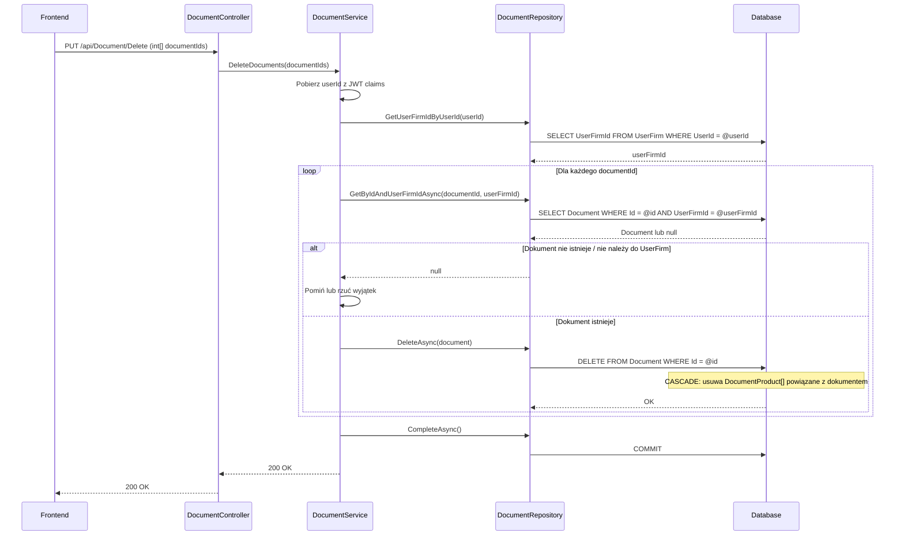

# Usuń dokumenty — proces techniczny

| Pole | Wartość |
|---|---|
| ID dokumentu | PROC-DeleteDocuments |
| Typ dokumentu | proces |
| Wersja | 0.1 |
| Status | szkic |
| Autor (ostatnia modyfikacja) | Agent Claudiusz Sonte 4.6 max |
| Data ostatniej modyfikacji | 2026-05-31 |

## Streszczenie

Proces fizycznie usuwa jeden lub więcej dokumentów z systemu. Endpoint przyjmuje tablicę ID — możliwe usuwanie wsadowe. Backend iteruje po identyfikatorach, sprawdza przynależność dokumentu do firmy użytkownika i usuwa każdy z nich. Usunięcie `Document` kaskadowo usuwa powiązane `DocumentProduct[]`. Operacja jest nieodwracalna (hard delete), brak transakcji obejmującej całą tablicę.

## Cel procesu

Usunąć błędnie wystawione lub nieaktualne dokumenty z listy faktur/proform/storn.

## Charakterystyka

| Atrybut | Wartość |
|---|---|
| ID procesu | PROC-DeleteDocuments |
| Typ | główny |
| Inicjator | Ekran listy faktur (lub proform/storn) + zaznaczenie wierszy + operacja „Usuń" |
| Warunki startu | Użytkownik zalogowany (JWT); wybrane co najmniej jeden dokument do usunięcia |
| Warunki zakończenia (sukces) | Rekordy `Document` i powiązane `DocumentProduct[]` usunięte; HTTP 200 |
| Warunki zakończenia (błąd) | Dokument nie istnieje lub nie należy do UserFirm (404 lub pominięcie) |
| Uczestnicy | Frontend (Angular), API (DocumentController), Service (DocumentService), Repository (DocumentRepository), Database (dbo.Document, dbo.DocumentProduct — CASCADE) |

## Diagram sekwencji

## Kroki

1. **Odbiór żądania** — `DocumentController` odbiera tablicę `int[] documentIds` z PUT `/api/Document/Delete` (body).
2. **Ekstrakcja userId** — serwis pobiera `userId` z claims JWT.
3. **Pobranie UserFirmId** — zapytanie przez repozytorium.
4. **Pętla po ID** — dla każdego `documentId`: pobranie dokumentu z filtrem po `UserFirmId`. Jeśli `null` — pominięcie lub błąd (zależy od implementacji).
5. **Fizyczne usunięcie** — `DocumentRepository.DeleteAsync(document)` — hard delete.
6. **Kaskadowe usunięcie pozycji** — baza automatycznie usuwa `DocumentProduct[]` (FK CASCADE).
7. **Zapis** — `UnitOfWork.CompleteAsync()`.
8. **Odpowiedź** — HTTP 200 OK.

## Obsługa błędów

| Błąd | Miejsce wystąpienia | Reakcja |
|---|---|---|
| Dokument nie istnieje / nie należy do UserFirm | DocumentService | Pominięcie lub 404 (zależy od implementacji) |
| Błąd deserializacji `int[]` z body | DocumentController | HTTP 400 Bad Request (anomalia DD-01) |
| Nieautoryzowany dostęp | AuthMiddleware | HTTP 401 Unauthorized |

## Powiązania

- Wywołany z ekranu: [Lista faktur](../../../01_ekrany/faktury/lista_faktur/ekran.md), [Lista proform](../../../01_ekrany/faktury_proforma/lista_faktur_proforma/ekran.md), [Lista storn](../../../01_ekrany/faktury_storno/lista_faktur_storno/ekran.md)
- Powiązane API: [PUT /api/Document/Delete](../../../04_api_i_integracje/01_api_frontend/document/PUT_Document_Delete.md)
- Powiązany algorytm: Nie dotyczy

## Powiązania z kodem

- Kontroler: `InvoiceJetAPI/Controllers/DocumentController.cs`
- Serwis: `InvoiceJetAPI/Services/DocumentService.cs`
- Repozytorium: `InvoiceJetAPI/Repositories/DocumentRepository.cs`

## Wątpliwości i braki

- **DD-01:** Parametr `[int[] documentIds]` z `[FromBody]` — potencjalny problem z deserializacją tablicy w niektórych konfiguracjach ASP.NET Core (weryfikacja wymagana).
- **DD-02:** Hard delete — brak soft-delete; dokumenty bezpowrotnie znikają.
- **DD-03:** Brak transakcji obejmującej całą tablicę ID — przy błędzie w połowie pętli część dokumentów zostanie usunięta, część nie.
- **DD-04:** `DocumentProducts` usuwane kaskadowo przez FK — działa poprawnie, ale warto odnotować.

## Rejestr zmian

| Wersja | Data | Autor | Opis zmiany |
|---|---|---|---|
| 0.1 | 2026-05-31 | Agent Claudiusz Sonte 4.6 max | Pierwsza wersja — adaptacja z P-11_DeleteDocument.md do nowego formatu. |
