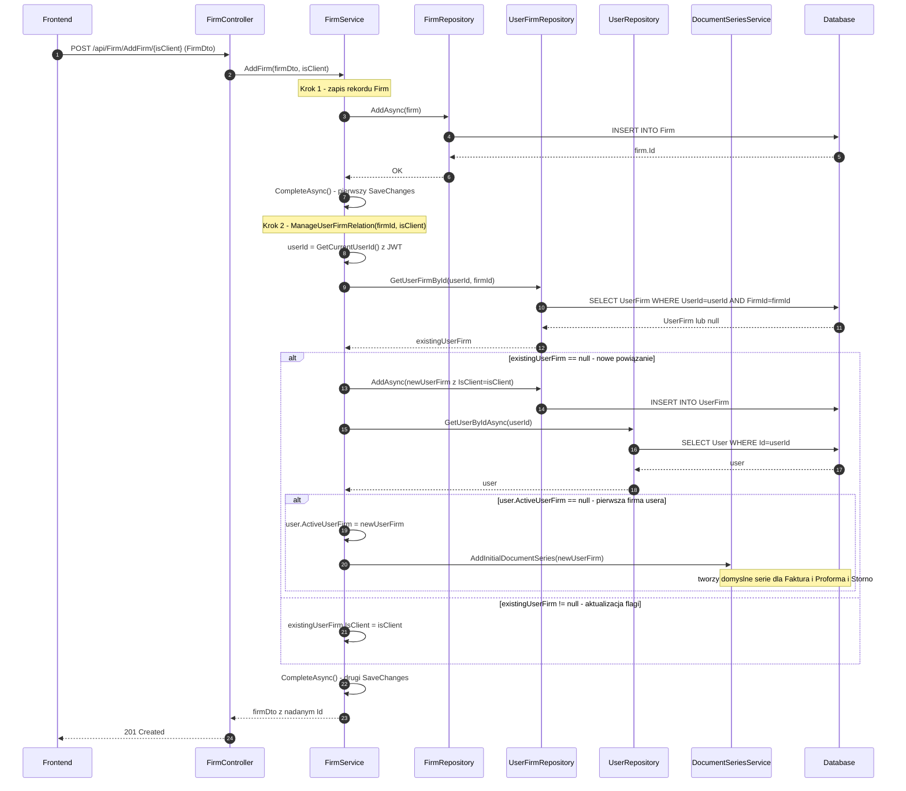

# Dodaj firmę — proces techniczny

| Pole | Wartość |
|---|---|
| ID dokumentu | PROC-AddFirm |
| Typ dokumentu | proces |
| Wersja | 0.1 |
| Status | szkic |
| Autor (ostatnia modyfikacja) | Agent Claudiusz Sonte 4.6 max |
| Data ostatniej modyfikacji | 2026-05-31 |

## Streszczenie

Proces umożliwia zalogowanemu użytkownikowi dodanie firmy do systemu. Parametr `isClient` decyduje o roli firmy: `false` — własna firma wystawiającego (przypisywana do `UserFirm`), `true` — firma klienta (dodawana do listy klientów `UserFirm.ClientFirms`). Jeden endpoint obsługuje oba przypadki. Po zapisaniu firma jest dostępna w selektorach formularzy dokumentów.

## Cel procesu

Zapisać nową firmę (własną lub klienta) powiązaną z kontem zalogowanego użytkownika, tak aby mogła być używana przy wystawianiu dokumentów.

## Charakterystyka

| Atrybut | Wartość |
|---|---|
| ID procesu | PROC-AddFirm |
| Typ | główny |
| Inicjator | Ekran danych firmy (`isClient=false`) lub dialog dodania klienta (`isClient=true`) + operacja „Dodaj" |
| Warunki startu | Użytkownik zalogowany (JWT); wypełniony formularz danych firmy |
| Warunki zakończenia (sukces) | Rekord `Firm` zapisany w DB; powiązanie z `UserFirm` zaktualizowane; HTTP 201 |
| Warunki zakończenia (błąd) | Brak — nie ma zdefiniowanych wyjątków dla AddFirm (walidacja po stronie frontu) |
| Uczestnicy | Frontend (Angular), API (FirmController), Service (FirmService), Repository (FirmRepository, UserFirmRepository), Database (dbo.Firm, dbo.UserFirm) |

## Diagram sekwencji

## Kroki (zweryfikowane z kodem FirmService.cs)

1. **Odbiór żądania** — `FirmController` odbiera `FirmDto` i parametr ścieżki `isClient` (bool).
2. **Zapis Firm** — `FirmRepository.AddAsync(firm)` + `CompleteAsync()` — **pierwszy SaveChanges**. Firma dostaje `Id`.
3. **ManageUserFirmRelation(firmId, isClient)**:
   - Pobierz `userId` z JWT claims
   - `UserFirmRepository.GetUserFirmById(userId, firmId)` — sprawdź czy powiązanie już istnieje
   - **Jeśli NIE istnieje:** utwórz `UserFirm { UserId, FirmId, IsClient=isClient }` i dodaj
     - Jeśli `user.ActiveUserFirm == null` (pierwsza firma usera): ustaw jako aktywną i wywołaj `DocumentSeriesService.AddInitialDocumentSeries` — tworzy domyślne serie numeracji
   - **Jeśli ISTNIEJE:** zaktualizuj tylko `existingUserFirm.IsClient = isClient`
4. **CompleteAsync()** — **drugi SaveChanges** dla UserFirm i User.
5. **Odpowiedź** — `firmDto` z nadanym `Id`, HTTP 201 Created.

> ⚠️ **Uwaga:** `isClient` NIE rozgałęzia logiki tworzenia osobnych tabel — decyduje wyłącznie o wartości flagi `UserFirm.IsClient`. Nie istnieje tabela `UserFirmClientFirm` — klienci to rekordy `UserFirm` z `IsClient=true`.

## Obsługa błędów

| Błąd | Miejsce wystąpienia | Reakcja |
|---|---|---|
| Nieautoryzowany dostęp | AuthMiddleware | HTTP 401 Unauthorized |
| Błąd DB (nieoczekiwany) | FirmRepository | HTTP 500 Internal Server Error (ExceptionMiddleware) |

## Powiązania

- Wywołany z ekranu: [Dane firmy](../../../01_ekrany/firma/dane_firmy/ekran.md) (`isClient=false`), [Klienci](../../../01_ekrany/firma/klienci/ekran.md) (`isClient=true`)
- Powiązane API: [POST /api/Firm/AddFirm](../../../04_api_i_integracje/01_api_frontend/firm/POST_Firm_AddFirm.md)
- Powiązany algorytm: Nie dotyczy

## Powiązania z kodem

- Kontroler: `InvoiceJetAPI/Controllers/FirmController.cs`
- Serwis: `InvoiceJetAPI/Services/FirmService.cs`
- Repozytorium: `InvoiceJetAPI/Repositories/FirmRepository.cs`, `InvoiceJetAPI/Repositories/UserFirmRepository.cs`

## Wątpliwości i braki

- Brak walidacji unikalności CUI (`cuiValue`) na poziomie backendu — możliwe zduplikowane firmy z tym samym NIP.
- Niejasna logika powiązania `UserFirm` dla pierwszej firmy użytkownika (brak dokumentacji przepływu inicjalnego).

## Rejestr zmian

| Wersja | Data | Autor | Opis zmiany |
|---|---|---|---|
| 0.1 | 2026-05-31 | Agent Claudiusz Sonte 4.6 max | Pierwsza wersja — wyodrębniona z P-03_ManageFirm.md (operacja AddFirm). |
