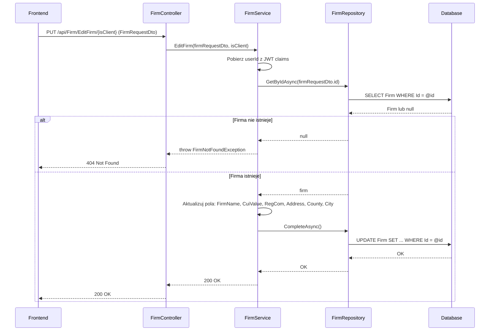

# Edytuj firmę — proces techniczny

| Pole | Wartość |
|---|---|
| ID dokumentu | PROC-EditFirm |
| Typ dokumentu | proces |
| Wersja | 0.1 |
| Status | szkic |
| Autor (ostatnia modyfikacja) | Agent Claudiusz Sonte 4.6 max |
| Data ostatniej modyfikacji | 2026-05-31 |

## Streszczenie

Proces umożliwia zalogowanemu użytkownikowi aktualizację danych istniejącej firmy (własnej lub klienta). Parametr `isClient` wskazuje kontekst edycji. Backend sprawdza istnienie firmy o podanym `id`, a następnie aktualizuje wszystkie pola na podstawie przesłanego DTO.

## Cel procesu

Zaktualizować dane firmy (nazwa, NIP, REGON, adres, województwo, miasto) zapisane w tabeli `Firm` tak, aby były zgodne z aktualnymi danymi kontrahenta.

## Charakterystyka

| Atrybut | Wartość |
|---|---|
| ID procesu | PROC-EditFirm |
| Typ | główny |
| Inicjator | Ekran danych firmy (`isClient=false`) lub dialog edycji klienta (`isClient=true`) + operacja „Zapisz" |
| Warunki startu | Użytkownik zalogowany (JWT); formularz z danymi firmy i niepustym `id` |
| Warunki zakończenia (sukces) | Rekord `Firm` zaktualizowany w DB; HTTP 200 |
| Warunki zakończenia (błąd) | Firma o podanym `id` nie istnieje (404) |
| Uczestnicy | Frontend (Angular), API (FirmController), Service (FirmService), Repository (FirmRepository), Database (dbo.Firm) |

## Diagram sekwencji

## Kroki

1. **Odbiór żądania** — `FirmController` odbiera `FirmRequestDto` (z niepustym polem `id`) i parametr `isClient` z PUT `/api/Firm/EditFirm/{isClient}`.
2. **Ekstrakcja userId** — serwis pobiera `userId` z claims JWT.
3. **Pobranie firmy** — `FirmRepository.GetByIdAsync(firmRequestDto.Id)`. Jeśli `null` → `FirmNotFoundException` (HTTP 404).
4. **Aktualizacja pól** — serwis nadpisuje pola encji: `FirmName`, `CuiValue`, `RegCom`, `Address`, `County`, `City`.
5. **Zapis** — `UnitOfWork.CompleteAsync()` (EF Core śledzi zmiany).
6. **Odpowiedź** — HTTP 200 OK.

## Obsługa błędów

| Błąd | Miejsce wystąpienia | Reakcja |
|---|---|---|
| `FirmNotFoundException` | FirmService | HTTP 404 Not Found — firma o podanym id nie istnieje |
| Nieautoryzowany dostęp | AuthMiddleware | HTTP 401 Unauthorized |
| Błąd DB (nieoczekiwany) | FirmRepository | HTTP 500 Internal Server Error (ExceptionMiddleware) |

## Powiązania

- Wywołany z ekranu: `01_ekrany/firma/dane_firmy/` (`isClient=false`), `01_ekrany/firma/klienci/` (`isClient=true`)
- Powiązane API: `PUT /api/Firm/EditFirm/{isClient}`
- Powiązany algorytm: Nie dotyczy

## Powiązania z kodem

- Kontroler: `InvoiceJetAPI/Controllers/FirmController.cs`
- Serwis: `InvoiceJetAPI/Services/FirmService.cs`
- Repozytorium: `InvoiceJetAPI/Repositories/FirmRepository.cs`

## Wątpliwości i braki

- Brak weryfikacji czy edytowana firma należy do zalogowanego użytkownika — wystarczy znać `id` firmy, by ją edytować (brak izolacji danych).
- Parametr `isClient` odbierany przez serwis, ale nie jest jasne czy wpływa na logikę aktualizacji (kod wymaga weryfikacji).

## Rejestr zmian

| Wersja | Data | Autor | Opis zmiany |
|---|---|---|---|
| 0.1 | 2026-05-31 | Agent Claudiusz Sonte 4.6 max | Pierwsza wersja — wyodrębniona z P-03_ManageFirm.md (operacja EditFirm). |
