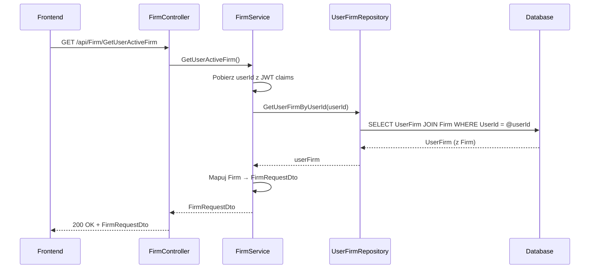

# Pobierz aktywną firmę użytkownika — proces techniczny

| Pole | Wartość |
|---|---|
| ID dokumentu | PROC-GetUserActiveFirm |
| Typ dokumentu | proces |
| Wersja | 0.1 |
| Status | szkic |
| Autor (ostatnia modyfikacja) | Agent Claudiusz Sonte 4.6 max |
| Data ostatniej modyfikacji | 2026-05-31 |

## Streszczenie

Proces pobiera dane własnej firmy zalogowanego użytkownika (tzw. firmy wystawiającej) na podstawie powiązania `UserFirm`. Zwraca pełne dane firmy w formacie `FirmRequestDto` do wypełnienia formularza ekranu „Dane firmy". Jest to operacja odczytu — nie modyfikuje żadnych danych.

## Cel procesu

Dostarczyć frontendowi dane własnej firmy użytkownika (wystawiającej faktury), aby wyświetlić je w formularzu danych firmy i umożliwić ich edycję.

## Charakterystyka

| Atrybut | Wartość |
|---|---|
| ID procesu | PROC-GetUserActiveFirm |
| Typ | pomocniczy |
| Inicjator | Ekran danych firmy — akcja inicjalizacji komponentu (ngOnInit) |
| Warunki startu | Użytkownik zalogowany (JWT); posiada powiązanie UserFirm |
| Warunki zakończenia (sukces) | `FirmRequestDto` zwrócony do frontendu; HTTP 200 |
| Warunki zakończenia (błąd) | Użytkownik nie ma przypisanej firmy (404 lub puste dane) |
| Uczestnicy | Frontend (Angular), API (FirmController), Service (FirmService), Repository (UserFirmRepository, FirmRepository), Database (dbo.UserFirm, dbo.Firm) |

## Diagram sekwencji

## Kroki

1. **Odbiór żądania** — `FirmController` obsługuje GET `/api/Firm/GetUserActiveFirm` (lub odpowiedni endpoint — zob. wątpliwości).
2. **Ekstrakcja userId** — serwis pobiera `userId` z claims JWT.
3. **Pobranie UserFirm** — `UserFirmRepository.GetUserFirmByUserId(userId)` zwraca powiązanie użytkownika z jego firmą (JOIN z tabelą `Firm`).
4. **Mapowanie** — `AutoMapper` mapuje `Firm` → `FirmRequestDto`.
5. **Odpowiedź** — HTTP 200 OK + `FirmRequestDto`.

## Obsługa błędów

| Błąd | Miejsce wystąpienia | Reakcja |
|---|---|---|
| UserFirm bez przypisanej firmy | FirmService | Zwrot null lub 404 — szczegóły wymagają weryfikacji kodu |
| Nieautoryzowany dostęp | AuthMiddleware | HTTP 401 Unauthorized |
| Błąd DB (nieoczekiwany) | Repository | HTTP 500 Internal Server Error (ExceptionMiddleware) |

## Powiązania

- Wywołany z ekranu: `01_ekrany/firma/dane_firmy/`
- Powiązane API: `GET /api/Firm/GetUserActiveFirm` (lub zbliżony endpoint — weryfikacja wymagana)
- Powiązany algorytm: Nie dotyczy

## Powiązania z kodem

- Kontroler: `InvoiceJetAPI/Controllers/FirmController.cs`
- Serwis: `InvoiceJetAPI/Services/FirmService.cs`
- Repozytorium: `InvoiceJetAPI/Repositories/UserFirmRepository.cs`

## Wątpliwości i braki

- P-03 nie dokumentuje wprost endpointu GetUserActiveFirm — konieczna weryfikacja nazwy endpointu w `FirmController.cs`.
- Niejasne zachowanie gdy `UserFirm.FirmId = null` (użytkownik po rejestracji, przed dodaniem firmy).

## Rejestr zmian

| Wersja | Data | Autor | Opis zmiany |
|---|---|---|---|
| 0.1 | 2026-05-31 | Agent Claudiusz Sonte 4.6 max | Pierwsza wersja — wyodrębniona z P-03_ManageFirm.md (operacja GetUserActiveFirm). |
