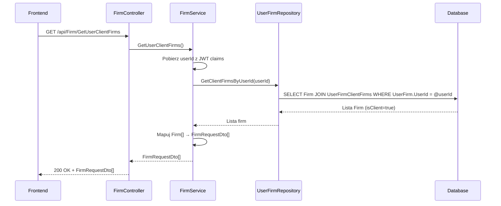

# Pobierz firmy klientów — proces techniczny

| Pole | Wartość |
|---|---|
| ID dokumentu | PROC-GetUserClientFirms |
| Typ dokumentu | proces |
| Wersja | 0.1 |
| Status | szkic |
| Autor (ostatnia modyfikacja) | Agent Claudiusz Sonte 4.6 max |
| Data ostatniej modyfikacji | 2026-05-31 |

## Streszczenie

Proces pobiera listę firm klientów przypisanych do zalogowanego użytkownika (firmy z parametrem `isClient=true`). Wynik zasilany jest do tabeli listy klientów na ekranie „Klienci" oraz do selektora odbiorcy przy tworzeniu dokumentów. Jest to operacja odczytu — nie modyfikuje żadnych danych.

## Cel procesu

Dostarczyć frontendowi listę firm-klientów użytkownika, aby wyświetlić je w tabeli „Klienci" i umożliwić wybór klienta przy wystawianiu faktury.

## Charakterystyka

| Atrybut | Wartość |
|---|---|
| ID procesu | PROC-GetUserClientFirms |
| Typ | pomocniczy |
| Inicjator | Ekran „Klienci" — akcja inicjalizacji (ngOnInit) lub ekran dodaj/edytuj dokument (selektor klienta) |
| Warunki startu | Użytkownik zalogowany (JWT) |
| Warunki zakończenia (sukces) | Lista `FirmRequestDto[]` zwrócona do frontendu; HTTP 200 |
| Warunki zakończenia (błąd) | Brak zdefiniowanych wyjątków — pusta lista gdy brak klientów |
| Uczestnicy | Frontend (Angular), API (FirmController), Service (FirmService), Repository (UserFirmRepository), Database (dbo.UserFirm, dbo.Firm) |

## Diagram sekwencji

## Kroki

1. **Odbiór żądania** — `FirmController` obsługuje GET `/api/Firm/GetUserClientFirms` (lub zbliżony endpoint).
2. **Ekstrakcja userId** — serwis pobiera `userId` z claims JWT.
3. **Pobranie klientów** — `UserFirmRepository.GetClientFirmsByUserId(userId)` zwraca firmy powiązane z `UserFirm` jako klienci (relacja many-to-many lub kolekcja `ClientFirms`).
4. **Mapowanie** — `AutoMapper` mapuje `Firm[]` → `FirmRequestDto[]`.
5. **Odpowiedź** — HTTP 200 OK + lista klientów (pusta lista gdy brak klientów).

## Obsługa błędów

| Błąd | Miejsce wystąpienia | Reakcja |
|---|---|---|
| Nieautoryzowany dostęp | AuthMiddleware | HTTP 401 Unauthorized |
| Błąd DB (nieoczekiwany) | Repository | HTTP 500 Internal Server Error (ExceptionMiddleware) |

## Powiązania

- Wywołany z ekranu: [Klienci](../../../01_ekrany/firma/klienci/ekran.md), [Dodaj/edytuj fakturę](../../../01_ekrany/faktury/dodaj_edytuj_fakture/ekran.md)
- Powiązane API: [GET /api/Firm/GetUserClientFirms](../../../04_api_i_integracje/01_api_frontend/firm/GET_Firm_GetUserClientFirms.md)
- Powiązane procesy: [dodaj_firme](../dodaj_firme/proces.md), [edytuj_firme](../edytuj_firme/proces.md), [usun_firme](../usun_firme/proces.md)
- Powiązane algorytmy: [ALG-10 Data Isolation Pattern](../../../03_algorytmy/ALG-10_DataIsolationPattern.md)

## Powiązania z kodem

- Kontroler: `InvoiceJetAPI/Controllers/FirmController.cs`
- Serwis: `InvoiceJetAPI/Services/FirmService.cs`
- Repozytorium: `InvoiceJetAPI/Repositories/UserFirmRepository.cs`

## Wątpliwości i braki

- P-03 nie dokumentuje wprost endpointu pobierania klientów — konieczna weryfikacja nazwy i sygnatury w `FirmController.cs`.
- Niejasna struktura relacji: czy `ClientFirms` to kolekcja w encji `UserFirm`, czy osobna tabela pośrednia.
- Dane firm klientów pojawiają się też w `GetDocumentAutofillInfo` — możliwe redundantne zapytania.

## Rejestr zmian

| Wersja | Data | Autor | Opis zmiany |
|---|---|---|---|
| 0.1 | 2026-05-31 | Agent Claudiusz Sonte 4.6 max | Pierwsza wersja — wyodrębniona z P-03_ManageFirm.md (operacja GetUserClientFirms). |
