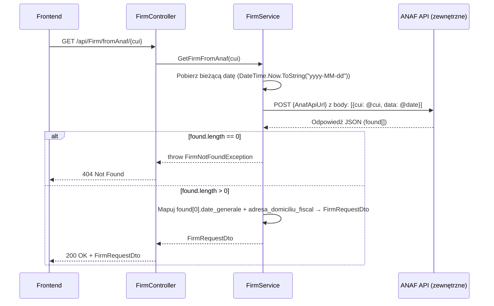

# Pobierz dane firmy z ANAF — proces techniczny

| Pole | Wartość |
|---|---|
| ID dokumentu | PROC-GetFirmFromAnaf |
| Typ dokumentu | proces |
| Wersja | 0.1 |
| Status | szkic |
| Autor (ostatnia modyfikacja) | Agent Claudiusz Sonte 4.6 max |
| Data ostatniej modyfikacji | 2026-05-31 |

## Streszczenie

Proces realizuje autouzupełnienie formularza danych firmy na podstawie numeru CUI (Cod Unic de Înregistrare — rumuński odpowiednik NIP). Backend wysyła żądanie do zewnętrznego API rumuńskiej administracji podatkowej (ANAF), mapuje odpowiedź na strukturę `FirmRequestDto` i zwraca ją do frontendu. Użytkownik może zatwierdzić pobrane dane lub je zmodyfikować przed zapisem.

## Cel procesu

Skrócić czas wprowadzania danych firmy przez automatyczne pobranie informacji rejestrowych (nazwa, NIP, REGON, adres) z publicznego rejestru ANAF na podstawie samego numeru CUI.

## Charakterystyka

| Atrybut | Wartość |
|---|---|
| ID procesu | PROC-GetFirmFromAnaf |
| Typ | pomocniczy |
| Inicjator | Ekran danych firmy lub dialog dodania klienta + kliknięcie ikony „chmury" (autouzupełnienie) |
| Warunki startu | Użytkownik zalogowany (JWT); wpisany numer CUI w formularzu |
| Warunki zakończenia (sukces) | `FirmRequestDto` z danymi ANAF zwrócony; HTTP 200; frontend wypełnia pola formularza |
| Warunki zakończenia (błąd) | Firma nie znaleziona w ANAF (404); ANAF niedostępny (500) |
| Uczestnicy | Frontend (Angular), API (FirmController), Service (FirmService), Zewnętrzny serwis ANAF API |

## Diagram sekwencji

## Kroki

1. **Odbiór żądania** — `FirmController` odbiera parametr `cui` (int) z GET `/api/Firm/fromAnaf/{cui}`.
2. **Przygotowanie daty** — serwis pobiera bieżącą datę w formacie `yyyy-MM-dd`.
3. **Wywołanie ANAF API** — `HttpClient.PostAsync(AnafApiUrl, [{cui, data}])`. URL pobrany z `AppSettings:AnafApiUrl`.
4. **Deserializacja odpowiedzi** — parsowanie JSON odpowiedzi ANAF.
5. **Walidacja wyniku** — jeśli `found` puste → `FirmNotFoundException` (HTTP 404).
6. **Mapowanie danych** — wyciągnięcie pól z `found[0]`:
   - `FirmName` ← `date_generale.denumire`
   - `CuiValue` ← `date_generale.cui`
   - `RegCom` ← `date_generale.nrRegCom`
   - `Address` ← `date_generale.adresa`
   - `County` ← `adresa_domiciliu_fiscal.ddenumire_Judet`
   - `City` ← `adresa_domiciliu_fiscal.ddenumire_Localitate`
7. **Odpowiedź** — HTTP 200 OK + `FirmRequestDto` z wypełnionymi polami.

## Obsługa błędów

| Błąd | Miejsce wystąpienia | Reakcja |
|---|---|---|
| `FirmNotFoundException` | FirmService | HTTP 404 Not Found — brak firmy o podanym CUI w ANAF |
| ANAF API timeout | HttpClient | HTTP 500 — brak obsługi timeoutu (anomalia ANAF-01) |
| Błąd klucza konfiguracji | AppSettings | HTTP 500 — brak `AppSettings:AnafApiUrl` |
| Nieautoryzowany dostęp | AuthMiddleware | HTTP 401 Unauthorized |

## Powiązania

- Wywołany z ekranu: [Dane firmy](../../../01_ekrany/firma/dane_firmy/ekran.md), [Klienci](../../../01_ekrany/firma/klienci/ekran.md)
- Powiązane API: [GET /api/Firm/fromAnaf](../../../04_api_i_integracje/01_api_frontend/firm/GET_Firm_fromAnaf.md)
- Powiązany algorytm: [integracja_anaf](../../../03_algorytmy/dedykowane/integracja_anaf.md)

## Powiązania z kodem

- Kontroler: `InvoiceJetAPI/Controllers/FirmController.cs`
- Serwis: `InvoiceJetAPI/Services/FirmService.cs`
- Repozytorium: Nie dotyczy (brak operacji na DB)

## Wątpliwości i braki

- Brak obsługi timeoutu — jeśli ANAF API nie odpowiada, żądanie czeka bez limitu czasu (ANAF-01).
- Brak cache — każde kliknięcie „chmury" wysyła nowe żądanie do zewnętrznego API (ANAF-02).
- Brak fallback gdy klucz `AppSettings:AnafApiUrl` nie istnieje w konfiguracji (ANAF-03).

## Rejestr zmian

| Wersja | Data | Autor | Opis zmiany |
|---|---|---|---|
| 0.1 | 2026-05-31 | Agent Claudiusz Sonte 4.6 max | Pierwsza wersja — adaptacja z P-04_GetFirmFromAnaf.md do nowego formatu. |
