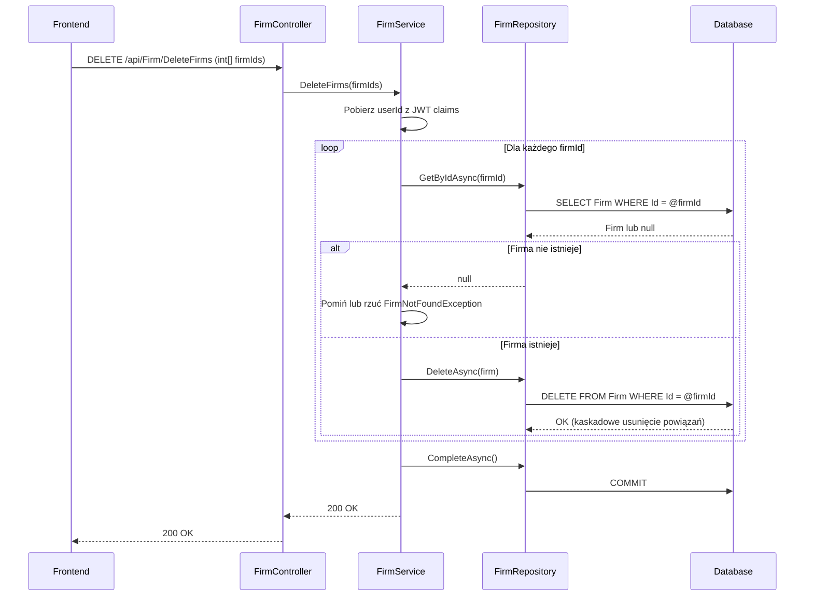

# Usuń firmę — proces techniczny

| Pole | Wartość |
|---|---|
| ID dokumentu | PROC-DeleteFirms |
| Typ dokumentu | proces |
| Wersja | 0.1 |
| Status | szkic |
| Autor (ostatnia modyfikacja) | Agent Claudiusz Sonte 4.6 max |
| Data ostatniej modyfikacji | 2026-05-31 |

## Streszczenie

Proces fizycznie usuwa firmę (lub firmy klientów) z bazy danych. Operacja dotyczy wyłącznie firm z parametrem `isClient=true` (firm klientów) — usunięcie własnej firmy wystawiającej nie jest obsługiwane standardowym przepływem. Usunięcie jest nieodwracalne (hard delete).

## Cel procesu

Usunąć z systemu firmy klientów, które nie są już aktywne lub zostały błędnie dodane, oczyszczając listę kontrahentów użytkownika.

## Charakterystyka

| Atrybut | Wartość |
|---|---|
| ID procesu | PROC-DeleteFirms |
| Typ | główny |
| Inicjator | Ekran „Klienci" + operacja „Usuń" (zaznaczenie wierszy + przycisk usunięcia) |
| Warunki startu | Użytkownik zalogowany (JWT); wybrana co najmniej jedna firma klienta do usunięcia |
| Warunki zakończenia (sukces) | Rekord(y) `Firm` usunięte z DB; HTTP 200 |
| Warunki zakończenia (błąd) | Firma nie istnieje (404) lub błąd FK constraint (500) |
| Uczestnicy | Frontend (Angular), API (FirmController), Service (FirmService), Repository (FirmRepository), Database (dbo.Firm) |

## Diagram sekwencji

## Kroki

1. **Odbiór żądania** — `FirmController` odbiera tablicę `int[] firmIds` z ciała żądania DELETE (lub PUT) do `/api/Firm/DeleteFirms`.
2. **Ekstrakcja userId** — serwis pobiera `userId` z claims JWT.
3. **Pętla po ID** — dla każdego `firmId`: pobiera rekord, sprawdza istnienie, wywołuje usunięcie.
4. **Fizyczne usunięcie** — `FirmRepository.DeleteAsync(firm)` — hard delete bez możliwości przywrócenia.
5. **Zapis** — `UnitOfWork.CompleteAsync()`.
6. **Odpowiedź** — HTTP 200 OK.

## Obsługa błędów

| Błąd | Miejsce wystąpienia | Reakcja |
|---|---|---|
| `FirmNotFoundException` | FirmService | HTTP 404 Not Found lub pominięcie (zależy od implementacji) |
| FK constraint (firma ma dokumenty) | Database | HTTP 500 — błąd constraint naruszenia referencji |
| Nieautoryzowany dostęp | AuthMiddleware | HTTP 401 Unauthorized |

## Powiązania

- Wywołany z ekranu: `01_ekrany/firma/klienci/`
- Powiązane API: `DELETE /api/Firm/DeleteFirms` lub `PUT /api/Firm/DeleteFirms` (weryfikacja metody HTTP wymagana)
- Powiązany algorytm: Nie dotyczy

## Powiązania z kodem

- Kontroler: `InvoiceJetAPI/Controllers/FirmController.cs`
- Serwis: `InvoiceJetAPI/Services/FirmService.cs`
- Repozytorium: `InvoiceJetAPI/Repositories/FirmRepository.cs`

## Wątpliwości i braki

- P-03 nie dokumentuje wprost endpointu usuwania firm — konieczna weryfikacja nazwy, metody HTTP i parametrów w `FirmController.cs`.
- Brak weryfikacji czy usuwana firma należy do zalogowanego użytkownika.
- Niejasne zachowanie gdy firma jest przypisana do dokumentów (potencjalny FK constraint violation).
- Brak informacji czy usunięcie jest możliwe dla własnej firmy wystawiającej (`isClient=false`).

## Rejestr zmian

| Wersja | Data | Autor | Opis zmiany |
|---|---|---|---|
| 0.1 | 2026-05-31 | Agent Claudiusz Sonte 4.6 max | Pierwsza wersja — wyodrębniona z P-03_ManageFirm.md (operacja DeleteFirms). |
