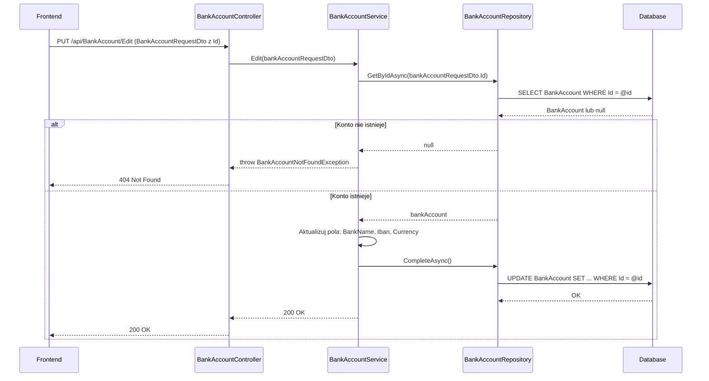

# Edytuj konto bankowe — proces techniczny

| Pole | Wartość |
|---|---|
| ID dokumentu | PROC-EditBankAccount |
| Typ dokumentu | proces |
| Wersja | 0.1 |
| Status | szkic |
| Autor (ostatnia modyfikacja) | Agent Claudiusz Sonte 4.6 max |
| Data ostatniej modyfikacji | 2026-05-31 |

## Streszczenie

Proces aktualizuje dane istniejącego konta bankowego (nazwa banku, IBAN, waluta). Backend weryfikuje istnienie konta po `id` i w przypadku sukcesu aktualizuje wszystkie pola. Zmiana danych konta wpływa na dane wyświetlane na wszystkich przyszłych dokumentach, ale nie retroaktywnie na już wystawione.

## Cel procesu

Zaktualizować dane konta bankowego firmy w systemie, aby dane na dokumentach były aktualne.

## Charakterystyka

| Atrybut | Wartość |
|---|---|
| ID procesu | PROC-EditBankAccount |
| Typ | główny |
| Inicjator | Ekran „Konta bankowe" + dialog „Edytuj konto" + operacja zapisu |
| Warunki startu | Użytkownik zalogowany (JWT); wybrane konto do edycji |
| Warunki zakończenia (sukces) | Rekord `BankAccount` zaktualizowany; HTTP 200 |
| Warunki zakończenia (błąd) | Konto nie istnieje (404) |
| Uczestnicy | Frontend (Angular), API (BankAccountController), Service (BankAccountService), Repository (BankAccountRepository), Database (dbo.BankAccount) |

## Diagram sekwencji

## Kroki

1. **Odbiór żądania** — `BankAccountController` odbiera `BankAccountRequestDto` (z niepustym `id`) z PUT `/api/BankAccount/Edit`.
2. **Pobranie konta** — `BankAccountRepository.GetByIdAsync(id)`. Jeśli `null` → `BankAccountNotFoundException` (HTTP 404).
3. **Aktualizacja pól** — serwis nadpisuje: `BankName`, `Iban`, `Currency`.
4. **Zapis** — `UnitOfWork.CompleteAsync()`.
5. **Odpowiedź** — HTTP 200 OK.

## Obsługa błędów

| Błąd | Miejsce wystąpienia | Reakcja |
|---|---|---|
| `BankAccountNotFoundException` | BankAccountService | HTTP 404 Not Found |
| Nieautoryzowany dostęp | AuthMiddleware | HTTP 401 Unauthorized |

## Powiązania

- Wywołany z ekranu: [Konta bankowe](../../../01_ekrany/firma/konta_bankowe/ekran.md)
- Powiązane API: [PUT /api/BankAccount/Edit](../../../04_api_i_integracje/01_api_frontend/bank_account/PUT_BankAccount_Edit.md)
- Powiązane algorytmy: [ALG-10 Data Isolation Pattern](../../../03_algorytmy/ALG-10_DataIsolationPattern.md)

## Powiązania z kodem

- Kontroler: `InvoiceJetAPI/Controllers/BankAccountController.cs`
- Serwis: `InvoiceJetAPI/Services/BankAccountService.cs`
- Repozytorium: `InvoiceJetAPI/Repositories/BankAccountRepository.cs`

## Wątpliwości i braki

- Brak weryfikacji czy edytowane konto należy do firmy zalogowanego użytkownika.
- Edycja konta wpływa na historyczne dokumenty (pole `BankAccountId` w dokumencie jest FK, nie kopia danych).

## Rejestr zmian

| Wersja | Data | Autor | Opis zmiany |
|---|---|---|---|
| 0.1 | 2026-05-31 | Agent Claudiusz Sonte 4.6 max | Pierwsza wersja — wyodrębniona z P-05_ManageBankAccounts.md (operacja Edit). |
