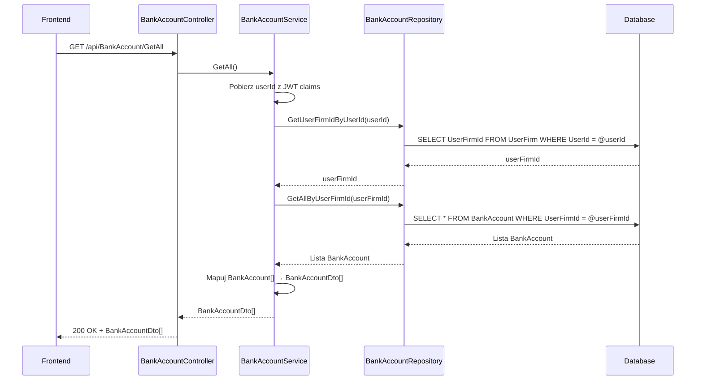

# Pobierz konta bankowe — proces techniczny

| Pole | Wartość |
|---|---|
| ID dokumentu | PROC-GetAllBankAccounts |
| Typ dokumentu | proces |
| Wersja | 0.1 |
| Status | szkic |
| Autor (ostatnia modyfikacja) | Agent Claudiusz Sonte 4.6 max |
| Data ostatniej modyfikacji | 2026-05-31 |

## Streszczenie

Proces pobiera listę wszystkich kont bankowych przypisanych do firmy zalogowanego użytkownika. Konta bankowe są izolowane przez `UserFirmId` — każda firma widzi tylko swoje konta. Lista zwracana jest jednorazowo bez paginacji. Wynik zasilany jest do tabeli ekranu „Konta bankowe" oraz do selektora konta w formularzu dokumentu.

## Cel procesu

Dostarczyć frontendowi listę kont bankowych firmy, aby umożliwić ich przeglądanie, zarządzanie i wybór konta przy wystawianiu dokumentów.

## Charakterystyka

| Atrybut | Wartość |
|---|---|
| ID procesu | PROC-GetAllBankAccounts |
| Typ | pomocniczy |
| Inicjator | Ekran „Konta bankowe" — ngOnInit; lub formularz dokumentu — inicjalizacja selektora |
| Warunki startu | Użytkownik zalogowany (JWT) z przypisaną firmą (UserFirm) |
| Warunki zakończenia (sukces) | Lista `BankAccountDto[]` zwrócona; HTTP 200 |
| Warunki zakończenia (błąd) | Brak — pusta lista gdy brak kont |
| Uczestnicy | Frontend (Angular), API (BankAccountController), Service (BankAccountService), Repository (BankAccountRepository), Database (dbo.BankAccount, dbo.UserFirm) |

## Diagram sekwencji

## Kroki

1. **Odbiór żądania** — `BankAccountController` obsługuje GET `/api/BankAccount/GetAll`.
2. **Ekstrakcja userId** — serwis pobiera `userId` z claims JWT.
3. **Pobranie UserFirmId** — zapytanie przez repozytorium.
4. **Pobranie kont** — `BankAccountRepository.GetAllByUserFirmId(userFirmId)`.
5. **Mapowanie** — `AutoMapper` mapuje `BankAccount[]` → `BankAccountDto[]`.
6. **Odpowiedź** — HTTP 200 OK + lista.

## Obsługa błędów

| Błąd | Miejsce wystąpienia | Reakcja |
|---|---|---|
| Nieautoryzowany dostęp | AuthMiddleware | HTTP 401 Unauthorized |
| Błąd DB (nieoczekiwany) | BankAccountRepository | HTTP 500 Internal Server Error (ExceptionMiddleware) |

## Powiązania

- Wywołany z ekranu: `01_ekrany/firma/konta_bankowe/`, `01_ekrany/faktury/dodaj_edytuj_fakture/`
- Powiązane API: `GET /api/BankAccount/GetAll`
- Powiązany algorytm: Nie dotyczy

## Powiązania z kodem

- Kontroler: `InvoiceJetAPI/Controllers/BankAccountController.cs`
- Serwis: `InvoiceJetAPI/Services/BankAccountService.cs`
- Repozytorium: `InvoiceJetAPI/Repositories/BankAccountRepository.cs`

## Wątpliwości i braki

- Brak paginacji.
- Konta bankowe pobierane też przez `GetDocumentAutofillInfo` — potencjalne redundantne zapytania.

## Rejestr zmian

| Wersja | Data | Autor | Opis zmiany |
|---|---|---|---|
| 0.1 | 2026-05-31 | Agent Claudiusz Sonte 4.6 max | Pierwsza wersja — wyodrębniona z P-05_ManageBankAccounts.md (operacja GetAll). |
