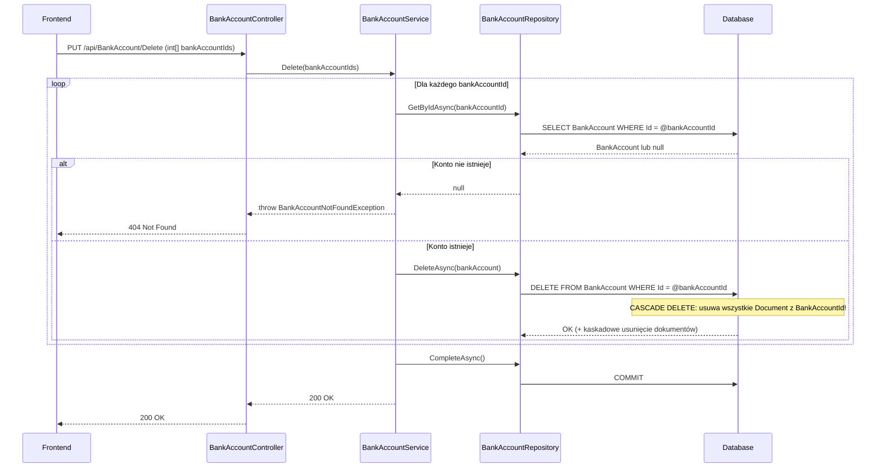

# Usuń konta bankowe — proces techniczny

| Pole | Wartość |
|---|---|
| ID dokumentu | PROC-DeleteBankAccounts |
| Typ dokumentu | proces |
| Wersja | 0.1 |
| Status | szkic |
| Autor (ostatnia modyfikacja) | Agent Claudiusz Sonte 4.6 max |
| Data ostatniej modyfikacji | 2026-05-31 |

## Streszczenie

Proces fizycznie usuwa jedno lub więcej kont bankowych firmy. Operacja jest nieodwracalna (hard delete). KRYTYCZNA ANOMALIA: tabela `Document` posiada `BankAccountId NOT NULL` z `CASCADE DELETE` — usunięcie konta bankowego powoduje kaskadowe usunięcie WSZYSTKICH dokumentów wystawionych z tym kontem, bez żadnego ostrzeżenia dla użytkownika.

## Cel procesu

Usunąć konto bankowe, które nie jest już używane przez firmę.

## Charakterystyka

| Atrybut | Wartość |
|---|---|
| ID procesu | PROC-DeleteBankAccounts |
| Typ | główny |
| Inicjator | Ekran „Konta bankowe" + zaznaczenie wierszy + operacja „Usuń" |
| Warunki startu | Użytkownik zalogowany (JWT); wybrane co najmniej jedno konto do usunięcia |
| Warunki zakończenia (sukces) | Rekord(y) `BankAccount` i kaskadowo `Document` usunięte; HTTP 200 |
| Warunki zakończenia (błąd) | Konto nie istnieje (404) |
| Uczestnicy | Frontend (Angular), API (BankAccountController), Service (BankAccountService), Repository (BankAccountRepository), Database (dbo.BankAccount, dbo.Document — CASCADE!) |

## Diagram sekwencji

## Kroki

1. **Odbiór żądania** — `BankAccountController` odbiera tablicę `int[] bankAccountIds` z PUT `/api/BankAccount/Delete`.
2. **Pętla po ID** — dla każdego `bankAccountId`: `BankAccountRepository.GetByIdAsync(id)`. Jeśli `null` → `BankAccountNotFoundException` (HTTP 404).
3. **Fizyczne usunięcie** — `BankAccountRepository.DeleteAsync(bankAccount)` — hard delete.
4. **Kaskadowe usunięcie dokumentów** — baza danych automatycznie usuwa wszystkie `Document` z FK `BankAccountId = @id` (anomalia BA-01 — KRYTYCZNE).
5. **Zapis** — `UnitOfWork.CompleteAsync()`.
6. **Odpowiedź** — HTTP 200 OK.

## Obsługa błędów

| Błąd | Miejsce wystąpienia | Reakcja |
|---|---|---|
| `BankAccountNotFoundException` | BankAccountService | HTTP 404 Not Found |
| Nieautoryzowany dostęp | AuthMiddleware | HTTP 401 Unauthorized |

## Powiązania

- Wywołany z ekranu: [Konta bankowe](../../../01_ekrany/firma/konta_bankowe/ekran.md)
- Powiązane API: [PUT /api/BankAccount/Delete](../../../04_api_i_integracje/01_api_frontend/bank_account/PUT_BankAccount_Delete.md)
- Powiązane algorytmy: [ALG-10 Data Isolation Pattern](../../../03_algorytmy/ALG-10_DataIsolationPattern.md)

## Powiązania z kodem

- Kontroler: `InvoiceJetAPI/Controllers/BankAccountController.cs`
- Serwis: `InvoiceJetAPI/Services/BankAccountService.cs`
- Repozytorium: `InvoiceJetAPI/Repositories/BankAccountRepository.cs`

## Wątpliwości i braki

- **KRYTYCZNE (BA-01):** `Document.BankAccountId` ma `NOT NULL + CASCADE DELETE` — usunięcie konta bankowego **usuwa WSZYSTKIE powiązane dokumenty** bez ostrzeżenia dla użytkownika. Wymaga natychmiastowej decyzji właściciela projektu (zmiana na SET NULL lub blokada usunięcia gdy są dokumenty).
- Hard delete — brak soft-delete.
- Brak weryfikacji czy usuwane konto należy do firmy zalogowanego użytkownika.

## Rejestr zmian

| Wersja | Data | Autor | Opis zmiany |
|---|---|---|---|
| 0.1 | 2026-05-31 | Agent Claudiusz Sonte 4.6 max | Pierwsza wersja — wyodrębniona z P-05_ManageBankAccounts.md (operacja Delete). |
