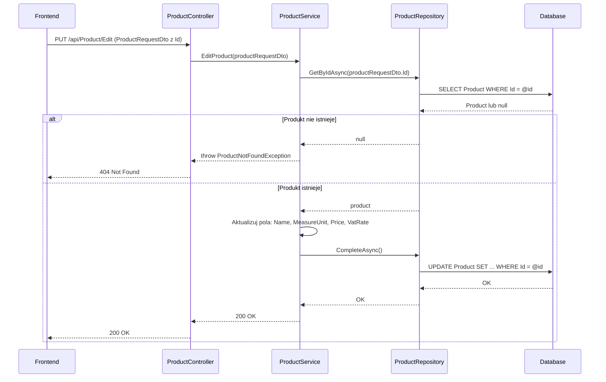

# Edytuj produkt — proces techniczny

| Pole | Wartość |
|---|---|
| ID dokumentu | PROC-EditProduct |
| Typ dokumentu | proces |
| Wersja | 0.1 |
| Status | szkic |
| Autor (ostatnia modyfikacja) | Agent Claudiusz Sonte 4.6 max |
| Data ostatniej modyfikacji | 2026-05-31 |

## Streszczenie

Proces aktualizuje dane istniejącego produktu lub usługi w katalogu firmy użytkownika. Backend sprawdza istnienie produktu o podanym `id`, a następnie aktualizuje jego pola. Zmiana nazwy podlega tym samym ograniczeniom UNIQUE INDEX co przy dodawaniu — globalna unikalność nazwy.

## Cel procesu

Zaktualizować dane produktu (nazwę, jednostkę miary, cenę, stawkę VAT) w katalogu firmy.

## Charakterystyka

| Atrybut | Wartość |
|---|---|
| ID procesu | PROC-EditProduct |
| Typ | główny |
| Inicjator | Ekran „Produkty" + dialog „Edytuj produkt" + operacja zapisu |
| Warunki startu | Użytkownik zalogowany (JWT); wybrany produkt do edycji |
| Warunki zakończenia (sukces) | Rekord `Product` zaktualizowany w DB; HTTP 200 |
| Warunki zakończenia (błąd) | Produkt nie istnieje (404); nowa nazwa zajęta globalnie (500) |
| Uczestnicy | Frontend (Angular), API (ProductController), Service (ProductService), Repository (ProductRepository), Database (dbo.Product) |

## Diagram sekwencji

## Kroki

1. **Odbiór żądania** — `ProductController` odbiera `ProductRequestDto` (z niepustym `id`) z PUT `/api/Product/Edit`.
2. **Pobranie produktu** — `ProductRepository.GetByIdAsync(id)`. Jeśli `null` → `ProductNotFoundException` (HTTP 404).
3. **Aktualizacja pól** — serwis nadpisuje: `Name`, `MeasureUnit`, `Price`, `VatRate`.
4. **Zapis** — `UnitOfWork.CompleteAsync()` (EF Core śledzi zmiany).
5. **Odpowiedź** — HTTP 200 OK.

## Obsługa błędów

| Błąd | Miejsce wystąpienia | Reakcja |
|---|---|---|
| `ProductNotFoundException` | ProductService | HTTP 404 Not Found — produkt o podanym id nie istnieje |
| UNIQUE INDEX violation (`Product.Name`) | Database | HTTP 500 — niezrozumiały błąd zamiast 409 (anomalia PD-02) |
| Nieautoryzowany dostęp | AuthMiddleware | HTTP 401 Unauthorized |

## Powiązania

- Wywołany z ekranu: `01_ekrany/produkty/`
- Powiązane API: `PUT /api/Product/Edit`
- Powiązany algorytm: Nie dotyczy

## Powiązania z kodem

- Kontroler: `InvoiceJetAPI/Controllers/ProductController.cs`
- Serwis: `InvoiceJetAPI/Services/ProductService.cs`
- Repozytorium: `InvoiceJetAPI/Repositories/ProductRepository.cs`

## Wątpliwości i braki

- Brak weryfikacji czy edytowany produkt należy do firmy zalogowanego użytkownika.
- Zmiana nazwy na zajętą przez inną firmę zwraca 500 zamiast 409 (anomalia PD-02, odziedziczona z AddProduct).

## Rejestr zmian

| Wersja | Data | Autor | Opis zmiany |
|---|---|---|---|
| 0.1 | 2026-05-31 | Agent Claudiusz Sonte 4.6 max | Pierwsza wersja — wyodrębniona z P-06_ManageProducts.md (operacja EditProduct). |
