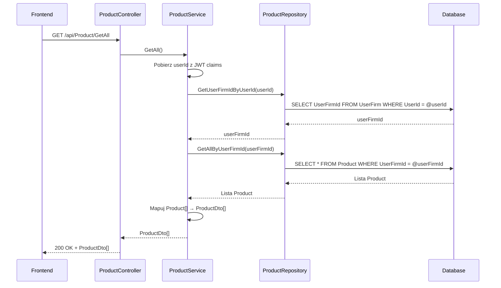

# Pobierz produkty — proces techniczny

| Pole | Wartość |
|---|---|
| ID dokumentu | PROC-GetAllProducts |
| Typ dokumentu | proces |
| Wersja | 0.1 |
| Status | szkic |
| Autor (ostatnia modyfikacja) | Agent Claudiusz Sonte 4.6 max |
| Data ostatniej modyfikacji | 2026-05-31 |

## Streszczenie

Proces pobiera pełną listę produktów/usług przypisanych do firmy zalogowanego użytkownika. Każda firma ma własny katalog produktów izolowany przez `UserFirmId`. Lista zwracana jest bez paginacji — jednorazowo cały katalog. Wynik zasilany jest do tabeli ekranu „Produkty" oraz do selektora pozycji w formularzu dokumentu.

## Cel procesu

Dostarczyć frontendowi listę wszystkich produktów i usług zdefiniowanych w katalogu firmy, aby umożliwić ich przeglądanie, edycję i wybór przy wystawianiu dokumentów.

## Charakterystyka

| Atrybut | Wartość |
|---|---|
| ID procesu | PROC-GetAllProducts |
| Typ | pomocniczy |
| Inicjator | Ekran „Produkty" — ngOnInit; lub ekran formularza dokumentu — inicjalizacja selektora |
| Warunki startu | Użytkownik zalogowany (JWT) z przypisaną firmą (UserFirm) |
| Warunki zakończenia (sukces) | Lista `ProductDto[]` zwrócona; HTTP 200 |
| Warunki zakończenia (błąd) | Brak — pusta lista gdy brak produktów |
| Uczestnicy | Frontend (Angular), API (ProductController), Service (ProductService), Repository (ProductRepository), Database (dbo.Product, dbo.UserFirm) |

## Diagram sekwencji

## Kroki

1. **Odbiór żądania** — `ProductController` obsługuje GET `/api/Product/GetAll`.
2. **Ekstrakcja userId** — serwis pobiera `userId` z claims JWT.
3. **Pobranie UserFirmId** — zapytanie przez `UserFirmRepository` lub bezpośrednio z claims.
4. **Pobranie produktów** — `ProductRepository.GetAllByUserFirmId(userFirmId)` zwraca wszystkie produkty przypisane do firmy.
5. **Mapowanie** — `AutoMapper` mapuje `Product[]` → `ProductDto[]`.
6. **Odpowiedź** — HTTP 200 OK + lista (pusta lista gdy brak produktów).

## Obsługa błędów

| Błąd | Miejsce wystąpienia | Reakcja |
|---|---|---|
| Nieautoryzowany dostęp | AuthMiddleware | HTTP 401 Unauthorized |
| Błąd DB (nieoczekiwany) | ProductRepository | HTTP 500 Internal Server Error (ExceptionMiddleware) |

## Powiązania

- Wywołany z ekranu: `01_ekrany/produkty/`, `01_ekrany/faktury/dodaj_edytuj_fakture/`
- Powiązane API: `GET /api/Product/GetAll`
- Powiązany algorytm: Nie dotyczy

## Powiązania z kodem

- Kontroler: `InvoiceJetAPI/Controllers/ProductController.cs`
- Serwis: `InvoiceJetAPI/Services/ProductService.cs`
- Repozytorium: `InvoiceJetAPI/Repositories/ProductRepository.cs`

## Wątpliwości i braki

- Brak paginacji — przy dużym katalogu produktów odpowiedź może być bardzo duża.
- Brak filtrowania i sortowania po stronie API.
- Lista produktów pobierana też przez `GetDocumentAutofillInfo` — potencjalne redundantne zapytania.

## Rejestr zmian

| Wersja | Data | Autor | Opis zmiany |
|---|---|---|---|
| 0.1 | 2026-05-31 | Agent Claudiusz Sonte 4.6 max | Pierwsza wersja — wyodrębniona z P-06_ManageProducts.md (operacja GetAll). |
