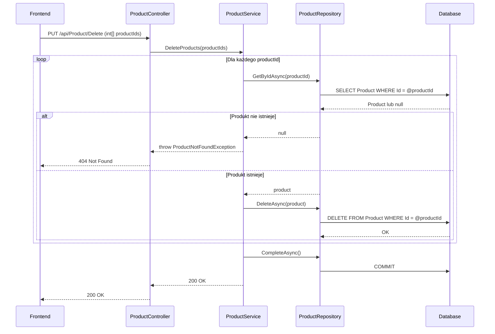

# Usuń produkty — proces techniczny

| Pole | Wartość |
|---|---|
| ID dokumentu | PROC-DeleteProducts |
| Typ dokumentu | proces |
| Wersja | 0.1 |
| Status | szkic |
| Autor (ostatnia modyfikacja) | Agent Claudiusz Sonte 4.6 max |
| Data ostatniej modyfikacji | 2026-05-31 |

## Streszczenie

Proces fizycznie usuwa jeden lub więcej produktów z katalogu firmy użytkownika. Usunięcie jest nieodwracalne (hard delete). Endpoint przyjmuje tablicę identyfikatorów, umożliwiając usuwanie wsadowe. Backend sprawdza istnienie każdego produktu przed usunięciem.

## Cel procesu

Usunąć z katalogu produkty lub usługi, które nie są już oferowane lub zostały błędnie dodane.

## Charakterystyka

| Atrybut | Wartość |
|---|---|
| ID procesu | PROC-DeleteProducts |
| Typ | główny |
| Inicjator | Ekran „Produkty" + zaznaczenie wierszy + operacja „Usuń" |
| Warunki startu | Użytkownik zalogowany (JWT); wybrane co najmniej jeden produkt do usunięcia |
| Warunki zakończenia (sukces) | Rekordy `Product` usunięte z DB; HTTP 200 |
| Warunki zakończenia (błąd) | Produkt nie istnieje (404) |
| Uczestnicy | Frontend (Angular), API (ProductController), Service (ProductService), Repository (ProductRepository), Database (dbo.Product) |

## Diagram sekwencji

## Kroki

1. **Odbiór żądania** — `ProductController` odbiera tablicę `int[] productIds` z PUT `/api/Product/Delete`.
2. **Pętla po ID** — dla każdego `productId`: `ProductRepository.GetByIdAsync(productId)`. Jeśli `null` → `ProductNotFoundException` (HTTP 404).
3. **Fizyczne usunięcie** — `ProductRepository.DeleteAsync(product)` — hard delete.
4. **Zapis** — `UnitOfWork.CompleteAsync()`.
5. **Odpowiedź** — HTTP 200 OK.

## Obsługa błędów

| Błąd | Miejsce wystąpienia | Reakcja |
|---|---|---|
| `ProductNotFoundException` | ProductService | HTTP 404 Not Found — produkt nie istnieje |
| FK constraint (produkt w dokumentach) | Database | HTTP 500 — jeśli produkt jest użyty w `DocumentProduct` |
| Nieautoryzowany dostęp | AuthMiddleware | HTTP 401 Unauthorized |

## Powiązania

- Wywołany z ekranu: [Produkty](../../../01_ekrany/produkty/ekran.md)
- Powiązane API: [PUT /api/Product/Delete](../../../04_api_i_integracje/01_api_frontend/product/PUT_Product_Delete.md)
- Powiązane algorytmy: [ALG-10 Data Isolation Pattern](../../../03_algorytmy/ALG-10_DataIsolationPattern.md)

## Powiązania z kodem

- Kontroler: `InvoiceJetAPI/Controllers/ProductController.cs`
- Serwis: `InvoiceJetAPI/Services/ProductService.cs`
- Repozytorium: `InvoiceJetAPI/Repositories/ProductRepository.cs`

## Wątpliwości i braki

- Brak weryfikacji czy usuwany produkt należy do firmy zalogowanego użytkownika.
- Niejasne zachowanie gdy produkt jest powiązany z istniejącymi dokumentami (`DocumentProduct`) — możliwy FK constraint violation.
- Hard delete — brak soft-delete; produkty z historycznych dokumentów mogą stać się niespójne.

## Rejestr zmian

| Wersja | Data | Autor | Opis zmiany |
|---|---|---|---|
| 0.1 | 2026-05-31 | Agent Claudiusz Sonte 4.6 max | Pierwsza wersja — wyodrębniona z P-06_ManageProducts.md (operacja DeleteProducts). |
