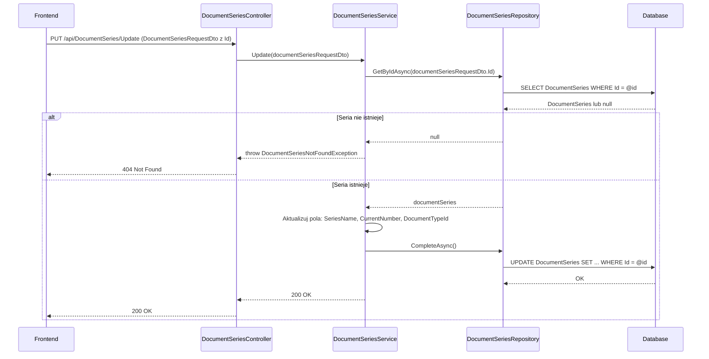

# Edytuj serię dokumentów — proces techniczny

| Pole | Wartość |
|---|---|
| ID dokumentu | PROC-UpdateDocumentSeries |
| Typ dokumentu | proces |
| Wersja | 0.1 |
| Status | szkic |
| Autor (ostatnia modyfikacja) | Agent Claudiusz Sonte 4.6 max |
| Data ostatniej modyfikacji | 2026-05-31 |

## Streszczenie

Proces aktualizuje dane istniejącej serii numeracji dokumentów (prefiks, bieżący numer, typ dokumentu). Backend weryfikuje istnienie serii po `id` i aktualizuje pola. Zmiana `CurrentNumber` wpływa na numerację kolejnych dokumentów wystawianych w tej serii.

## Cel procesu

Zaktualizować konfigurację serii numeracyjnej — np. zmienić prefiks lub ręcznie ustawić bieżący numer (np. przy migracji danych z innego systemu).

## Charakterystyka

| Atrybut | Wartość |
|---|---|
| ID procesu | PROC-UpdateDocumentSeries |
| Typ | główny |
| Inicjator | Ekran „Serie dokumentów" + dialog „Edytuj serię" + operacja zapisu |
| Warunki startu | Użytkownik zalogowany (JWT); wybrana seria do edycji |
| Warunki zakończenia (sukces) | Rekord `DocumentSeries` zaktualizowany; HTTP 200 |
| Warunki zakończenia (błąd) | Seria nie istnieje (404) |
| Uczestnicy | Frontend (Angular), API (DocumentSeriesController), Service (DocumentSeriesService), Repository (DocumentSeriesRepository), Database (dbo.DocumentSeries) |

## Diagram sekwencji

## Kroki

1. **Odbiór żądania** — `DocumentSeriesController` odbiera `DocumentSeriesRequestDto` (z niepustym `id`) z PUT `/api/DocumentSeries/Update`.
2. **Pobranie serii** — `DocumentSeriesRepository.GetByIdAsync(id)`. Jeśli `null` → `DocumentSeriesNotFoundException` (HTTP 404).
3. **Aktualizacja pól** — serwis nadpisuje: `SeriesName`, `CurrentNumber`, `DocumentTypeId`.
4. **Zapis** — `UnitOfWork.CompleteAsync()`.
5. **Odpowiedź** — HTTP 200 OK.

## Obsługa błędów

| Błąd | Miejsce wystąpienia | Reakcja |
|---|---|---|
| `DocumentSeriesNotFoundException` | DocumentSeriesService | HTTP 404 Not Found |
| Nieautoryzowany dostęp | AuthMiddleware | HTTP 401 Unauthorized |

## Powiązania

- Wywołany z ekranu: [Serie dokumentów](../../../01_ekrany/serie_dokumentow/ekran.md)
- Powiązane API: [PUT /api/DocumentSeries/Update](../../../04_api_i_integracje/01_api_frontend/document_series/PUT_DocumentSeries_Update.md)
- Powiązany algorytm: [generowanie_numeru_dokumentu](../../../03_algorytmy/dedykowane/generowanie_numeru_dokumentu.md)

## Powiązania z kodem

- Kontroler: `InvoiceJetAPI/Controllers/DocumentSeriesController.cs`
- Serwis: `InvoiceJetAPI/Services/DocumentSeriesService.cs`
- Repozytorium: `InvoiceJetAPI/Repositories/DocumentSeriesRepository.cs`

## Wątpliwości i braki

- Brak weryfikacji czy edytowana seria należy do firmy zalogowanego użytkownika.
- Ręczna zmiana `CurrentNumber` może spowodować duplikaty numerów dokumentów jeśli ustawiona na wartość już użytą.

## Rejestr zmian

| Wersja | Data | Autor | Opis zmiany |
|---|---|---|---|
| 0.1 | 2026-05-31 | Agent Claudiusz Sonte 4.6 max | Pierwsza wersja — wyodrębniona z P-07_ManageDocumentSeries.md (operacja Update). |
