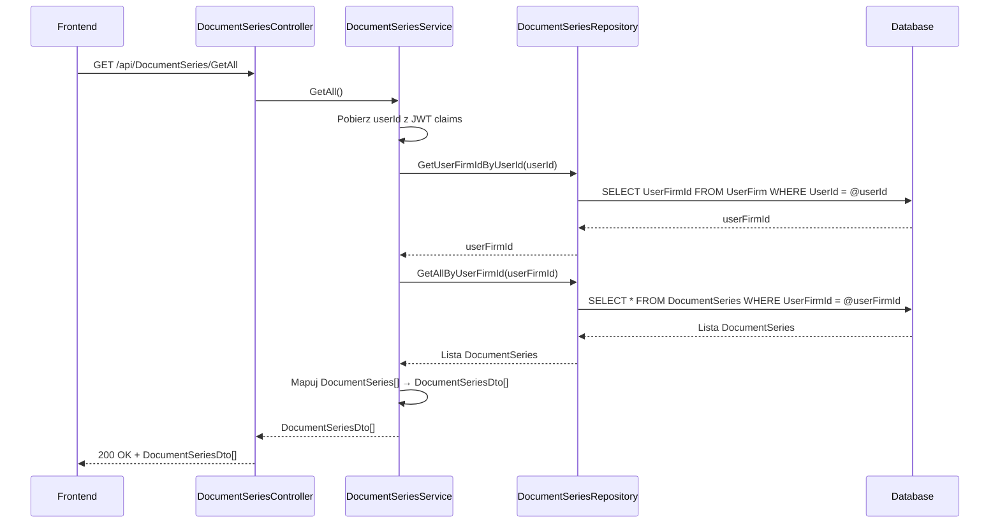

# Pobierz serie dokumentów — proces techniczny

| Pole | Wartość |
|---|---|
| ID dokumentu | PROC-GetAllDocumentSeries |
| Typ dokumentu | proces |
| Wersja | 0.1 |
| Status | szkic |
| Autor (ostatnia modyfikacja) | Agent Claudiusz Sonte 4.6 max |
| Data ostatniej modyfikacji | 2026-05-31 |

## Streszczenie

Proces pobiera listę wszystkich serii numeracji dokumentów przypisanych do firmy zalogowanego użytkownika. Serie definiują prefiks i bieżący numer składające się na numer dokumentu (np. `FV0005`). Lista zwracana jest bez paginacji i bez filtrowania po typie — wszystkie serie naraz. Wynik zasilany jest do tabeli ekranu „Serie dokumentów" oraz do selektora serii w formularzu dokumentu (gdzie filtrowanie po `documentTypeId` odbywa się przez osobny endpoint).

## Cel procesu

Dostarczyć frontendowi listę wszystkich serii dokumentów firmy do zarządzania nimi na ekranie konfiguracji serii.

## Charakterystyka

| Atrybut | Wartość |
|---|---|
| ID procesu | PROC-GetAllDocumentSeries |
| Typ | pomocniczy |
| Inicjator | Ekran „Serie dokumentów" — ngOnInit |
| Warunki startu | Użytkownik zalogowany (JWT) z przypisaną firmą (UserFirm) |
| Warunki zakończenia (sukces) | Lista `DocumentSeriesDto[]` zwrócona; HTTP 200 |
| Warunki zakończenia (błąd) | Brak — pusta lista gdy brak serii |
| Uczestnicy | Frontend (Angular), API (DocumentSeriesController), Service (DocumentSeriesService), Repository (DocumentSeriesRepository), Database (dbo.DocumentSeries) |

## Diagram sekwencji

## Kroki

1. **Odbiór żądania** — `DocumentSeriesController` obsługuje GET `/api/DocumentSeries/GetAll`.
2. **Ekstrakcja userId** — serwis pobiera `userId` z claims JWT.
3. **Pobranie UserFirmId** — zapytanie przez repozytorium.
4. **Pobranie serii** — `DocumentSeriesRepository.GetAllByUserFirmId(userFirmId)`.
5. **Mapowanie** — `AutoMapper` mapuje `DocumentSeries[]` → `DocumentSeriesDto[]`.
6. **Odpowiedź** — HTTP 200 OK + lista.

## Obsługa błędów

| Błąd | Miejsce wystąpienia | Reakcja |
|---|---|---|
| Nieautoryzowany dostęp | AuthMiddleware | HTTP 401 Unauthorized |
| Błąd DB (nieoczekiwany) | DocumentSeriesRepository | HTTP 500 Internal Server Error (ExceptionMiddleware) |

## Powiązania

- Wywołany z ekranu: [Serie dokumentów](../../../01_ekrany/serie_dokumentow/ekran.md)
- Powiązane API: [GET /api/DocumentSeries/GetAll](../../../04_api_i_integracje/01_api_frontend/document_series/GET_DocumentSeries_GetAll.md)
- Powiązany algorytm: [generowanie_numeru_dokumentu](../../../03_algorytmy/dedykowane/generowanie_numeru_dokumentu.md)
- Powiązane algorytmy (uzupełnienie): [ALG-10 Data Isolation Pattern](../../../03_algorytmy/ALG-10_DataIsolationPattern.md)

## Powiązania z kodem

- Kontroler: `InvoiceJetAPI/Controllers/DocumentSeriesController.cs`
- Serwis: `InvoiceJetAPI/Services/DocumentSeriesService.cs`
- Repozytorium: `InvoiceJetAPI/Repositories/DocumentSeriesRepository.cs`

## Wątpliwości i braki

- Brak filtrowania po `DocumentTypeId` w tym endpoincie — filtrowanie per typ jest realizowane przez `GetDocumentAutofillInfo`.

## Rejestr zmian

| Wersja | Data | Autor | Opis zmiany |
|---|---|---|---|
| 0.1 | 2026-05-31 | Agent Claudiusz Sonte 4.6 max | Pierwsza wersja — wyodrębniona z P-07_ManageDocumentSeries.md (operacja GetAll). |
